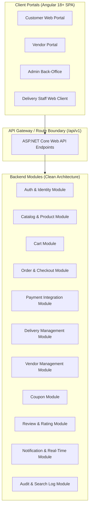
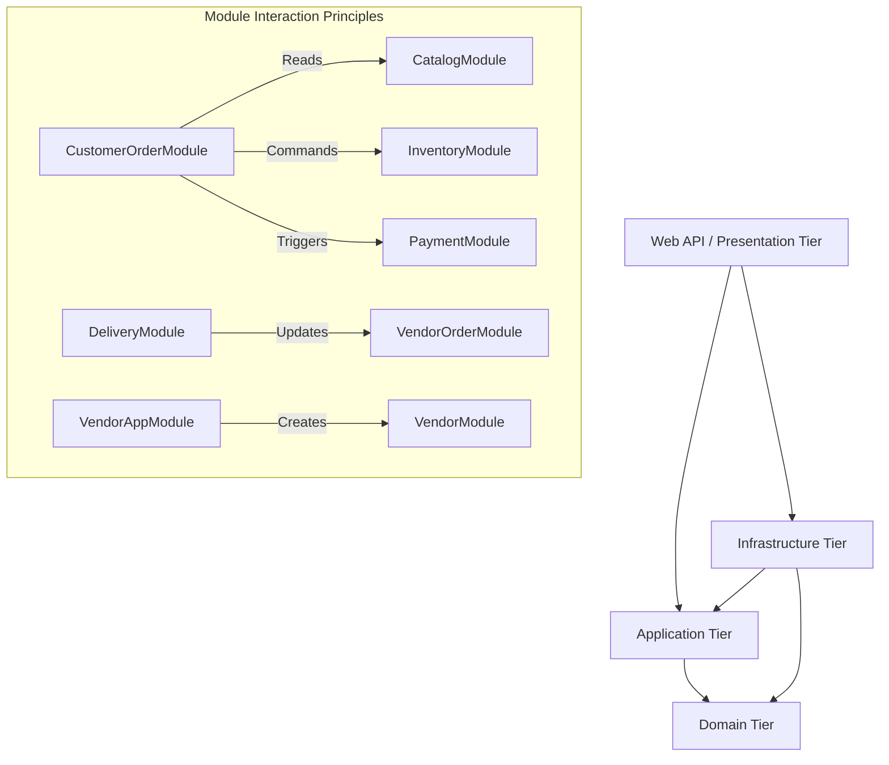
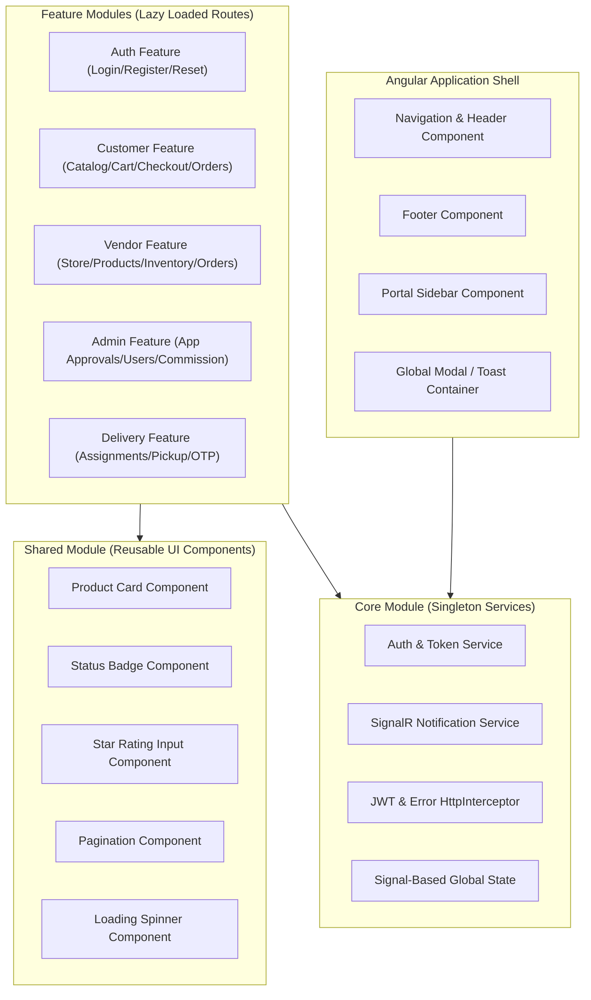
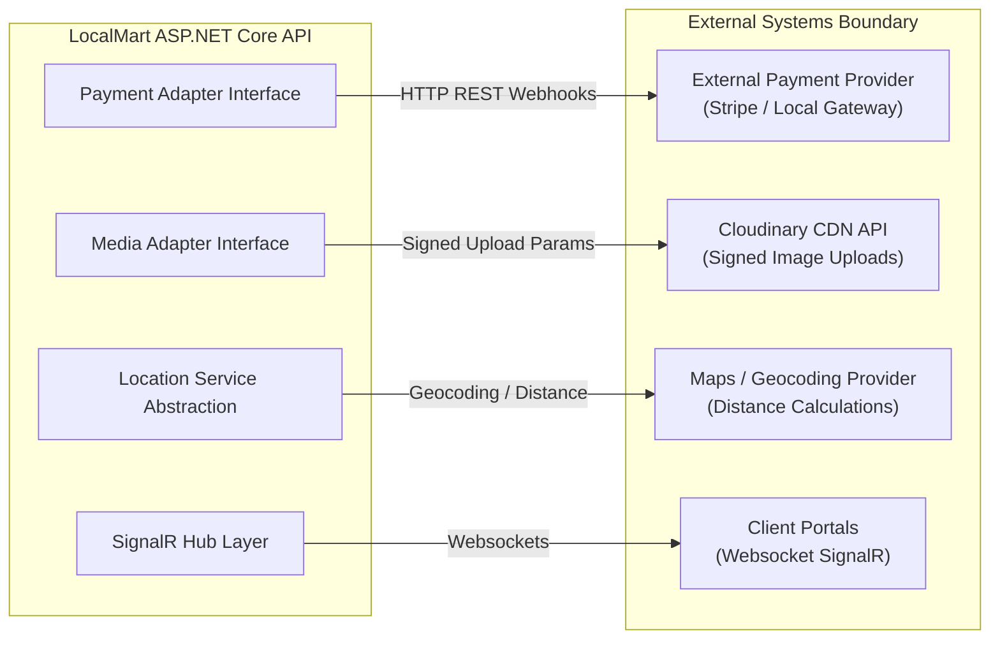
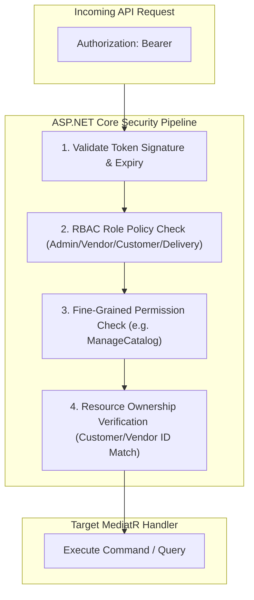
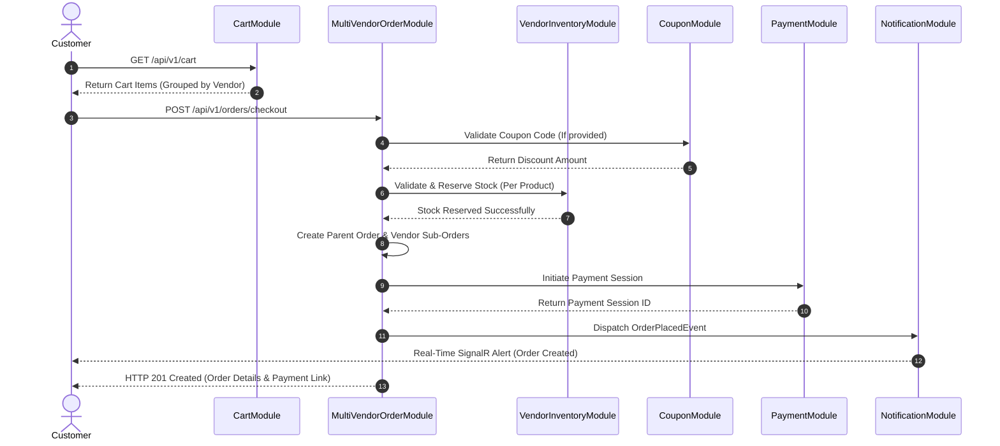
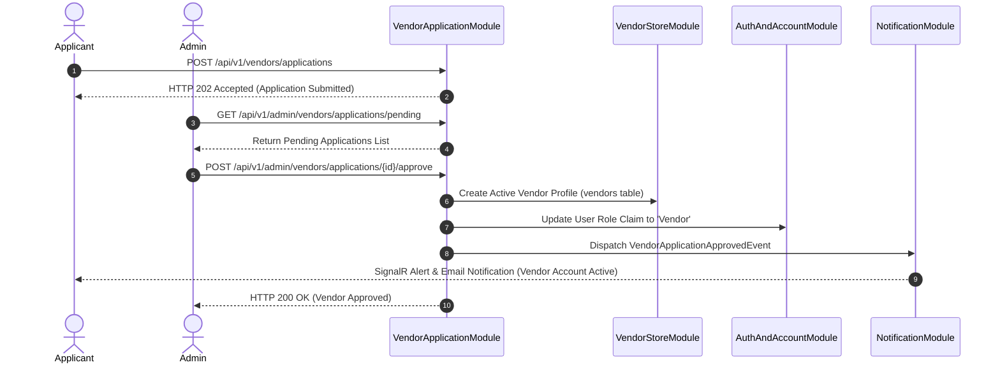

# LocalMart — Detailed Module & Component Architecture Specification

**Document Version:** 1.0  
**Phase:** 08 — Detailed Module / Component Architecture  
**Status:** Draft / Pending Architect Review  
**Date:** September 12, 2026  
**Primary Target Stack:** ASP.NET Core 8.0 Web API (.NET 8 / C#) & Angular 18+ (TypeScript / Tailwind CSS)  
**Database Target:** PostgreSQL 15+ / Supabase-Managed PostgreSQL  
**Primary Source Document:** `LocalMart_BRD_v1.0(1).md`  
**Consolidated Baselines:**  
1. [`docs/BRD_BASELINE.md`](file:///d:/new%20e%20commers/docs/BRD_BASELINE.md)  
2. [`docs/SRS.md`](file:///d:/new%20e%20commers/docs/SRS.md)  
3. [`docs/USER_FLOWS_AND_USE_CASES.md`](file:///d:/new%20e%20commers/docs/USER_FLOWS_AND_USE_CASES.md)  
4. [`docs/USE_CASE_SPECIFICATIONS.md`](file:///d:/new%20e%20commers/docs/USE_CASE_SPECIFICATIONS.md)  
5. [`docs/REQUIREMENTS_TRACEABILITY_MATRIX.md`](file:///d:/new%20e%20commers/docs/REQUIREMENTS_TRACEABILITY_MATRIX.md)  
6. [`docs/DATABASE_DESIGN_AND_ERD.md`](file:///d:/new%20e%20commers/docs/DATABASE_DESIGN_AND_ERD.md)  
7. [`docs/API_CONTRACT.md`](file:///d:/new%20e%20commers/docs/API_CONTRACT.md)  
8. [`docs/SYSTEM_ARCHITECTURE.md`](file:///d:/new%20e%20commers/docs/SYSTEM_ARCHITECTURE.md)  
**Project:** LocalMart — Location-Aware Multi-Vendor E-Commerce Marketplace  

---

## 1. Document Control

### 1.1 Purpose
This document specifies the detailed module and component architecture for **LocalMart**. It transforms the high-level Clean Architecture and solution design established in [`docs/SYSTEM_ARCHITECTURE.md`](file:///d:/new%20e%20commers/docs/SYSTEM_ARCHITECTURE.md) into concrete, granular module definitions, component boundaries, layer responsibilities, data ownership matrices, authorization scopes, cross-module interaction flows, and integration boundaries.

### 1.2 Document Priority & Traceability Hierarchy
1. Primary Business Source of Truth: [`LocalMart_BRD_v1.0(1).md`](file:///d:/new%20e%20commers/LocalMart_BRD_v1.0%281%29.md)
2. Consolidated Baseline Reference: [`docs/BRD_BASELINE.md`](file:///d:/new%20e%20commers/docs/BRD_BASELINE.md)
3. Software Requirements Specification: [`docs/SRS.md`](file:///d:/new%20e%20commers/docs/SRS.md)
4. User Flows & Use Case Catalog: [`docs/USER_FLOWS_AND_USE_CASES.md`](file:///d:/new%20e%20commers/docs/USER_FLOWS_AND_USE_CASES.md)
5. Formal Use Case Specifications: [`docs/USE_CASE_SPECIFICATIONS.md`](file:///d:/new%20e%20commers/docs/USE_CASE_SPECIFICATIONS.md)
6. Requirements Traceability Matrix: [`docs/REQUIREMENTS_TRACEABILITY_MATRIX.md`](file:///d:/new%20e%20commers/docs/REQUIREMENTS_TRACEABILITY_MATRIX.md)
7. Database Design & ERD: [`docs/DATABASE_DESIGN_AND_ERD.md`](file:///d:/new%20e%20commers/docs/DATABASE_DESIGN_AND_ERD.md)
8. API Contract & Specification: [`docs/API_CONTRACT.md`](file:///d:/new%20e%20commers/docs/API_CONTRACT.md)
9. System Architecture Specification: [`docs/SYSTEM_ARCHITECTURE.md`](file:///d:/new%20e%20commers/docs/SYSTEM_ARCHITECTURE.md)

### 1.3 Scope & Non-Goals
* **Included:** Granular module specifications across Customer, Vendor, Admin, Delivery, and Cross-Cutting domains; Angular 18+ frontend module/component boundaries; ASP.NET Core Clean Architecture layer responsibilities; CQRS command/query partitioning; authorization boundaries; data ownership matrices; 16 cross-module interaction sequence models; external integration boundaries; error/failure handling strategies; and complete traceability back to locked baselines.
* **Explicit Non-Goals:** Writing executable C# code, Angular TypeScript code, SQL migrations, EF Core DbContext entities, Docker scripts, or live API endpoints. This document is strict architectural design documentation.

---

## 2. Purpose & Objectives

The primary objective of Phase 08 is to provide an implementation-ready architectural blueprint that breaks down the system into cohesive, low-coupling modules. Each module is documented with clear contracts, strict domain boundaries, explicit data ownership rules, and clear cross-module communication mechanisms to guide backend and frontend software engineering teams without ambiguity.

---

## 3. Scope & Architectural Boundaries

LocalMart operates across four distinct user portals accessing a unified, modular ASP.NET Core Web API backend connected to PostgreSQL / Supabase:



---

## 4. Architecture Baseline References

| Phase | Artifact | File Path | Status |
|---|---|---|---|
| Phase 00 | BRD Baseline | [`docs/BRD_BASELINE.md`](file:///d:/new%20e%20commers/docs/BRD_BASELINE.md) | APPROVED / LOCKED |
| Phase 01 | SRS | [`docs/SRS.md`](file:///d:/new%20e%20commers/docs/SRS.md) | APPROVED / LOCKED |
| Phase 02 | User Flows & Use Cases | [`docs/USER_FLOWS_AND_USE_CASES.md`](file:///d:/new%20e%20commers/docs/USER_FLOWS_AND_USE_CASES.md) | APPROVED / LOCKED |
| Phase 03 | Use Case Specs | [`docs/USE_CASE_SPECIFICATIONS.md`](file:///d:/new%20e%20commers/docs/USE_CASE_SPECIFICATIONS.md) | APPROVED / LOCKED |
| Phase 04 | Traceability Matrix | [`docs/REQUIREMENTS_TRACEABILITY_MATRIX.md`](file:///d:/new%20e%20commers/docs/REQUIREMENTS_TRACEABILITY_MATRIX.md) | APPROVED / LOCKED |
| Phase 05 | Database Design & ERD | [`docs/DATABASE_DESIGN_AND_ERD.md`](file:///d:/new%20e%20commers/docs/DATABASE_DESIGN_AND_ERD.md) | APPROVED / LOCKED |
| Phase 06 | API Contract | [`docs/API_CONTRACT.md`](file:///d:/new%20e%20commers/docs/API_CONTRACT.md) | APPROVED / LOCKED |
| Phase 07 | System Architecture | [`docs/SYSTEM_ARCHITECTURE.md`](file:///d:/new%20e%20commers/docs/SYSTEM_ARCHITECTURE.md) | APPROVED / LOCKED |

---

## 5. Module Architecture Overview

The system is partitioned into vertical business feature modules cross-cutted by foundational technical services. Following Clean Architecture principles, each module isolates its business domain models, application use-case logic, and infrastructure adapters while enforcing explicit communication interfaces for inter-module interactions.

---

## 6. Module Dependency Model



### Allowed Dependency Rules:
1. **Domain Layer:** Pure C# domain entities, value objects, domain events, and status enums. Zero external framework dependencies.
2. **Application Layer:** MediatR Command/Query handlers, DTOs, FluentValidation rules, and interface definitions (`IUnitOfWork`, `IRepository`, `INotificationService`). Depends ONLY on Domain.
3. **Infrastructure Layer:** EF Core DbContext, PostgreSQL mappings, Cloudinary adapter, SignalR hub dispatchers, and external payment gateway HTTP clients. Implements Application interfaces.
4. **Web API Layer:** ASP.NET Core controllers, middleware, JWT authorization handlers, rate limiters, and Swagger documentation. Depends on Application and Infrastructure for dependency injection wiring.

---

## 7. Frontend Module Architecture (Angular 18+)



### Conceptual Frontend Architecture Principles:
* **Lazy Loading:** All feature portals are lazy-loaded via Angular Route definitions (`loadChildren` / `loadComponent`).
* **State Management:** Reactive state handled using Angular Signals (`signal()`, `computed()`, `effect()`) for UI state and RxJS `Observable` streams for async HTTP data pipelines.
* **Route Guards:** `AuthGuard` (validates JWT presence), `RoleGuard` (validates `Admin`, `Vendor`, `Customer`, `Delivery` roles), `PermissionGuard` (validates specific permission claims), and `PendingChangesGuard` (prevents form data loss).
* **Form Handling:** Angular Reactive Forms with custom validators mirroring backend domain validation rules.

---

## 8. Backend Module Architecture (ASP.NET Core 8 / Clean Architecture)

```mermaid
flowchart LR
    subgraph WebAPI ["Web API Layer"]
        Controllers["Controllers (/api/v1/...)"]
        Filters["Custom Exception & Validation Filters"]
        Swagger["OpenAPI / Swagger Annotations"]
    end

    subgraph Application ["Application Layer (MediatR)"]
        Commands["Command Handlers (Write Model)"]
        Queries["Query Handlers (Read Model)"]
        Validators["FluentValidation Rules"]
        Behaviors["Logging & Transaction Pipeline Behaviors"]
    end

    subgraph Domain ["Domain Layer"]
        Entities["Domain Entities & Aggregates"]
        ValueObjects["Value Objects & Rules"]
        Enums["Canonical Status Enums"]
        Events["Domain Events"]
    end

    subgraph Infrastructure ["Infrastructure Layer"]
        EFCore["EF Core DbContext & Configuration"]
        PaymentAdapter["Payment Gateway Adapter"]
        CloudinaryAdapter["Cloudinary Direct Upload Adapter"]
        SignalRHub["SignalR Notification Dispatcher"]
    end

    WebAPI --> Application
    Application --> Domain
    Infrastructure --> Application
    Infrastructure --> Domain
```



---

## 9. Domain / Application / Infrastructure / API Layer Boundaries

| Tier | Primary Responsibility | Key Elements / Artifacts | Constraints |
|---|---|---|---|
| **Domain** | Core business logic, domain entities, rules, enums. | `Customer`, `Vendor`, `Product`, `VendorOrder`, `Payment`, `Review` | Zero framework/third-party dependencies. Pure C#. |
| **Application** | Use-case orchestration, CQRS handling, validation. | `CreateOrderCommand`, `GetCatalogProductsQuery`, `Validator` | Depends only on Domain. Uses MediatR & FluentValidation. |
| **Infrastructure**| External integration, DB persistence, notifications. | `AppDbContext`, `CloudinaryService`, `SignalRNotificationDispatcher` | Implements Application interfaces (`IAppDbContext`, etc.). |
| **Web API** | HTTP routing, request parsing, authentication, OpenAPI. | `OrdersController`, `JwtAuthenticationMiddleware`, `ProblemDetails` | Thin controllers delegating to MediatR via `ISender`. |

---

## 10. Core Business Modules Breakdown

---

### 10.1 Authentication & Account Module (Customer / Common)

1. **Module Name:** `AuthAndAccountModule`
2. **Purpose:** Handles user registration, authentication, JWT token issuance, refresh token rotation, profile management, and password management.
3. **Responsibilities:** Authenticating credentials, issuing JWT claims, managing `refresh_tokens`, user profile updates.
4. **In-Scope Capabilities:** Registration, Login, Token Refresh, Profile Management, Password Change.
5. **Out-of-Scope Capabilities:** Vendor business application submission (handled in `VendorApplicationModule`), role permission assignment (handled in `AdminUserManagementModule`).
6. **Main Actors:** Customer, Vendor, Admin, Delivery Staff.
7. **Related Business Rules:** `BR-001` (RBAC), `BR-002` (Customer Account Isolation).
8. **Related Functional Requirements:** `FR-AUTH-001` to `FR-AUTH-006`.
9. **Related Use Cases:** `UC-001` (User Registration), `UC-002` (User Login).
10. **Related API Areas:** Section 7.1 (`POST /api/v1/auth/register`, `POST /api/v1/auth/login`, `POST /api/v1/auth/refresh-token`, `GET /api/v1/auth/me`).
11. **Related Database Entities:** `users`, `roles`, `permissions`, `user_roles`, `role_permissions`, `refresh_tokens`.
12. **Dependencies:** `Infrastructure.Persistence`, `CrossCutting.Security`.
13. **Data Ownership Responsibility:** Exclusive owner of `users`, `refresh_tokens`, `roles`, `permissions`.
14. **Authorization Boundary:** Anonymous for register/login/refresh; Authenticated for profile operations.
15. **Cross-Module Interactions:** Emits `UserRegisteredEvent` consumed by `NotificationModule`.
16. **External Integrations:** None.
17. **Important Validation Rules:** Unique email address, password complexity standards (`NFR-SEC-001`).
18. **Failure/Error Considerations:** `401 Unauthorized` for invalid credentials; `409 Conflict` for duplicate email.
19. **Deferred Decisions:** Password hashing algorithm parameters (`Argon2`/`BCrypt` work factor deferred).

---

### 10.2 Product Discovery & Search Module

1. **Module Name:** `ProductDiscoveryAndSearchModule`
2. **Purpose:** Provides location-aware product search, filtering, category navigation, and logs customer search terms.
3. **Responsibilities:** Location-filtered product queries, text search matching, price/category filtering, query term logging to `search_logs`.
4. **In-Scope Capabilities:** Distance-based vendor filtering, text search, catalog browsing, logging search queries.
5. **Out-of-Scope Capabilities:** AI semantic search, recommendations, `pgvector` indexing (Explicit Non-Goals).
6. **Main Actors:** Customer, Guest User.
7. **Related Business Rules:** `BR-003` (Location-Based Store & Product Discovery), `BR-005` (Product Catalog Governance).
8. **Related Functional Requirements:** `FR-SCH-001` to `FR-SCH-004`.
9. **Related Use Cases:** `UC-003` (Search & Filter Products), `UC-004` (View Product Details).
10. **Related API Areas:** Section 7.3 (`GET /api/v1/products/search`, `GET /api/v1/categories`).
11. **Related Database Entities:** `products`, `vendors`, `categories`, `search_logs`.
12. **Dependencies:** `CatalogModule`, `LocationService`.
13. **Data Ownership Responsibility:** Reads `products` and `vendors`; Writes to `search_logs`.
14. **Authorization Boundary:** Public / Anonymous accessible.
15. **Cross-Module Interactions:** Emits `SearchPerformedEvent` asynchronously to `AuditAndSearchLogModule`.
16. **External Integrations:** Geocoding / Distance calculation service abstraction.
17. **Important Validation Rules:** Search radius must be positive numeric value; query string sanitized against SQL injection.
18. **Failure/Error Considerations:** Returns empty paginated list if no products match location radius.
19. **Deferred Decisions:** Maps provider and PostGIS spatial indexing evaluation remain deferred.

---

### 10.3 Categories & Catalog Module

1. **Module Name:** `CatalogModule`
2. **Purpose:** Manages category hierarchies, product attributes, and product moderation states.
3. **Responsibilities:** Admin category CRUD, vendor product creation and update, product status transitions.
4. **In-Scope Capabilities:** Category management, product publishing by active vendors, status management (`Draft`, `Active`, `Inactive`, `OutOfStock`, `Suspended`).
5. **Out-of-Scope Capabilities:** Customer cart placement (CartModule), stock deduction (InventoryModule).
6. **Main Actors:** Admin, Vendor, Customer.
7. **Related Business Rules:** `BR-005` (Product Catalog & Moderation), `BR-006` (Vendor Product Ownership).
8. **Related Functional Requirements:** `FR-CAT-001` to `FR-CAT-004`, `FR-PROD-001` to `FR-PROD-005`.
9. **Related Use Cases:** `UC-004` (View Product Details), `UC-011` (Vendor Create Product).
10. **Related API Areas:** Section 7.3 & 7.5 (`/api/v1/categories`, `/api/v1/vendor/products`).
11. **Related Database Entities:** `categories`, `products`, `product_images`.
12. **Dependencies:** `VendorModule`, `CloudinaryMediaService`.
13. **Data Ownership Responsibility:** Exclusive owner of `categories`, `products`, `product_images`.
14. **Authorization Boundary:** Categories: Public Read, Admin Write. Products: Vendor Write (own store), Admin Moderate.
15. **Cross-Module Interactions:** Validates vendor active status with `VendorModule` before publishing.
16. **External Integrations:** Cloudinary API for signed image uploads.
17. **Important Validation Rules:** Category name unique; Product price > 0; Stock quantity >= 0.
18. **Failure/Error Considerations:** `403 Forbidden` if vendor attempts to modify another vendor's product.
19. **Deferred Decisions:** None.

---

### 10.4 Shopping Cart Module

1. **Module Name:** `CartModule`
2. **Purpose:** Manages transient customer shopping carts, validating item availability and multi-vendor item grouping.
3. **Responsibilities:** Add item, update quantity, remove item, clear cart, group cart items by `vendor_id`.
4. **In-Scope Capabilities:** Multi-vendor cart management, price verification against active catalog.
5. **Out-of-Scope Capabilities:** Inventory stock reservation (occurs during checkout execution).
6. **Main Actors:** Customer.
7. **Related Business Rules:** `BR-004` (Multi-Vendor Order Hierarchy), `BR-007` (Cart & Multi-Vendor Grouping).
8. **Related Functional Requirements:** `FR-CRT-001` to `FR-CRT-004`.
9. **Related Use Cases:** `UC-005` (Manage Shopping Cart).
10. **Related API Areas:** Section 7.4 (`GET /api/v1/cart`, `POST /api/v1/cart/items`, `PUT /api/v1/cart/items/{id}`, `DELETE /api/v1/cart/items/{id}`).
11. **Related Database Entities:** `carts`, `cart_items`.
12. **Dependencies:** `CatalogModule`, `AuthAndAccountModule`.
13. **Data Ownership Responsibility:** Exclusive owner of `carts` and `cart_items`.
14. **Authorization Boundary:** Customer role (authenticated customer cart isolation).
15. **Cross-Module Interactions:** Queries `CatalogModule` for current product pricing and active status.
16. **External Integrations:** None.
17. **Important Validation Rules:** Quantity must be positive integer > 0; product must be in `Active` status.
18. **Failure/Error Considerations:** `400 Bad Request` if requested product is `Inactive` or `OutOfStock`.
19. **Deferred Decisions:** Cart persistence duration / guest cart merge strategy remains implementation detail.

---

### 10.5 Multi-Vendor Checkout & Order Module

1. **Module Name:** `MultiVendorOrderModule`
2. **Purpose:** Orchestrates multi-vendor order creation, sub-order splitting, inventory validation, coupon application, and order status transitions.
3. **Responsibilities:** Parent Order creation (`orders`), Vendor Sub-Order generation (`vendor_orders`), sub-order line items (`order_items`), order lifecycle state transitions.
4. **In-Scope Capabilities:** Checkout processing, parent-child order hierarchy, order history, status tracking.
5. **Out-of-Scope Capabilities:** Payment collection execution (PaymentModule), physical delivery routing (DeliveryModule).
6. **Main Actors:** Customer, Vendor, Admin, Delivery Staff.
7. **Related Business Rules:** `BR-004` (Multi-Vendor Order Split), `BR-008` (Order Execution & Sub-Orders), `BR-009` (Payment & Fulfillment), `BR-010` (Delivery & Fulfillment).
8. **Related Functional Requirements:** `FR-ORD-001` to `FR-ORD-008`.
9. **Related Use Cases:** `UC-006` (Checkout & Place Order), `UC-007` (Customer Order Tracking), `UC-013` (Vendor Sub-Order Management).
10. **Related API Areas:** Section 7.4, 7.6, 7.7 (`/api/v1/orders`, `/api/v1/vendor/orders`, `/api/v1/admin/orders`).
11. **Related Database Entities:** `orders`, `vendor_orders`, `order_items`, `order_status_history`.
12. **Dependencies:** `CartModule`, `InventoryModule`, `PaymentModule`, `CouponModule`, `DeliveryModule`.
13. **Data Ownership Responsibility:** Exclusive owner of `orders`, `vendor_orders`, `order_items`, `order_status_history`.
14. **Authorization Boundary:** Customer: View own orders; Vendor: View/Update own sub-orders; Admin: Global order visibility.
15. **Cross-Module Interactions:** Requests inventory reservation from `InventoryModule`; Triggers payment authorization via `PaymentModule`; Assigns delivery via `DeliveryModule`.
16. **External Integrations:** None directly (delegated to Payment & Delivery modules).
17. **Important Validation Rules:** Customer shipping address must be within vendor service radius; cart cannot be empty.
18. **Failure/Error Considerations:** Transaction rollbacks parent order creation if any sub-order inventory reservation fails.
19. **Deferred Decisions:** Inventory reservation expiration timeout mechanics remain deferred.

---

### 10.6 Payment Integration Boundary Module

1. **Module Name:** `PaymentModule`
2. **Purpose:** Manages payment processing abstractions, online payment webhooks, COD tracking, and payment transaction logging.
3. **Responsibilities:** Initiating payment sessions, processing payment webhooks safely, updating payment statuses (`Pending`, `Processing`, `Paid`, `Failed`, `Refunded`), preventing duplicate financial transitions.
4. **In-Scope Capabilities:** Provider-neutral payment abstraction, webhook signature verification, payment state synchronization.
5. **Out-of-Scope Capabilities:** Direct credit card data storage (Strict PCI-DSS Compliance Boundary).
6. **Main Actors:** Customer, System Webhook, Admin.
7. **Related Business Rules:** `BR-009` (Payment & Fulfillment Integrity).
8. **Related Functional Requirements:** `FR-PAY-001` to `FR-PAY-005`.
9. **Related Use Cases:** `UC-006` (Order Payment Step), `UC-017` (Payment Gateway Webhook Handling).
10. **Related API Areas:** Section 7.4 & 7.8 (`/api/v1/payments`, `/api/v1/webhooks/payments`).
11. **Related Database Entities:** `payments`, `payment_transactions`.
12. **Dependencies:** `MultiVendorOrderModule`, `CrossCutting.Security`.
13. **Data Ownership Responsibility:** Exclusive owner of `payments` and `payment_transactions`.
14. **Authorization Boundary:** Customer: Initiate payment; Anonymous Webhook: Verified via HTTP signature header; Admin: View payment logs.
15. **Cross-Module Interactions:** Emits `PaymentConfirmedEvent` to `MultiVendorOrderModule` to trigger vendor order confirmation (`Confirmed`).
16. **External Integrations:** External Payment Gateway (Stripe / Local Provider Abstraction).
17. **Important Validation Rules:** Webhook payload signature must match secret key; Idempotency key verified for duplicate dispatch protection.
18. **Failure/Error Considerations:** `400 Bad Request` for invalid webhook signature; Webhook dispatches must be idempotent.
19. **Deferred Decisions:** External payment provider selection remains deferred.

---

### 10.7 Customer Addresses Module

1. **Module Name:** `AddressModule`
2. **Purpose:** Manages customer delivery addresses, spatial coordinates, and primary address selection.
3. **Responsibilities:** Address CRUD, latitude/longitude storage, default address flag management.
4. **In-Scope Capabilities:** Customer delivery address management, distance calculation helper routines.
5. **Out-of-Scope Capabilities:** PostGIS spatial index optimizations (Deferred Decision).
6. **Main Actors:** Customer.
7. **Related Business Rules:** `BR-003` (Location Discovery Boundary).
8. **Related Functional Requirements:** `FR-ADDR-001` to `FR-ADDR-003`.
9. **Related Use Cases:** `UC-006` (Checkout Address Selection).
10. **Related API Areas:** Section 7.4 (`/api/v1/customer/addresses`).
11. **Related Database Entities:** `customer_addresses`.
12. **Dependencies:** `AuthAndAccountModule`.
13. **Data Ownership Responsibility:** Exclusive owner of `customer_addresses`.
14. **Authorization Boundary:** Customer role (authenticated owner access).
15. **Cross-Module Interactions:** Provides customer latitude/longitude to `ProductDiscoveryAndSearchModule` and `MultiVendorOrderModule`.
16. **External Integrations:** Geocoding API abstraction for address validation.
17. **Important Validation Rules:** Latitude [-90, 90], Longitude [-180, 180]; Street address and city mandatory.
18. **Failure/Error Considerations:** `404 Not Found` if updating non-existent address ID.
19. **Deferred Decisions:** Maps provider selection remains deferred.

---

### 10.8 Reviews & Ratings Module

1. **Module Name:** `ReviewModule`
2. **Purpose:** Handles customer product/vendor reviews, eligibility verification, rating calculations, and admin moderation.
3. **Responsibilities:** Review submission, review eligibility verification (must have delivered order containing item), average rating updates, admin review deletion/hiding.
4. **In-Scope Capabilities:** Verified purchase review posting, vendor rating aggregation, admin moderation.
5. **Out-of-Scope Capabilities:** Unverified purchase reviews (Explicitly Forbidden).
6. **Main Actors:** Customer, Admin.
7. **Related Business Rules:** `BR-011` (Review Eligibility & Verified Purchase).
8. **Related Functional Requirements:** `FR-REV-001` to `FR-REV-004`.
9. **Related Use Cases:** `UC-008` (Submit Product Review), `UC-023` (Admin Review Moderation).
10. **Related API Areas:** Section 7.3 & 7.7 (`/api/v1/products/{id}/reviews`, `/api/v1/admin/reviews`).
11. **Related Database Entities:** `reviews`, `products`, `vendors`.
12. **Dependencies:** `MultiVendorOrderModule`, `CatalogModule`.
13. **Data Ownership Responsibility:** Exclusive owner of `reviews`.
14. **Authorization Boundary:** Customer (verified order owner) to write; Admin to moderate; Public to read.
15. **Cross-Module Interactions:** Queries `MultiVendorOrderModule` to verify delivered status of `order_item` prior to review creation.
16. **External Integrations:** None.
17. **Important Validation Rules:** Rating integer between 1 and 5; Customer must own a `Delivered` order containing the product.
18. **Failure/Error Considerations:** `403 Forbidden` if customer has not purchased/received the product.
19. **Deferred Decisions:** None.

---

### 10.9 Coupons & Promotion Module

1. **Module Name:** `CouponModule`
2. **Purpose:** Manages discount coupons, usage limits, expiration rules, and cart discount calculations.
3. **Responsibilities:** Coupon creation (Admin/Vendor), coupon validation against cart total, tracking redemption count in `coupon_usages`.
4. **In-Scope Capabilities:** Fixed/Percentage discount calculation, minimum order amount verification, total/per-user redemption caps.
5. **Out-of-Scope Capabilities:** Automated dynamic pricing / AI promotional engine.
6. **Main Actors:** Admin, Vendor, Customer.
7. **Related Business Rules:** `BR-012` (Coupons & Promotions Governance).
8. **Related Functional Requirements:** `FR-CPN-001` to `FR-CPN-005`.
9. **Related Use Cases:** `UC-006` (Apply Coupon at Checkout), `UC-020` (Admin Create Coupon).
10. **Related API Areas:** Section 7.4 & 7.7 (`/api/v1/coupons/validate`, `/api/v1/admin/coupons`).
11. **Related Database Entities:** `coupons`, `coupon_usages`.
12. **Dependencies:** `MultiVendorOrderModule`, `CartModule`.
13. **Data Ownership Responsibility:** Exclusive owner of `coupons` and `coupon_usages`.
14. **Authorization Boundary:** Admin/Vendor to create/manage; Customer to validate and redeem.
15. **Cross-Module Interactions:** Called by `MultiVendorOrderModule` during checkout to validate code and calculate final subtotal.
16. **External Integrations:** None.
17. **Important Validation Rules:** Current date between `start_date` and `end_date`; Usage count < `max_uses`.
18. **Failure/Error Considerations:** `400 Bad Request` if coupon expired, limit reached, or cart below minimum spend.
19. **Deferred Decisions:** Partial multi-vendor coupon split accounting rules remain deferred.

---

### 10.10 Notification & Real-Time Module

1. **Module Name:** `NotificationModule`
2. **Purpose:** Manages user notification persistence and dispatching real-time websocket messages via SignalR.
3. **Responsibilities:** Storing notifications in `notifications`, pushing real-time alerts to connected SignalR clients on `/hubs/notifications`.
4. **In-Scope Capabilities:** In-app notification store, unread count tracking, SignalR live events for order status updates.
5. **Out-of-Scope Capabilities:** Distributed Redis backplane scaling (Deferred Decision).
6. **Main Actors:** Customer, Vendor, Admin, Delivery Staff.
7. **Related Business Rules:** `BR-008`, `BR-010` (Real-Time Notification Delivery).
8. **Related Functional Requirements:** `FR-NOT-001` to `FR-NOT-004`.
9. **Related Use Cases:** `UC-007`, `UC-013`, `UC-015` (Order Status Notifications).
10. **Related API Areas:** Section 7.9 (`/api/v1/notifications`, Hub: `/hubs/notifications`).
11. **Related Database Entities:** `notifications`.
12. **Dependencies:** `ASP.NET Core SignalR Infrastructure`.
13. **Data Ownership Responsibility:** Exclusive owner of `notifications`.
14. **Authorization Boundary:** Authenticated user access (isolated to recipient `user_id`).
15. **Cross-Module Interactions:** Listens to domain events (`OrderPlacedEvent`, `OrderStatusChangedEvent`, `VendorApprovedEvent`).
16. **External Integrations:** None in MVP (Push notifications / SMS gateway out of MVP scope).
17. **Important Validation Rules:** Notification recipient must exist in `users`.
18. **Failure/Error Considerations:** If SignalR client is disconnected, message remains persisted in DB for retrieval on reconnect.
19. **Deferred Decisions:** SignalR Redis backplane scaling architecture remains deferred.

---

## 11. Vendor Side Modules

---

### 11.1 Vendor Application & Onboarding Module

1. **Module Name:** `VendorApplicationModule`
2. **Purpose:** Manages prospective vendor application submissions, document attachments, and administrative review workflows.
3. **Responsibilities:** Capturing business details, storing pending applications (`vendor_applications`), processing Admin Approval/Rejection.
4. **In-Scope Capabilities:** Applicant submission, admin review queue, approval triggering vendor profile creation.
5. **Out-of-Scope Capabilities:** Automated background checks / immediate self-activation (Approval is mandatory).
6. **Main Actors:** Guest/Applicant, Admin.
7. **Related Business Rules:** `BR-013` (Vendor Onboarding & Approval Boundary).
8. **Related Functional Requirements:** `FR-VND-001` to `FR-VND-003`.
9. **Related Use Cases:** `UC-009` (Submit Vendor Application), `UC-018` (Approve/Reject Vendor Application).
10. **Related API Areas:** Section 7.2 & 7.7 (`POST /api/v1/vendors/applications`, `POST /api/v1/admin/vendors/applications/{id}/approve`).
11. **Related Database Entities:** `vendor_applications`, `vendors`, `users`.
12. **Dependencies:** `AuthAndAccountModule`, `CloudinaryMediaService`, `NotificationModule`.
13. **Data Ownership Responsibility:** Exclusive owner of `vendor_applications`.
14. **Authorization Boundary:** Anonymous / Guest to submit; Admin to review/approve/reject.
15. **Cross-Module Interactions:** Upon approval via `POST /api/v1/admin/vendors/applications/{id}/approve`, creates record in `vendors` table and updates `users` role claim to `Vendor`.
16. **External Integrations:** Cloudinary for business document attachments.
17. **Important Validation Rules:** Business tax ID and store name mandatory; Email must not already belong to an active vendor.
18. **Failure/Error Considerations:** `400 Bad Request` if mandatory business documents missing.
19. **Deferred Decisions:** Vendor reapplication mechanics and jurisdiction-specific verification rules remain deferred.

---

### 11.2 Vendor Profile & Storefront Module

1. **Module Name:** `VendorStoreModule`
2. **Purpose:** Manages vendor store profiles, operating hours, delivery radius, banner/logo media, and store active status.
3. **Responsibilities:** Store info CRUD, operating hours configuration, location coordinate updates, store status toggling (`Active`, `Inactive`, `Suspended`).
4. **In-Scope Capabilities:** Storefront customization, service radius configuration, vendor self-deactivation.
5. **Out-of-Scope Capabilities:** Multi-branch store management (Explicit Out-of-Scope).
6. **Main Actors:** Vendor, Admin, Customer.
7. **Related Business Rules:** `BR-003` (Location Radius), `BR-006` (Vendor Store Management).
8. **Related Functional Requirements:** `FR-VND-004` to `FR-VND-006`.
9. **Related Use Cases:** `UC-010` (Manage Vendor Store Profile).
10. **Related API Areas:** Section 7.5 & 7.7 (`/api/v1/vendor/profile`, `/api/v1/admin/vendors/{id}`).
11. **Related Database Entities:** `vendors`.
12. **Dependencies:** `CloudinaryMediaService`, `LocationService`.
13. **Data Ownership Responsibility:** Exclusive owner of `vendors`.
14. **Authorization Boundary:** Vendor role (own store record); Admin role (global store management).
15. **Cross-Module Interactions:** Stores vendor latitude/longitude used by `ProductDiscoveryAndSearchModule`.
16. **External Integrations:** Cloudinary for store logo and banner assets.
17. **Important Validation Rules:** Service radius > 0 km; Store name required.
18. **Failure/Error Considerations:** `403 Forbidden` if vendor attempts to update another vendor's store profile.
19. **Deferred Decisions:** None.

---

### 11.3 Vendor Inventory Control Module

1. **Module Name:** `VendorInventoryModule`
2. **Purpose:** Tracks stock quantities, reserved quantities, low stock thresholds, and stock movement logs.
3. **Responsibilities:** Managing `quantity_available` and `quantity_reserved` in `inventory`, logging changes to `inventory_logs`.
4. **In-Scope Capabilities:** Stock adjustment by vendor, atomic reservation during checkout, stock release on order cancellation.
5. **Out-of-Scope Capabilities:** Advanced warehouse management / multi-location inventory.
6. **Main Actors:** Vendor, System Order Service.
7. **Related Business Rules:** `BR-009` (Inventory & Fulfillment Integrity).
8. **Related Functional Requirements:** `FR-INV-001` to `FR-INV-004`.
9. **Related Use Cases:** `UC-012` (Manage Vendor Inventory).
10. **Related API Areas:** Section 7.5 (`/api/v1/vendor/inventory`).
11. **Related Database Entities:** `inventory`, `inventory_logs`.
12. **Dependencies:** `CatalogModule`, `MultiVendorOrderModule`.
13. **Data Ownership Responsibility:** Exclusive owner of `inventory` and `inventory_logs`.
14. **Authorization Boundary:** Vendor role (own product inventory); Internal system execution for checkout reservations.
15. **Cross-Module Interactions:** Invoked by `MultiVendorOrderModule` to validate and reserve stock during checkout.
16. **External Integrations:** None.
17. **Important Validation Rules:** Available quantity cannot be decremented below 0; Reserved quantity cannot be negative.
18. **Failure/Error Considerations:** Concurrent checkout stock updates handle race conditions via atomic DB queries or optimistic concurrency.
19. **Deferred Decisions:** Inventory hold expiration timeout and automated background cleanup worker mechanics remain deferred.

---

### 11.4 Vendor Earnings & Commission Visibility Module

1. **Module Name:** `VendorCommissionModule`
2. **Purpose:** Provides vendors with visibility into order earnings, marketplace commission deductions, and payout history.
3. **Responsibilities:** Calculating net earnings per sub-order, logging marketplace commission rates, presenting financial summaries.
4. **In-Scope Capabilities:** Sub-order commission breakdown, payout log history viewing.
5. **Out-of-Scope Capabilities:** Automated banking payouts / payment gateway distribution integration.
6. **Main Actors:** Vendor, Admin.
7. **Related Business Rules:** `BR-014` (Marketplace Commission & Payout Governance).
8. **Related Functional Requirements:** `FR-FIN-001` to `FR-FIN-004`.
9. **Related Use Cases:** `UC-014` (View Vendor Earnings), `UC-021` (Manage Commission Rates & Payouts).
10. **Related API Areas:** Section 7.5 & 7.7 (`/api/v1/vendor/earnings`, `/api/v1/admin/commissions`).
11. **Related Database Entities:** `vendor_commissions`, `vendor_payouts`, `vendor_orders`.
12. **Dependencies:** `MultiVendorOrderModule`.
13. **Data Ownership Responsibility:** Exclusive owner of `vendor_commissions` and `vendor_payouts`.
14. **Authorization Boundary:** Vendor (own store earnings); Admin (global financial management).
15. **Cross-Module Interactions:** Listens to `VendorOrderDeliveredEvent` to compute commission and record pending vendor payout.
16. **External Integrations:** None in MVP.
17. **Important Validation Rules:** Commission percentage between 0.00% and 100.00%.
18. **Failure/Error Considerations:** Financial values stored using `numeric(12,2)` precision to eliminate rounding errors.
19. **Deferred Decisions:** Commission calculation financial base (gross vs net of discount/tax) remains deferred.

---

## 12. Admin Side Modules

---

### 12.1 Admin Governance & User Management Module

1. **Module Name:** `AdminUserManagementModule`
2. **Purpose:** Manages platform users, role assignments, account suspensions, and permission management.
3. **Responsibilities:** Listing users, toggling account active/suspended state, managing `user_roles`.
4. **In-Scope Capabilities:** User listing, role assignment, security suspension.
5. **Out-of-Scope Capabilities:** Password decryption (Passwords are securely hashed).
6. **Main Actors:** Admin.
7. **Related Business Rules:** `BR-001` (RBAC), `BR-015` (Audit Logging & Governance).
8. **Related Functional Requirements:** `FR-ADM-001` to `FR-ADM-004`.
9. **Related Use Cases:** `UC-019` (Admin Manage Users & Roles).
10. **Related API Areas:** Section 7.7 (`/api/v1/admin/users`).
11. **Related Database Entities:** `users`, `roles`, `user_roles`.
12. **Dependencies:** `AuthAndAccountModule`.
13. **Data Ownership Responsibility:** Shared administrative access to `users` and `user_roles`.
14. **Authorization Boundary:** Admin role with `ManageUsers` permission.
15. **Cross-Module Interactions:** Updates user account state enforced immediately by JWT token validator.
16. **External Integrations:** None.
17. **Important Validation Rules:** Cannot remove Admin role from the super-admin account.
18. **Failure/Error Considerations:** `403 Forbidden` if non-admin attempts access.
19. **Deferred Decisions:** None.

---

### 12.2 System Audit & Search Analytics Module

1. **Module Name:** `AuditAndSearchLogModule`
2. **Purpose:** Captures security audit trails for sensitive admin operations and logs customer search terms for marketplace analytics.
3. **Responsibilities:** Writing immutable records to `audit_logs` and `search_logs`.
4. **In-Scope Capabilities:** Audit log viewing, search term frequency reporting.
5. **Out-of-Scope Capabilities:** Modification or deletion of audit logs (Audit logs are strictly append-only).
6. **Main Actors:** Admin, System Event Dispatcher.
7. **Related Business Rules:** `BR-015` (Audit Logging & Governance).
8. **Related Functional Requirements:** `FR-AUD-001` to `FR-AUD-003`.
9. **Related Use Cases:** `UC-024` (Admin View System Audit Logs).
10. **Related API Areas:** Section 7.7 (`/api/v1/admin/audit-logs`, `/api/v1/admin/analytics/search`).
11. **Related Database Entities:** `audit_logs`, `search_logs`.
12. **Dependencies:** `MediatR Pipeline Behaviors`.
13. **Data Ownership Responsibility:** Exclusive owner of `audit_logs` and `search_logs`.
14. **Authorization Boundary:** Admin role (`ViewAuditLogs` permission).
15. **Cross-Module Interactions:** MediatR `AuditPipelineBehavior` automatically intercepts state-changing commands and writes audit records.
16. **External Integrations:** None.
17. **Important Validation Rules:** Audit log record must contain `actor_id`, `action`, `entity_name`, `timestamp`, and `ip_address`.
18. **Failure/Error Considerations:** Audit logging failures must be caught safely without failing the primary business transaction.
19. **Deferred Decisions:** Audit log retention lifecycle policy remains deferred.

---

## 13. Delivery Side Modules

---

### 13.1 Delivery Assignment & Tracking Module

1. **Module Name:** `DeliveryModule`
2. **Purpose:** Manages delivery personnel assignments and delivery status updates (`Ready`, `Assigned`, `PickedUp`, `OutForDelivery`, `Delivered`, `FailedDelivery`).
3. **Responsibilities:** Assigning sub-orders to delivery staff (`delivery_assignments`), updating delivery statuses.
4. **Delivery Staff Web Client:** Order delivery assignment acceptance, store pickup confirmation, and order delivery completion status management.
5. **Out-of-Scope Capabilities:** Live GPS driver tracking on map / real-time location streaming (Explicit Out-of-Scope); OTP-based delivery verification (Candidate future enhancement; OUT OF CURRENT BASELINE SCOPE).
6. **Main Actors:** Delivery Staff, Vendor, Admin, Customer.
7. **Related Business Rules:** `BR-010` (Delivery & Fulfillment Governance).
8. **Related Functional Requirements:** `FR-DEL-001` to `FR-DEL-006`.
9. **Related Use Cases:** `UC-015` (Delivery Staff Assignment & Acceptance), `UC-016` (Complete Order Delivery).
10. **Related API Areas:** Section 7.6 (`/api/v1/delivery/assignments`, `/api/v1/delivery/assignments/{id}/status`).
11. **Related Database Entities:** `delivery_assignments`, `vendor_orders`.
12. **Dependencies:** `MultiVendorOrderModule`, `NotificationModule`.
13. **Data Ownership Responsibility:** Exclusive owner of `delivery_assignments`.
14. **Authorization Boundary:** Delivery Staff role (assigned tasks); Admin role (assignment management).
15. **Cross-Module Interactions:** Updating delivery status to `Delivered` automatically transitions `vendor_order` status to `Delivered` and triggers `VendorOrderDeliveredEvent`.
16. **External Integrations:** None.
17. **Important Validation Rules:** Delivery assignment must be in `OutForDelivery` status before transitioning to `Delivered`.
18. **Failure/Error Considerations:** `400 Bad Request` if invalid status transition attempted.
19. **Deferred Decisions:** None.

---

## 14. Cross-Cutting Modules

---

### 14.1 Security & Authorization Module

1. **Module Name:** `SecurityModule`
2. **Purpose:** Provides centralized JWT authentication middleware, custom authorization policies, permission checkers, and data isolation handlers.
3. **Responsibilities:** Validating bearer tokens, extracting claims, enforcing policy guards (`RequireAdmin`, `RequireVendorOwner`, `RequireCustomerOwner`).
4. **In-Scope Capabilities:** JWT validation, RBAC, fine-grained permission claim checks, customer/vendor resource ownership checks.
5. **Out-of-Scope Capabilities:** Third-party OAuth2 social logins (Out of MVP Scope).
6. **Main Actors:** System Security Layer.
7. **Related Business Rules:** `BR-001`, `BR-002`, `BR-006`.
8. **Related Functional Requirements:** `FR-AUTH-004`, `NFR-SEC-001` to `NFR-SEC-004`.
9. **Related Use Cases:** All use cases.
10. **Related API Areas:** Global HTTP Pipeline Middleware.
11. **Related Database Entities:** `users`, `roles`, `permissions`, `user_roles`, `role_permissions`.
12. **Dependencies:** `ASP.NET Core Authentication & Authorization`.
13. **Data Ownership Responsibility:** Reads auth tables; Enforces access rules across all modules.
14. **Authorization Boundary:** System-wide guard tier.
15. **Cross-Module Interactions:** Intercepts all incoming HTTP API requests prior to controller execution.
16. **External Integrations:** None.
17. **Important Validation Rules:** JWT expiration checked on every request; Revoked refresh tokens rejected.
18. **Failure/Error Considerations:** Returns `401 Unauthorized` for invalid/missing JWT; `403 Forbidden` for permission failure.
19. **Deferred Decisions:** Password hashing algorithm parameters remain deferred.

---

### 14.2 File & Media Upload Module

1. **Module Name:** `MediaUploadModule`
2. **Purpose:** Provides backend-generated signed upload parameters/signatures for direct client uploads to Cloudinary.
3. **Responsibilities:** Generating backend-generated signed upload parameters (timestamp, signature, upload preset) to prevent API key exposure.
4. **In-Scope Capabilities:** Backend-generated signed upload parameter generation for products, store logos, banners, and vendor verification documents.
5. **Out-of-Scope Capabilities:** Self-hosting binary storage on API server (Media hosted exclusively on Cloudinary).
6. **Main Actors:** Customer, Vendor, Admin, Guest Applicant.
7. **Related Business Rules:** `BR-005`, `BR-006`, `BR-013`.
8. **Related Functional Requirements:** `FR-PROD-001`, `FR-VND-001`.
9. **Related Use Cases:** `UC-009`, `UC-010`, `UC-011`.
10. **Related API Areas:** Section 7.5 & 7.10 (`POST /api/v1/media/signed-upload-params`).
11. **Related Database Entities:** Stores returned Cloudinary image URLs in `product_images`, `vendors`, `vendor_applications`.
12. **Dependencies:** `Cloudinary API SDK`.
13. **Data Ownership Responsibility:** Generates transient signatures; Stores media metadata URLs in domain tables.
14. **Authorization Boundary:** Authenticated users (Vendors/Applicants/Admins).
15. **Cross-Module Interactions:** Client obtains backend-generated signed upload parameters/signatures from API, uploads directly to Cloudinary, then submits returned media URL to domain modules.
16. **External Integrations:** Cloudinary API.
17. **Important Validation Rules:** Upload folder restricted based on user role (`/products`, `/stores`, `/documents`).
18. **Failure/Error Considerations:** Cloudinary API secrets and credentials kept strictly on backend; Never exposed to frontend clients.
19. **Deferred Decisions:** None.

---

### 14.3 Idempotency & Resilience Module

1. **Module Name:** `IdempotencyModule`
2. **Purpose:** Ensures high-risk operations (such as checkout and payment webhooks) execute idempotently using `Idempotency-Key` headers while enforcing provider-neutral resilience principles.
3. **Responsibilities:** Intercepting requests with `Idempotency-Key`, checking if key was processed, returning cached response for duplicate submissions, enforcing safe failure handling and external integration isolation.
4. **In-Scope Capabilities:** Idempotency key checking, request deduplication, timeout handling, duplicate-event protection.
5. **Out-of-Scope Capabilities:** Distributed Redis cache backend (Storage implementation is deferred); Circuit breaker patterns (Candidate future implementation pattern; NOT a locked mandatory baseline decision).
6. **Main Actors:** Customer Client, External Payment Webhook.
7. **Related Business Rules:** `BR-008`, `BR-009`.
8. **Related Functional Requirements:** `NFR-REL-002`.
9. **Related Use Cases:** `UC-006`, `UC-017`.
10. **Related API Areas:** Section 7.4 & 7.8 (`Idempotency-Key` Header).
11. **Related Database Entities:** Idempotency tracking table / storage.
12. **Dependencies:** `MediatR Pipeline Behaviors`.
13. **Data Ownership Responsibility:** Manages idempotency request keys and execution payloads.
14. **Authorization Boundary:** System Middleware Tier.
15. **Cross-Module Interactions:** Wraps `CreateOrderCommand` and `ProcessPaymentWebhookCommand`.
16. **External Integrations:** External Payment Provider integration boundary.
17. **Important Validation Rules:** `Idempotency-Key` header string required for `/api/v1/orders/checkout`.
18. **Failure/Error Considerations:** Re-submitting identical idempotency key returns original HTTP status and payload without re-executing business logic; External gateway failures handled safely without corrupting order state.
19. **Deferred Decisions:** Idempotency key storage mechanism and retention policy remain deferred.

---

## 15. External Integration Boundaries



---

## 16. Security & Data Isolation Boundaries



---

## 17. Data Ownership Boundary Matrix

| Entity Name | Primary Owner Module | Write Access Modules | Read Access Modules |
|---|---|---|---|
| `users`, `refresh_tokens` | `AuthAndAccountModule` | `AuthModule`, `AdminUserMgmtModule` | All Modules |
| `roles`, `permissions` | `AuthAndAccountModule` | `AdminUserMgmtModule` | Auth, Security Middleware |
| `vendor_applications` | `VendorApplicationModule` | `VendorApplicationModule` | Admin Portal |
| `vendors` | `VendorStoreModule` | `VendorStoreModule`, `VendorAppModule`, `AdminModule` | Customer, Vendor, Admin, Delivery |
| `categories` | `CatalogModule` | `CatalogModule` (Admin) | All Modules |
| `products`, `product_images`| `CatalogModule` | `CatalogModule` (Vendor/Admin) | Customer, Vendor, Admin |
| `inventory`, `inventory_logs`| `VendorInventoryModule` | `VendorInventoryModule`, `OrderModule` | Vendor, Order System |
| `carts`, `cart_items` | `CartModule` | `CartModule` | Customer (Owner) |
| `orders`, `vendor_orders` | `MultiVendorOrderModule` | `OrderModule`, `DeliveryModule`, `PaymentModule` | Customer, Vendor, Admin, Delivery |
| `order_items` | `MultiVendorOrderModule` | `OrderModule` | Customer, Vendor, Admin, Delivery |
| `payments`, `payment_txns` | `PaymentModule` | `PaymentModule` | Customer, Admin |
| `delivery_assignments` | `DeliveryModule` | `DeliveryModule` | Delivery Staff, Vendor, Admin |
| `reviews` | `ReviewModule` | `ReviewModule` (Customer/Admin) | Customer, Vendor, Admin (Public) |
| `coupons`, `coupon_usages` | `CouponModule` | `CouponModule` (Admin/Vendor) | Customer, Order Module |
| `notifications` | `NotificationModule` | `NotificationModule` | Recipient User |
| `audit_logs`, `search_logs` | `AuditAndSearchLogModule` | `MediatR Audit Behavior`, `SearchModule` | Admin |

---

## 18. Cross-Module Interaction Flows

### Flow 1: Customer Cart to Multi-Vendor Checkout



### Flow 2: Vendor Application to Admin Approval



---

## 19. Error & Failure Boundaries

### 19.1 Standardized API Error Response (RFC 7807 Problem Details)
All API endpoints return errors strictly formatted using RFC 7807 Problem Details:

```json
{
  "type": "https://localmart.com/errors/inventory-insufficient",
  "title": "Insufficient Stock Available",
  "status": 400,
  "detail": "Product 'Organic Fresh Milk' only has 2 items available, but 5 were requested.",
  "instance": "/api/v1/orders/checkout",
  "errors": {
    "items[0].quantity": ["Requested quantity exceeds available stock."]
  }
}
```

### 19.2 HTTP Status Code Boundary Map
* `400 Bad Request`: Validation failure, invalid coupon, insufficient stock.
* `401 Unauthorized`: Missing or expired JWT bearer token.
* `403 Forbidden`: Insufficient role or permission claims; resource ownership mismatch.
* `404 Not Found`: Target entity ID does not exist.
* `409 Conflict`: Duplicate resource creation (e.g. duplicate registration email).
* `422 Unprocessable Entity`: Domain business rule violation.
* `500 Internal Server Error`: Unhandled exception (Masked details in production).

---

## 20. Authorization Boundaries & Permission Matrix

| Permission Claim | Admin | Vendor | Customer | Delivery Staff | Anonymous |
|---|:---:|:---:|:---:|:---:|:---:|
| `BrowseCatalog` | ✅ | ✅ | ✅ | ✅ | ✅ |
| `ManageCart` | ❌ | ❌ | ✅ | ❌ | ❌ |
| `PlaceOrder` | ❌ | ❌ | ✅ | ❌ | ❌ |
| `ManageOwnProducts` | ❌ | ✅ | ❌ | ❌ | ❌ |
| `ManageOwnInventory` | ❌ | ✅ | ❌ | ❌ | ❌ |
| `FulfillSubOrders` | ❌ | ✅ | ❌ | ❌ | ❌ |
| `ManageDeliveries` | ❌ | ❌ | ❌ | ✅ | ❌ |
| `ApproveVendors` | ✅ | ❌ | ❌ | ❌ | ❌ |
| `ManageSystemUsers` | ✅ | ❌ | ❌ | ❌ | ❌ |
| `ViewSystemAuditLogs`| ✅ | ❌ | ❌ | ❌ | ❌ |

---

## 21. Requirements & System Traceability

| Module | Business Rules | Functional Requirements | Use Cases | API Areas | Entity Mapping |
|---|---|---|---|---|---|
| `AuthAndAccountModule` | `BR-001`, `BR-002` | `FR-AUTH-001..006` | `UC-001`, `UC-002` | Section 7.1 | `users`, `refresh_tokens`, `roles` |
| `CatalogModule` | `BR-005`, `BR-006` | `FR-CAT-001..004`, `FR-PROD-001..005` | `UC-004`, `UC-011` | Section 7.3, 7.5 | `categories`, `products`, `product_images` |
| `CartModule` | `BR-004`, `BR-007` | `FR-CRT-001..004` | `UC-005` | Section 7.4 | `carts`, `cart_items` |
| `MultiVendorOrderModule`| `BR-004`, `BR-008`, `BR-009` | `FR-ORD-001..008` | `UC-006`, `UC-007`, `UC-013` | Section 7.4, 7.6, 7.7 | `orders`, `vendor_orders`, `order_items` |
| `PaymentModule` | `BR-009` | `FR-PAY-001..005` | `UC-006`, `UC-017` | Section 7.4, 7.8 | `payments`, `payment_transactions` |
| `DeliveryModule` | `BR-010` | `FR-DEL-001..006` | `UC-015`, `UC-016` | Section 7.6 | `delivery_assignments` |
| `VendorApplicationModule`| `BR-013` | `FR-VND-001..003` | `UC-009`, `UC-018` | Section 7.2, 7.7 | `vendor_applications`, `vendors` |
| `VendorStoreModule` | `BR-003`, `BR-006` | `FR-VND-004..006` | `UC-010` | Section 7.5, 7.7 | `vendors` |
| `VendorInventoryModule` | `BR-009` | `FR-INV-001..004` | `UC-012` | Section 7.5 | `inventory`, `inventory_logs` |
| `ReviewModule` | `BR-011` | `FR-REV-001..004` | `UC-008`, `UC-023` | Section 7.3, 7.7 | `reviews` |
| `CouponModule` | `BR-012` | `FR-CPN-001..005` | `UC-006`, `UC-020` | Section 7.4, 7.7 | `coupons`, `coupon_usages` |
| `NotificationModule` | `BR-008`, `BR-010` | `FR-NOT-001..004` | `UC-007`, `UC-013`, `UC-015` | Section 7.9 | `notifications` |
| `AuditAndSearchLogModule`| `BR-015` | `FR-AUD-001..003`, `FR-SCH-004` | `UC-003`, `UC-024` | Section 7.7 | `audit_logs`, `search_logs` |

---

## 22. Preserved Deferred Technical Decisions

The following 14 technical decisions remain explicitly deferred:

1. **External Payment Provider Selection:** Gateway selection (Stripe vs local provider) remains deferred.
2. **Maps API Provider:** Provider selection (Google Maps vs Mapbox vs OSM) remains deferred.
3. **PostGIS Evaluation:** Spatial indexing engine selection remains deferred.
4. **SignalR Backplane & Real-time Scaling:** Redis backplane / scaling architecture remains deferred.
5. **Inventory Hold Expiration Mechanics:** Background worker scheduling mechanism remains deferred.
6. **Password Hashing Parameters:** Algorithm selection (`Argon2`/`BCrypt` work factor) remains deferred.
7. **Commission Calculation Base:** Gross vs net financial calculation base remains deferred.
8. **Database Connection Pooling:** PgBouncer vs EF Core internal pooling configuration remains deferred.
9. **Partial Multi-Vendor Refund Mechanics:** Detailed partial refund calculation logic remains deferred.
10. **Vendor Reapplication Mechanics:** Application cooldown period and policy remain deferred.
11. **Jurisdiction-Specific Vendor Verification:** Business registration verification details remain deferred.
12. **PostgreSQL RLS Policies:** Row Level Security policy implementation details remain deferred.
13. **Database Deployment & Replication:** Primary-replica topology and failover strategy remain deferred.
14. **Idempotency Key Storage:** Key storage engine and retention lifecycle remain deferred.

---

## 23. MVP Scope Protection Guardrails

The following explicit non-goals remain strictly enforced as **OUT OF MVP SCOPE**:
* ❌ No AI semantic search or AI recommendation engines.
* ❌ No `pgvector` or vector embedding implementations.
* ❌ No live driver GPS streaming or continuous location tracking.
* ❌ No OTP-based delivery verification (Candidate future enhancement; OUT OF CURRENT BASELINE SCOPE).
* ❌ No native mobile apps (iOS / Android) or mandatory PWA requirement.
* ❌ No multi-currency or cryptocurrency support.
* ❌ No international shipping or cross-border tax calculation.
* ❌ No Redis caching or Redis backplane requirement.
* ❌ No multi-branch vendor store implementations.

---

## 24. Architecture Validation & Integrity Verification

A complete cross-document consistency audit was performed against all Phase 00–07 baselines prior to finalizing Phase 08:
* **Canonical Vendor Approval Endpoint:** Confirmed as `POST /api/v1/admin/vendors/applications/{id}/approve` (Matches Phase 06 API Contract and Phase 07 System Architecture).
* **Canonical Domain Statuses:** Verified exact alignment for Product, Vendor Order, Delivery, and Payment status enums.
* **Clean Architecture Layers:** Verified strict separation between Domain, Application, Infrastructure, and Web API.
* **No Unapproved Modifications:** Zero edits were made to Phase 00–07 documents.

---

## 25. Phase 08 Documentation Status

Phase 08 Documentation Status: READY FOR ARCHITECT REVIEW
