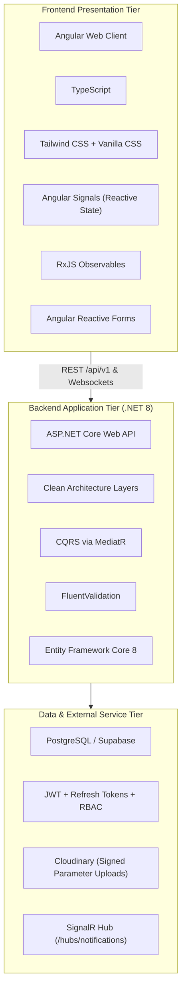
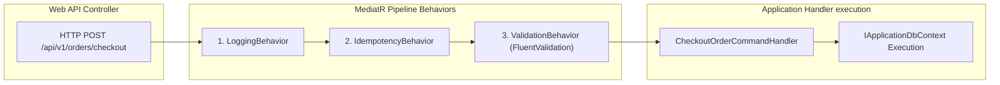
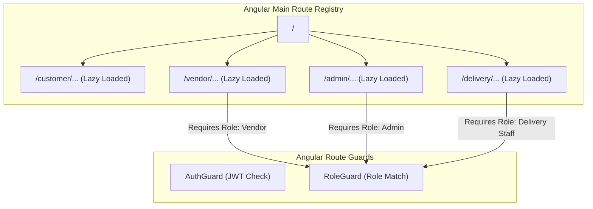
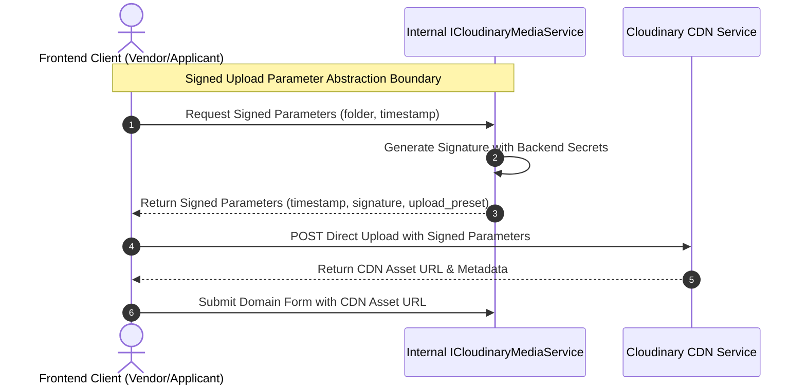

# LocalMart — Low-Level Design (LLD) & Technical Specification

**Document Version:** 1.1 (Architect Review Correction Pass)  
**Phase:** 09 — Low-Level Design (LLD) Specification  
**Status:** Draft / Pending Architect Review  
**Date:** September 12, 2026  
**Primary Target Stack:** ASP.NET Core Web API (C# / .NET 8) & Angular (TypeScript, Tailwind CSS, RxJS, Angular Signals, Reactive Forms)  
**Database Target:** PostgreSQL / Supabase-Managed PostgreSQL  
**Primary Source Document:** `LocalMart_BRD_v1.0(1).md`  
**Consolidated Baselines (Locked):**  
1. [`docs/BRD_BASELINE.md`](file:///d:/new%20e%20commers/docs/BRD_BASELINE.md)  
2. [`docs/SRS.md`](file:///d:/new%20e%20commers/docs/SRS.md)  
3. [`docs/USER_FLOWS_AND_USE_CASES.md`](file:///d:/new%20e%20commers/docs/USER_FLOWS_AND_USE_CASES.md)  
4. [`docs/USE_CASE_SPECIFICATIONS.md`](file:///d:/new%20e%20commers/docs/USE_CASE_SPECIFICATIONS.md)  
5. [`docs/REQUIREMENTS_TRACEABILITY_MATRIX.md`](file:///d:/new%20e%20commers/docs/REQUIREMENTS_TRACEABILITY_MATRIX.md)  
6. [`docs/DATABASE_DESIGN_AND_ERD.md`](file:///d:/new%20e%20commers/docs/DATABASE_DESIGN_AND_ERD.md)  
7. [`docs/API_CONTRACT.md`](file:///d:/new%20e%20commers/docs/API_CONTRACT.md)  
8. [`docs/SYSTEM_ARCHITECTURE.md`](file:///d:/new%20e%20commers/docs/SYSTEM_ARCHITECTURE.md)  
9. [`docs/DETAILED_MODULE_COMPONENT_ARCHITECTURE.md`](file:///d:/new%20e%20commers/docs/DETAILED_MODULE_COMPONENT_ARCHITECTURE.md)  
**Project:** LocalMart — Location-Aware Multi-Vendor E-Commerce Marketplace  

---

## 1. Document Control & Baselines

### 1.1 Purpose
This specification establishes the code-ready Low-Level Design (LLD) for **LocalMart**. It translates the approved System Architecture ([`docs/SYSTEM_ARCHITECTURE.md`](file:///d:/new%20e%20commers/docs/SYSTEM_ARCHITECTURE.md)) and Detailed Module Architecture ([`docs/DETAILED_MODULE_COMPONENT_ARCHITECTURE.md`](file:///d:/new%20e%20commers/docs/DETAILED_MODULE_COMPONENT_ARCHITECTURE.md)) into precise directory layouts, namespace conventions, class/interface blueprints, CQRS command/query contracts, FluentValidation pipeline schemas, EF Core repository abstractions, Angular route/component trees, Signal-based state management topologies, and cross-cutting pipeline specifications.

### 1.2 Document Priority & Traceability Hierarchy
1. Primary Business Source of Truth: [`LocalMart_BRD_v1.0(1).md`](file:///d:/new%20e%20commers/LocalMart_BRD_v1.0%281%29.md)
2. Consolidated Baseline Reference: [`docs/BRD_BASELINE.md`](file:///d:/new%20e%20commers/docs/BRD_BASELINE.md)
3. Software Requirements Specification: [`docs/SRS.md`](file:///d:/new%20e%20commers/docs/SRS.md)
4. User Flows & Use Case Catalog: [`docs/USER_FLOWS_AND_USE_CASES.md`](file:///d:/new%20e%20commers/docs/USER_FLOWS_AND_USE_CASES.md)
5. Formal Use Case Specifications: [`docs/USE_CASE_SPECIFICATIONS.md`](file:///d:/new%20e%20commers/docs/USE_CASE_SPECIFICATIONS.md)
6. Requirements Traceability Matrix: [`docs/REQUIREMENTS_TRACEABILITY_MATRIX.md`](file:///d:/new%20e%20commers/docs/REQUIREMENTS_TRACEABILITY_MATRIX.md)
7. Database Design & ERD: [`docs/DATABASE_DESIGN_AND_ERD.md`](file:///d:/new%20e%20commers/docs/DATABASE_DESIGN_AND_ERD.md)
8. API Contract & Specification: [`docs/API_CONTRACT.md`](file:///d:/new%20e%20commers/docs/API_CONTRACT.md)
9. System Architecture Specification: [`docs/SYSTEM_ARCHITECTURE.md`](file:///d:/new%20e%20commers/docs/SYSTEM_ARCHITECTURE.md)
10. Detailed Module & Component Architecture: [`docs/DETAILED_MODULE_COMPONENT_ARCHITECTURE.md`](file:///d:/new%20e%20commers/docs/DETAILED_MODULE_COMPONENT_ARCHITECTURE.md)

### 1.3 Scope & Strict Non-Goals
* **Included:** Structural C# namespace specifications, MediatR command/query contracts, DTO structural definitions, EF Core mapping interface definitions, Angular directory layout, Signal state declarations, authorization guard contracts, and RFC 7807 error handling specifications.
* **Explicit Non-Goals:** Writing executable C# code, Angular TypeScript source files, SQL migration files, Docker runtime scripts, or live API deployment configurations. This document is strict low-level architectural specification.

---

## 2. Purpose & Architectural Objectives

The LLD specification bridges high-level module architecture and future software implementation by providing developers with explicit contracts, clear class/interface relationships, consistent naming standards, and strict boundary rules without prematurely resolving deferred architectural decisions.

---

## 3. Approved Technology Baseline & Framework Constraints



---

## 4. Backend Directory & Project Solution Structure

The backend follows a standard 4-tier Clean Architecture solution layout (`LocalMart.sln`):

```
LocalMart.sln
├── src/
│   ├── LocalMart.Domain/
│   │   ├── Common/
│   │   │   ├── BaseEntity.cs
│   │   │   ├── ValueObject.cs
│   │   │   └── IDomainEvent.cs
│   │   ├── Entities/
│   │   │   ├── User.cs
│   │   │   ├── Vendor.cs
│   │   │   ├── Product.cs
│   │   │   ├── Order.cs
│   │   │   ├── VendorOrder.cs
│   │   │   ├── OrderItem.cs
│   │   │   ├── Payment.cs
│   │   │   ├── Review.cs
│   │   │   └── Inventory.cs
│   │   ├── Enums/
│   │   │   ├── ProductStatus.cs
│   │   │   ├── VendorOrderStatus.cs
│   │   │   ├── DeliveryStatus.cs
│   │   │   ├── PaymentStatus.cs
│   │   │   └── PaymentMethod.cs
│   │   └── Events/ (Candidate Implementation Events)
│   │       ├── OrderPlacedEvent.cs (Candidate Event)
│   │       ├── VendorApprovedEvent.cs (Candidate Event)
│   │       └── VendorOrderDeliveredEvent.cs (Candidate Event)
│   │
│   ├── LocalMart.Application/
│   │   ├── Common/
│   │   │   ├── Interfaces/
│   │   │   │   ├── IApplicationDbContext.cs
│   │   │   │   ├── IPasswordHasher.cs
│   │   │   │   ├── IJwtTokenGenerator.cs
│   │   │   │   ├── ICloudinaryMediaService.cs
│   │   │   │   ├── ISignalRNotificationService.cs
│   │   │   │   └── ICurrentUserService.cs
│   │   │   ├── Behaviors/
│   │   │   │   ├── ValidationBehavior.cs
│   │   │   │   ├── LoggingBehavior.cs
│   │   │   │   └── IdempotencyBehavior.cs
│   │   │   └── Models/
│   │   │       ├── Result.cs
│   │   │       └── WebhookValidationRequest.cs
│   │   ├── Features/
│   │   │   ├── Auth/
│   │   │   │   ├── Commands/
│   │   │   │   │   ├── RegisterUserCommand.cs
│   │   │   │   │   └── LoginCommand.cs
│   │   │   │   └── Queries/
│   │   │   ├── Products/
│   │   │   │   ├── Commands/
│   │   │   │   └── Queries/
│   │   │   │       └── SearchProductsQuery.cs
│   │   │   ├── Orders/
│   │   │   │   ├── Commands/
│   │   │   │   │   └── CheckoutOrderCommand.cs
│   │   │   │   └── Queries/
│   │   │   └── Vendors/
│   │   │       ├── Commands/
│   │   │       │   └── ApproveVendorApplicationCommand.cs
│   │   │       └── Queries/
│   │   └── DTOs/
│   │
│   ├── LocalMart.Infrastructure/
│   │   ├── Persistence/
│   │   │   ├── ApplicationDbContext.cs
│   │   │   ├── Configurations/
│   │   │   └── Repositories/
│   │   ├── Identity/
│   │   │   ├── PasswordHasherAdapter.cs
│   │   │   └── JwtTokenGenerator.cs
│   │   ├── Services/
│   │   │   ├── CloudinaryMediaService.cs
│   │   │   └── LocationService.cs
│   │   └── SignalR/
│   │       ├── NotificationHub.cs
│   │       └── SignalRNotificationService.cs
│   │
│   └── LocalMart.WebAPI/
│       ├── Controllers/
│       │   ├── AuthController.cs
│       │   ├── ProductsController.cs
│       │   ├── OrdersController.cs
│       │   └── AdminVendorsController.cs
│       ├── Middleware/
│       │   └── ExceptionHandlingMiddleware.cs
│       └── Program.cs
└── tests/
```

---

## 5. Frontend Directory & Feature Structure

The frontend application follows an Angular modular architecture partitioned into Core, Shared, and Feature modules:

```
src/app/
├── core/
│   ├── guards/
│   │   ├── auth.guard.ts
│   │   ├── role.guard.ts
│   │   └── permission.guard.ts
│   ├── interceptors/
│   │   ├── jwt.interceptor.ts
│   │   └── error.interceptor.ts
│   ├── services/
│   │   ├── auth.service.ts
│   │   ├── signalr.service.ts
│   │   ├── cart.service.ts
│   │   └── notification.service.ts
│   └── state/
│       ├── auth-user.signal.ts
│       └── active-cart.signal.ts
│
├── shared/
│   ├── components/
│   │   ├── navbar/
│   │   ├── footer/
│   │   ├── product-card/
│   │   ├── status-badge/
│   │   └── star-rating/
│   ├── directives/
│   └── pipes/
│
├── features/
│   ├── auth/
│   │   ├── pages/login/
│   │   ├── pages/register/
│   │   └── auth.routes.ts
│   ├── customer/
│   │   ├── pages/catalog/
│   │   ├── pages/product-detail/
│   │   ├── pages/cart/
│   │   ├── pages/checkout/
│   │   ├── pages/order-history/
│   │   └── customer.routes.ts
│   ├── vendor/
│   │   ├── pages/store-profile/
│   │   ├── pages/inventory-management/
│   │   ├── pages/sub-orders/
│   │   └── vendor.routes.ts
│   ├── admin/
│   │   ├── pages/vendor-applications/
│   │   ├── pages/catalog-moderation/
│   │   ├── pages/commission-management/
│   │   └── admin.routes.ts
│   └── delivery/
│       ├── pages/assignment-list/
│       ├── pages/delivery-details/
│       └── delivery.routes.ts
│
├── app.component.ts
├── app.config.ts
└── app.routes.ts
```

---

## 6. Backend Domain Layer LLD Specifications

### 6.1 Base Classes & Candidate Domain Events
* `BaseEntity<TKey>`: Abstract base containing `Id` (UUID/bigint), `CreatedAt` (`timestamptz`), `UpdatedAt` (`timestamptz`), and a protected collection of `IDomainEvent` triggers. *(Note: Universal `CreatedBy`/`UpdatedBy` columns are excluded to match ERD specifications; administrative operations write immutable audit records to `audit_logs`)*.
* `ValueObject`: Base record for structural immutability (e.g. `AddressValueObject`, `MoneyValueObject`).
* **Candidate Domain Events (Design Options):** `OrderPlacedEvent`, `VendorApprovedEvent`, `VendorOrderDeliveredEvent` are specified as candidate domain events to support asynchronous decoupled handling, rather than mandatory locked domain contracts.

### 6.2 Canonical Enums Specification
* **ProductStatus:** `Draft`, `Active`, `Inactive`, `OutOfStock`, `Suspended`.
* **VendorOrderStatus:** `Pending`, `Confirmed`, `Preparing`, `ReadyForPickup`, `PickedUp`, `OutForDelivery`, `Delivered`, `Cancelled`, `Rejected`, `FailedDelivery`, `Refunded`.
* **DeliveryStatus:** `Ready`, `Assigned`, `PickedUp`, `OutForDelivery`, `Delivered`, `FailedDelivery`.
* **PaymentStatus:** `Pending`, `Processing`, `Paid`, `Failed`, `Refunded`.
* **PaymentMethod:** `COD`, `Online`.

---

## 7. Backend Application Layer LLD / MediatR CQRS Contracts

The Application layer implements use cases strictly partitioned into Commands (write state) and Queries (read-only views) processed via MediatR.



### 7.1 Key CQRS Command/Query Specifications

#### Public User Registration (Role Pre-Assigned to Customer)
* `RegisterUserCommand`: Inputs: `Email`, `Password`, `FirstName`, `LastName`, `PhoneNumber`. *(Note: Public registration strictly assigns the `Customer` role by default. Clients CANNOT submit a privileged role claim such as `Admin`, `Vendor`, or `Delivery`)*.
  - **Role Provisioning Governance:**
    1. **Customer:** Assigned automatically upon public registration.
    2. **Vendor:** Granted exclusively via Admin approval of a Vendor Application (`POST /api/v1/admin/vendors/applications/{id}/approve`).
    3. **Admin & Delivery Staff:** Provisioned exclusively through controlled administrative management flows.

#### Product Search & Discovery
* `SearchProductsQuery`: Inputs: `SearchTerm`, `CategoryId`, `Latitude`, `Longitude`, `RadiusKm`, `MinPrice`, `MaxPrice`, `PageNumber`, `PageSize`.

#### Checkout Execution
* `CheckoutOrderCommand`: Inputs: `CustomerAddressId`, `PaymentMethod`, `CouponCode`, `CartItems[]`, Header: `Idempotency-Key`.

#### Admin Vendor Approval
* `ApproveVendorApplicationCommand`: Canonical Route: `POST /api/v1/admin/vendors/applications/{id}/approve`. Inputs: `ApplicationId`, `AdminNotes`.

---

## 8. Backend Infrastructure Layer LLD Specifications

### 8.1 Password Hashing Abstraction
* **Interface Specification:** `IPasswordHasher`
  - Method: `string HashPassword(string plainTextPassword)`
  - Method: `bool VerifyPassword(string plainTextPassword, string hashedPassword)`
* **Architectural Constraint:** The concrete implementation (`PasswordHasherAdapter`) wraps a secure, industry-standard password hashing library. Specific algorithm selection (e.g. `Argon2` vs `BCrypt`) and parameters (work factors) remain deferred implementation choices.

### 8.2 Inventory Management Abstraction
* **Interface Specification:** `IInventoryService`
  - Method: `Task<bool> ValidateAndReserveStockAsync(List<OrderItemReservation> items, CancellationToken ct)`
  - Method: `Task ReleaseStockReservationAsync(Guid vendorOrderId, CancellationToken ct)`
* **Architectural Constraint:** Conceptual abstraction only. Exact transaction isolation levels, DB locking mechanics (pessimistic vs optimistic), hold timeouts, and background cleanup scheduling remain deferred.

### 8.3 Provider-Neutral Payment Abstraction
* **Interface Specification:** `IPaymentGatewayAdapter`
  - Method: `Task<PaymentSessionResult> InitiatePaymentSessionAsync(PaymentInitiationRequest request, CancellationToken ct)`
  - Method: `Task<PaymentWebhookValidationResult> ValidateWebhookSignatureAsync(WebhookValidationRequest request, CancellationToken ct)`
* **Framework Neutrality:** `WebhookValidationRequest` is a framework-neutral DTO containing `RawPayload` (string/bytes) and `NormalizedHeaders` (`IDictionary<string, string>`). ASP.NET Core `IHeaderDictionary` is NOT exposed in the Application layer.
* **Supported Payment Methods:** `COD`, `Online`. Gateway provider selection (Stripe vs local provider) remains deferred.

### 8.4 Location Service Abstraction
* **Interface Specification:** `ILocationService`
  - Method: `double CalculateDistanceKm(double lat1, double lon1, double lat2, double lon2)`
  - Method: `Task<GeocodingResult> ResolveAddressCoordinatesAsync(string addressString, CancellationToken ct)`
* **Architectural Constraint:** Maps provider selection (Google Maps / Mapbox / OSM) and PostGIS spatial indexing remain deferred.

---

## 9. Backend Web API Layer LLD Specifications

Controllers inherit from a base `ApiController` exposing `ISender` MediatR instance. Routes explicitly mirror the exact paths established in [`docs/API_CONTRACT.md`](file:///d:/new%20e%20commers/docs/API_CONTRACT.md).

### 9.1 Representative Controller Method Signatures with Explicit Canonical Routes

#### AuthController
```csharp
namespace LocalMart.WebAPI.Controllers;

[ApiController]
[Route("api/v1/auth")]
public class AuthController : ApiController
{
    [HttpPost("register")]
    [AllowAnonymous]
    [ProducesResponseType(typeof(AuthResponseDto), StatusCodes.Status201Created)]
    [ProducesResponseType(typeof(ProblemDetails), StatusCodes.Status400BadRequest)]
    public async Task<IActionResult> Register([FromBody] UserRegisterRequestDto request, CancellationToken ct)
    {
        // Maps request to RegisterUserCommand (Role is strictly forced to Customer)
        var command = new RegisterUserCommand(request.Email, request.Password, request.FirstName, request.LastName, request.PhoneNumber);
        var result = await Mediator.Send(command, ct);
        return CreatedAtAction(nameof(GetCurrentUserProfile), result);
    }
}
```

#### OrdersController
```csharp
namespace LocalMart.WebAPI.Controllers;

[ApiController]
[Route("api/v1/orders")]
public class OrdersController : ApiController
{
    [HttpPost("checkout")]
    [Authorize(Roles = "Customer")]
    [ProducesResponseType(typeof(OrderCheckoutResponseDto), StatusCodes.Status201Created)]
    [ProducesResponseType(typeof(ProblemDetails), StatusCodes.Status400BadRequest)]
    public async Task<IActionResult> Checkout(
        [FromBody] OrderCheckoutRequestDto request,
        [FromHeader(Name = "Idempotency-Key")] string idempotencyKey,
        CancellationToken ct)
    {
        var command = new CheckoutOrderCommand(request, idempotencyKey);
        var result = await Mediator.Send(command, ct);
        return CreatedAtAction(nameof(GetOrderById), new { id = result.ParentOrderId }, result);
    }
}
```

#### AdminVendorsController (Canonical Vendor Approval Route)
```csharp
namespace LocalMart.WebAPI.Controllers;

[ApiController]
[Route("api/v1/admin/vendors")]
public class AdminVendorsController : ApiController
{
    [HttpPost("applications/{id:guid}/approve")]
    [Authorize(Roles = "Admin")]
    [ProducesResponseType(typeof(VendorApplicationApprovalResponseDto), StatusCodes.Status200OK)]
    [ProducesResponseType(typeof(ProblemDetails), StatusCodes.Status400BadRequest)]
    public async Task<IActionResult> ApproveApplication(
        [FromRoute] Guid id,
        [FromBody] ApproveVendorApplicationRequestDto request,
        CancellationToken ct)
    {
        var command = new ApproveVendorApplicationCommand(id, request.Notes);
        var result = await Mediator.Send(command, ct);
        return Ok(result);
    }
}
```

---

## 10. Frontend Core & Shared Layer LLD Specifications

### 10.1 Angular Signal-Based State Store (Auth & Cart)
* `AuthUserSignal`: Stores current user token, role claims, and authentication state (`signal<AuthUserState>`).
* `ActiveCartSignal`: Computed Signal (`computed()`) deriving multi-vendor cart item count, vendor sub-totals, and grand total.

### 10.2 HTTP Interceptors & Framework Authentication
* `JwtInterceptor`: Automatically attaches `Authorization: Bearer <token>` to outgoing `/api/v1/` requests.
* `ErrorInterceptor`: Intercepts RFC 7807 error responses, showing toast alerts for `400`/`500` and redirecting `401` to login.
* **Security Framework:** ASP.NET Core JWT Bearer authentication middleware + standard authorization policy engine (`[Authorize(Roles = "...")]`). Custom authentication middleware is omitted.

---

## 11. Frontend Feature Portal LLD Specifications



---

## 12. Cross-Cutting Pipeline Specifications

* **LoggingBehavior:** Logs request execution time, user ID, and command payload summaries.
* **ValidationBehavior:** Intercepts request via FluentValidation rules prior to handler invocation, throwing `ValidationException` on rule failure.
* **AuditBehavior:** Automatically records state-changing administrative operations to `audit_logs`.

---

## 13. Cloudinary Signed Upload LLD Flow

Signed parameter generation is specified as an internal service boundary abstraction (`ICloudinaryMediaService`). Client API routes exposing signed parameters are classified as candidate integration routes requiring future API Contract approval.



* **Security Guardrail:** Backend API credentials/secrets are never exposed to frontend clients. Direct client upload to Cloudinary is required.

---

## 14. SignalR Notification Dispatch LLD Blueprint

* **Hub Contract:** `NotificationHub` at route `/hubs/notifications`.
* **Typed Client Interface:** `INotificationClient`
  - `Task ReceiveNotification(NotificationPayloadDto notification);`
  - `Task OrderStatusUpdated(OrderStatusUpdateDto update);`
* **Scaling Strategy:** Distributed scaling and Redis backplane strategies remain deferred. Current specification defines hub contracts only.

---

## 15. Database Access & Repository Abstraction

* `IApplicationDbContext`: Exposes `DbSet<T>` for all 35 normalized ERD entities (`users`, `vendors`, `products`, `orders`, `vendor_orders`, `order_items`, `payments`, `reviews`, etc.).
* **Entity Framework Core Column Precision:** Configured via Fluent API (`IEntityTypeConfiguration<T>`) mapping relationships, foreign key constraints, and specific column precision for monetary fields (`numeric(12,2)`) as defined in [`docs/DATABASE_DESIGN_AND_ERD.md`](file:///d:/new%20e%20commers/docs/DATABASE_DESIGN_AND_ERD.md).

---

## 16. API Request/Response DTO Specifications

All DTO schemas strictly match the definitions in [`docs/API_CONTRACT.md`](file:///d:/new%20e%20commers/docs/API_CONTRACT.md).

### 16.1 Key DTO Structs
* `UserRegisterRequestDto`: `email`, `password`, `firstName`, `lastName`, `phoneNumber`. *(Role omitted; public registration is Customer only)*.
* `VendorApplicationRequestDto`: `businessName`, `taxId`, `contactPhone`, `businessAddress`, `documentUrls[]`. *(Credentials/applicantPassword omitted; applications reference registered user account)*.
* `OrderCheckoutRequestDto`: `customerAddressId`, `paymentMethod`, `couponCode`, `items[]`.
* `OrderCheckoutResponseDto`: `parentOrderId`, `orderNumber`, `grandTotal`, `paymentStatus`, `vendorSubOrders[]`.
* `ApproveVendorApplicationRequestDto`: `notes`.

---

## 17. Authorization Guard & Permission Policy LLD

### 17.1 ASP.NET Core Policy Registrations
* `RequireAdminPolicy`: Requires `Role == "Admin"`.
* `RequireVendorPolicy`: Requires `Role == "Vendor"`.
* `RequireCustomerPolicy`: Requires `Role == "Customer"`.
* `RequireDeliveryStaffPolicy`: Requires `Role == "Delivery Staff"`.
* `ManageCatalogPermissionPolicy`: Requires permission claim `permissions.catalog.manage`.

---

## 18. Resilience & Error Handling Specifications

* **Standardized Problem Details (RFC 7807):** All API errors return structured JSON matching RFC 7807 specs (`type`, `title`, `status`, `detail`, `instance`, `errors`).
* **Provider-Neutral Resilience:** Safe failure handling, request timeouts, duplicate event protection via `Idempotency-Key` headers, and external integration failure isolation.
* **Idempotency Storage:** Storage mechanism (cache/database/Redis) and retention policies remain deferred.

---

## 19. Complete Phase 09 Traceability Matrix

| Phase 08 Module | Business Rules | Functional Requirements | Use Cases | API Routes | ERD Entity Mappings |
|---|---|---|---|---|---|
| `AuthAndAccountModule` | `BR-001`, `BR-002` | `FR-AUTH-001..006` | `UC-001`, `UC-002` | `POST /api/v1/auth/register`, `POST /api/v1/auth/login` | `users`, `refresh_tokens`, `roles`, `user_roles` |
| `ProductDiscoveryAndSearchModule`| `BR-003`, `BR-005` | `FR-SCH-001..004` | `UC-003`, `UC-004` | `GET /api/v1/products/search`, `GET /api/v1/categories` | `products`, `vendors`, `categories`, `search_logs` |
| `CatalogModule` | `BR-005`, `BR-006` | `FR-CAT-001..004`, `FR-PROD-001..005` | `UC-004`, `UC-011` | `GET /api/v1/categories`, `POST /api/v1/vendor/products` | `categories`, `products`, `product_images` |
| `CartModule` | `BR-004`, `BR-007` | `FR-CRT-001..004` | `UC-005` | `GET /api/v1/cart`, `POST /api/v1/cart/items` | `carts`, `cart_items` |
| `MultiVendorOrderModule` | `BR-004`, `BR-008`, `BR-009` | `FR-ORD-001..008` | `UC-006`, `UC-007`, `UC-013` | `POST /api/v1/orders/checkout`, `GET /api/v1/vendor/orders` | `orders`, `vendor_orders`, `order_items` |
| `PaymentModule` | `BR-009` | `FR-PAY-001..005` | `UC-006`, `UC-017` | `POST /api/v1/payments`, `POST /api/v1/webhooks/payments` | `payments`, `payment_transactions` |
| `AddressModule` | `BR-003` | `FR-ADDR-001..003` | `UC-006` | `GET /api/v1/customer/addresses` | `customer_addresses` |
| `ReviewModule` | `BR-011` | `FR-REV-001..004` | `UC-008`, `UC-023` | `POST /api/v1/products/{id}/reviews` | `reviews` |
| `CouponModule` | `BR-012` | `FR-CPN-001..005` | `UC-006`, `UC-020` | `POST /api/v1/coupons/validate` | `coupons`, `coupon_usages` |
| `NotificationModule` | `BR-008`, `BR-010` | `FR-NOT-001..004` | `UC-007`, `UC-013` | `GET /api/v1/notifications`, `/hubs/notifications` | `notifications` |
| `VendorApplicationModule` | `BR-013` | `FR-VND-001..003` | `UC-009`, `UC-018` | `POST /api/v1/vendors/applications`, `POST /api/v1/admin/vendors/applications/{id}/approve` | `vendor_applications`, `vendors` |
| `VendorStoreModule` | `BR-003`, `BR-006` | `FR-VND-004..006` | `UC-010` | `GET /api/v1/vendor/profile`, `PUT /api/v1/vendor/profile` | `vendors` |
| `VendorInventoryModule` | `BR-009` | `FR-INV-001..004` | `UC-012` | `GET /api/v1/vendor/inventory`, `PUT /api/v1/vendor/inventory` | `inventory`, `inventory_logs` |
| `VendorCommissionModule` | `BR-014` | `FR-FIN-001..004` | `UC-014`, `UC-021` | `GET /api/v1/vendor/earnings`, `GET /api/v1/admin/commissions` | `vendor_commissions`, `vendor_payouts` |
| `AdminUserManagementModule` | `BR-001`, `BR-015` | `FR-ADM-001..004` | `UC-019` | `GET /api/v1/admin/users`, `PUT /api/v1/admin/users/{id}/status` | `users`, `roles`, `user_roles` |
| `AuditAndSearchLogModule` | `BR-015` | `FR-AUD-001..003`, `FR-SCH-004` | `UC-003`, `UC-024` | `GET /api/v1/admin/audit-logs` | `audit_logs`, `search_logs` |
| `DeliveryModule` | `BR-010` | `FR-DEL-001..006` | `UC-015`, `UC-016` | `GET /api/v1/delivery/assignments`, `PUT /api/v1/delivery/assignments/{id}/status` | `delivery_assignments` |
| `SecurityModule` | `BR-001`, `BR-002` | `FR-AUTH-004` | `UC-001`, `UC-002` | Middleware Tier (`Authorization: Bearer <JWT>`) | `users`, `roles`, `permissions` |
| `MediaUploadModule` | `BR-005`, `BR-013` | `FR-PROD-001`, `FR-VND-001` | `UC-009`, `UC-011` | Integration Boundary (`ICloudinaryMediaService`) | `product_images`, `vendors` |
| `IdempotencyModule` | `BR-008`, `BR-009` | `NFR-REL-002` | `UC-006`, `UC-017` | Header Tier (`Idempotency-Key`) | Idempotency Storage |

---

## 20. 14 Deferred Technical Decisions Index

The following 14 technical decisions remain explicitly **DEFERRED**:

1. External payment provider selection (Stripe vs local provider).
2. Maps API provider (Google Maps vs Mapbox vs OSM).
3. PostGIS spatial index evaluation.
4. SignalR Redis backplane & real-time scaling topology.
5. Inventory hold expiration timeout & background worker mechanics.
6. Password hashing algorithm parameters (`Argon2`/`BCrypt` work factor).
7. Commission calculation financial base (gross vs net).
8. Database connection pooling strategy (PgBouncer vs EF Core internal).
9. Partial multi-vendor refund mechanics.
10. Vendor reapplication mechanics & cooldown policy.
11. Jurisdiction-specific vendor verification rules.
12. PostgreSQL RLS policy mechanics.
13. Database deployment & replication topology.
14. Idempotency key storage engine & retention policy.

---

## 21. MVP Scope Protection Guardrails

The following explicit non-goals remain strictly enforced as **OUT OF MVP SCOPE**:
* ❌ No AI semantic search or AI recommendation engines.
* ❌ No `pgvector` or vector embedding implementations.
* ❌ No live driver GPS streaming or continuous location tracking.
* ❌ No OTP-based delivery verification (Candidate future enhancement; OUT OF CURRENT BASELINE SCOPE).
* ❌ No native mobile apps (iOS / Android) or mandatory PWA requirement.
* ❌ No multi-currency or cryptocurrency support.
* ❌ No international shipping or cross-border tax calculation.
* ❌ No Redis caching or Redis backplane requirement.
* ❌ No multi-branch vendor store implementations.

---

## 22. Phase 09 Validation & Status

Phase 09 Documentation Status: READY FOR ARCHITECT REVIEW
