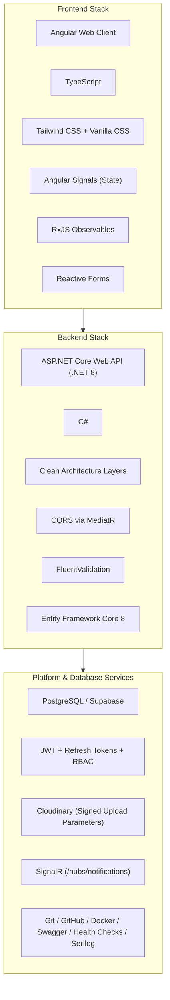
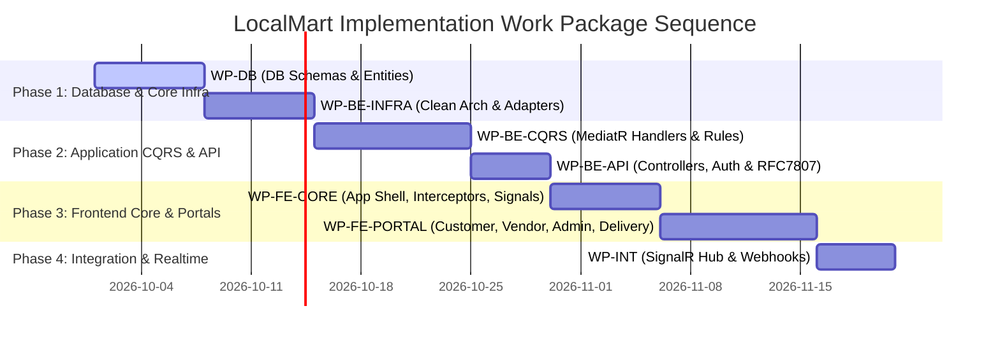

# LocalMart — Phase 10 Documentation Plan: Implementation Readiness & Development Work Package Specification

**Document Version:** 1.0  
**Phase:** 10 — Implementation Readiness & Development Work Package Planning  
**Status:** Proposal / Pending Architect Review  
**Date:** September 12, 2026  
**Primary Target Stack:** ASP.NET Core Web API (C# / .NET 8) & Angular (TypeScript, Tailwind CSS, RxJS, Angular Signals, Reactive Forms)  
**Database Target:** PostgreSQL / Supabase-Managed PostgreSQL  
**Primary Source Document:** `LocalMart_BRD_v1.0(1).md`  
**Consolidated Baselines (Locked):**  
1. [`docs/BRD_BASELINE.md`](file:///d:/new%20e%20commers/docs/BRD_BASELINE.md) (Phase 00 Baseline)  
2. [`docs/SRS.md`](file:///d:/new%20e%20commers/docs/SRS.md) (Phase 01 Baseline)  
3. [`docs/USER_FLOWS_AND_USE_CASES.md`](file:///d:/new%20e%20commers/docs/USER_FLOWS_AND_USE_CASES.md) (Phase 02 Baseline)  
4. [`docs/USE_CASE_SPECIFICATIONS.md`](file:///d:/new%20e%20commers/docs/USE_CASE_SPECIFICATIONS.md) (Phase 03 Baseline)  
5. [`docs/REQUIREMENTS_TRACEABILITY_MATRIX.md`](file:///d:/new%20e%20commers/docs/REQUIREMENTS_TRACEABILITY_MATRIX.md) (Phase 04 Baseline)  
6. [`docs/DATABASE_DESIGN_AND_ERD.md`](file:///d:/new%20e%20commers/docs/DATABASE_DESIGN_AND_ERD.md) (Phase 05 Baseline)  
7. [`docs/API_CONTRACT.md`](file:///d:/new%20e%20commers/docs/API_CONTRACT.md) (Phase 06 Baseline)  
8. [`docs/SYSTEM_ARCHITECTURE.md`](file:///d:/new%20e%20commers/docs/SYSTEM_ARCHITECTURE.md) (Phase 07 Baseline)  
9. [`docs/DETAILED_MODULE_COMPONENT_ARCHITECTURE.md`](file:///d:/new%20e%20commers/docs/DETAILED_MODULE_COMPONENT_ARCHITECTURE.md) (Phase 08 Baseline)  
10. [`docs/LOW_LEVEL_DESIGN_SPECIFICATION.md`](file:///d:/new%20e%20commers/docs/LOW_LEVEL_DESIGN_SPECIFICATION.md) (Phase 09 Baseline)  
**Project:** LocalMart — Location-Aware Multi-Vendor E-Commerce Marketplace  

---

## 1. Executive Summary & Purpose

The purpose of Phase 10 is to create the formal **Implementation Readiness & Development Work Package Specification** for LocalMart (`docs/IMPLEMENTATION_READINESS_WORK_PACKAGES.md`).

Building upon the approved Low-Level Design Specification ([`docs/LOW_LEVEL_DESIGN_SPECIFICATION.md`](file:///d:/new%20e%20commers/docs/LOW_LEVEL_DESIGN_SPECIFICATION.md)), Phase 10 maps the LLD specifications into discrete, ordered, implementation-ready Work Packages (WPs). Each Work Package will define clear acceptance criteria, dependencies, technical scope, testing criteria, Definition of Done (DoD), and complete 10-tier traceability from business requirements down to execution units.

This document remains a **DOCUMENTATION-ONLY** plan. No source code, SQL migrations, EF Core schema changes, or live configurations will be generated in Phase 10.

---

## 2. Priority Hierarchy & Authoritative Inputs

Phase 10 is derived strictly from the 10 approved and locked baseline artifacts:

1. [`LocalMart_BRD_v1.0(1).md`](file:///d:/new%20e%20commers/LocalMart_BRD_v1.0%281%29.md) (Primary Business Source)
2. [`docs/BRD_BASELINE.md`](file:///d:/new%20e%20commers/docs/BRD_BASELINE.md) (Consolidated BRD Baseline)
3. [`docs/SRS.md`](file:///d:/new%20e%20commers/docs/SRS.md) (Software Requirements Specification)
4. [`docs/USER_FLOWS_AND_USE_CASES.md`](file:///d:/new%20e%20commers/docs/USER_FLOWS_AND_USE_CASES.md) (User Flows Catalog)
5. [`docs/USE_CASE_SPECIFICATIONS.md`](file:///d:/new%20e%20commers/docs/USE_CASE_SPECIFICATIONS.md) (Formal Use Cases `UC-001..024`)
6. [`docs/REQUIREMENTS_TRACEABILITY_MATRIX.md`](file:///d:/new%20e%20commers/docs/REQUIREMENTS_TRACEABILITY_MATRIX.md) (Requirements Matrix)
7. [`docs/DATABASE_DESIGN_AND_ERD.md`](file:///d:/new%20e%20commers/docs/DATABASE_DESIGN_AND_ERD.md) (35 Normalized ERD Entities)
8. [`docs/API_CONTRACT.md`](file:///d:/new%20e%20commers/docs/API_CONTRACT.md) (RESTful OpenAPI Specification `/api/v1`)
9. [`docs/SYSTEM_ARCHITECTURE.md`](file:///d:/new%20e%20commers/docs/SYSTEM_ARCHITECTURE.md) (Clean Architecture & Solution Blueprint)
10. [`docs/DETAILED_MODULE_COMPONENT_ARCHITECTURE.md`](file:///d:/new%20e%20commers/docs/DETAILED_MODULE_COMPONENT_ARCHITECTURE.md) (20 Business Modules & Boundaries)
11. [`docs/LOW_LEVEL_DESIGN_SPECIFICATION.md`](file:///d:/new%20e%20commers/docs/LOW_LEVEL_DESIGN_SPECIFICATION.md) (Code-Ready LLD Blueprint)

---

## 3. Approved Technology Baseline & Framework Tooling

Phase 10 enforces the approved, immutable technology baseline:

---

## 4. Scope & Strict Non-Goals

### 4.1 Included Scope (Documentation Planning)
* Decomposition of LLD into discrete Work Packages across Database, Backend Core, CQRS Commands/Queries, Web API, Frontend Core, and Feature Portals.
* Formal DAG (Directed Acyclic Graph) dependency mapping and sequencing of execution units.
* Testing strategy definition (Unit test boundaries, Integration test setup specs, E2E test scenario specs).
* Definition of Done (DoD) criteria per Work Package tier.
* Risk and dependency tracking matrix.
* 10-Tier end-to-end traceability matrix.

### 4.2 Explicit Non-Goals (No Source Code / No Migrations)
* ❌ NO executable C# classes, controllers, or EF Core DbContext entities.
* ❌ NO TypeScript source files, Angular components, HTML templates, or CSS styling.
* ❌ NO SQL DDL/DML scripts or EF Core `Migrations/` folders.
* ❌ NO Supabase live database project setup or schema execution.
* ❌ NO Docker runtime scripts, `docker-compose.yml`, or CI/CD YAML pipelines.

---

## 5. Work Package Structure & Organization

Phase 10 will define 7 primary Work Package categories:

```mermaid
flowchart LR
    WP1["1. Database & Persistence WPs\n(WP-DB-001..004)"]
    WP2["2. Backend Infrastructure WPs\n(WP-BE-INFRA-001..005)"]
    WP3["3. Backend CQRS Feature WPs\n(WP-BE-CQRS-001..008)"]
    WP4["4. Web API & Security WPs\n(WP-BE-API-001..004)"]
    WP5["5. Frontend Core & Shared WPs\n(WP-FE-CORE-001..004)"]
    WP6["6. Frontend Feature Portal WPs\n(WP-FE-PORTAL-001..005)"]
    WP7["7. Real-Time & Integration WPs\n(WP-INT-001..003)"]

    WP1 --> WP2
    WP2 --> WP3
    WP3 --> WP4
    WP4 --> WP5
    WP5 --> WP6
    WP6 --> WP7
```

### Proposed Work Package Breakdown:

#### 1. Database & Persistence Work Packages (WP-DB)
* `WP-DB-001`: Core Identity & Auth Schema Configuration (`users`, `roles`, `permissions`, `refresh_tokens`).
* `WP-DB-002`: Vendor & Catalog Schema Configuration (`vendors`, `categories`, `products`, `product_images`, `inventory`).
* `WP-DB-003`: Order & Payment Schema Configuration (`orders`, `vendor_orders`, `order_items`, `payments`, `customer_addresses`).
* `WP-DB-004`: Reviews, Coupons & Governance Schema (`reviews`, `coupons`, `notifications`, `audit_logs`, `search_logs`).

#### 2. Backend Core & Infrastructure Work Packages (WP-BE-INFRA)
* `WP-BE-INFRA-001`: Clean Architecture Base Classes (`BaseEntity`, `ValueObject`, `Result<T>`).
* `WP-BE-INFRA-002`: Identity & Password Hashing Abstraction (`IPasswordHasher`, `IJwtTokenGenerator`).
* `WP-BE-INFRA-003`: Media Integration Abstraction (`ICloudinaryMediaService` signed parameter generator).
* `WP-BE-INFRA-004`: Location Service Abstraction (`ILocationService` distance calculation).
* `WP-BE-INFRA-005`: Payment Gateway Abstraction (`IPaymentGatewayAdapter`, `WebhookValidationRequest`).

#### 3. Backend CQRS Commands & Queries Work Packages (WP-BE-CQRS)
* `WP-BE-CQRS-001`: User Auth CQRS Handlers (Public Registration with forced `Customer` role, Login, Refresh Token).
* `WP-BE-CQRS-002`: Vendor Onboarding CQRS Handlers (Application Submission, Admin Application Approval).
* `WP-BE-CQRS-003`: Product Catalog & Search CQRS Handlers (Catalog CRUD, Location-filtered Search).
* `WP-BE-CQRS-004`: Shopping Cart CQRS Handlers (Add, Update, Remove, View Cart).
* `WP-BE-CQRS-005`: Multi-Vendor Order & Checkout CQRS Handlers (Checkout execution, Parent/Sub-order splitting, Stock reservation).
* `WP-BE-CQRS-006`: Payment & Webhook CQRS Handlers (Initiate Payment, Process Webhook safely).
* `WP-BE-CQRS-007`: Delivery Assignment CQRS Handlers (Assignment creation, Status transition to Delivered).
* `WP-BE-CQRS-008`: Reviews, Coupons & Financial Visibility CQRS Handlers.

#### 4. Backend Web API & Security Work Packages (WP-BE-API)
* `WP-BE-API-001`: REST Controllers Routing & OpenAPI Specifications (`/api/v1`).
* `WP-BE-API-002`: ASP.NET Core JWT Bearer & RBAC Authorization Policy Setup (`RequireAdmin`, `RequireVendor`, etc.).
* `WP-BE-API-003`: MediatR Pipeline Behaviors (`LoggingBehavior`, `ValidationBehavior`, `IdempotencyBehavior`).
* `WP-BE-API-004`: RFC 7807 Problem Details Global Exception Handling Middleware.

#### 5. Frontend Core & Shared Component Work Packages (WP-FE-CORE)
* `WP-FE-CORE-001`: Angular Application Shell & Modular Structure Setup.
* `WP-FE-CORE-002`: HTTP Interceptors (`JwtInterceptor`, `ErrorInterceptor`).
* `WP-FE-CORE-003`: Signal-Based State Stores (`AuthUserSignal`, `ActiveCartSignal`).
* `WP-FE-CORE-004`: Reusable Shared UI Components (Product Card, Status Badge, Star Rating, Navbar).

#### 6. Frontend Feature Portal Work Packages (WP-FE-PORTAL)
* `WP-FE-PORTAL-001`: Customer Portal Feature Module (Catalog, Product Details, Cart, Multi-Vendor Checkout, Orders).
* `WP-FE-PORTAL-002`: Vendor Portal Feature Module (Store Profile, Product Catalog Mgmt, Inventory, Sub-Orders).
* `WP-FE-PORTAL-003`: Admin Portal Feature Module (Vendor App Approval, Catalog Moderation, User Mgmt, Audit Logs).
* `WP-FE-PORTAL-004`: Delivery Staff Web Client Feature Module (Assignments, Pickup, Delivery Confirmation).
* `WP-FE-PORTAL-005`: Angular Route Guards (`AuthGuard`, `RoleGuard`, `PermissionGuard`).

#### 7. Real-Time & Integration Work Packages (WP-INT)
* `WP-INT-001`: SignalR Notification Hub (`/hubs/notifications`) & Typed Client Handlers.
* `WP-INT-002`: Cloudinary Direct Client Upload Integration Flow.
* `WP-INT-003`: Payment Gateway Webhook Integration Boundary.

---

## 6. Implementation Sequencing & Dependency Graph

---

## 7. Definition of Done (DoD) Criteria

Every Work Package specification in Phase 10 will define mandatory DoD criteria across 4 dimensions:

1. **Architecture & Contract Compliance:**
   - Strict adherence to Clean Architecture layers and CQRS boundaries.
   - Exact route matching against [`docs/API_CONTRACT.md`](file:///d:/new%20e%20commers/docs/API_CONTRACT.md).
   - Zero exposure of API secrets or database entities directly to client portals.
2. **Quality & Validation Standards:**
   - 100% request validation coverage via FluentValidation.
   - RFC 7807 Problem Details response formatting for all failure states.
3. **Traceability Compliance:**
   - Evidence-based mapping back to BRD rules, SRS requirements, and Use Case specifications.
4. **Security & Authorization Compliance:**
   - Enforcement of JWT Bearer authentication and policy guards.
   - Customer account isolation and vendor store data isolation verified.

---

## 8. Preserved 14 Deferred Technical Decisions Index

Phase 10 explicitly preserves all 14 deferred decisions without resolving them:

1. **External Payment Provider Selection:** Gateway selection (Stripe vs local provider) remains deferred.
2. **Maps API Provider:** Provider selection (Google Maps vs Mapbox vs OSM) remains deferred.
3. **PostGIS Evaluation:** Spatial indexing engine selection remains deferred.
4. **SignalR Backplane & Real-Time Scaling:** Redis backplane / scaling topology remains deferred.
5. **Inventory Hold Expiration Mechanics:** Background worker scheduling mechanism remains deferred.
6. **Password Hashing Parameters:** Algorithm selection (`Argon2`/`BCrypt` work factor) remains deferred.
7. **Commission Calculation Base:** Gross vs net financial calculation base remains deferred.
8. **Database Connection Pooling:** PgBouncer vs EF Core internal pooling configuration remains deferred.
9. **Partial Multi-Vendor Refund Mechanics:** Detailed partial refund calculation logic remains deferred.
10. **Vendor Reapplication Mechanics:** Application cooldown period and policy remain deferred.
11. **Jurisdiction-Specific Vendor Verification:** Business registration verification details remain deferred.
12. **PostgreSQL RLS Policies:** Row Level Security policy implementation details remain deferred.
13. **Database Deployment & Replication:** Primary-replica topology and failover strategy remain deferred.
14. **Idempotency Key Storage:** Key storage engine and retention lifecycle remain deferred.

---

## 9. MVP Scope Protection Guardrails

The following non-goals remain strictly enforced as **OUT OF MVP SCOPE**:
* ❌ No AI semantic search or AI recommendation engines.
* ❌ No `pgvector` or vector embedding implementations.
* ❌ No live driver GPS streaming or continuous location tracking.
* ❌ No OTP-based delivery verification (Candidate future enhancement; OUT OF CURRENT BASELINE SCOPE).
* ❌ No native mobile apps (iOS / Android) or mandatory PWA requirement.
* ❌ No multi-currency or cryptocurrency support.
* ❌ No international shipping or cross-border tax calculation.
* ❌ No Redis caching or Redis backplane requirement.
* ❌ No multi-branch vendor store implementations.

---

## 10. Canonical Role Terminology Enforcement

All Phase 10 work package definitions will strictly use canonical role names:
* **Customer** (Self-registered public users)
* **Vendor** (Approved store owners via `POST /api/v1/admin/vendors/applications/{id}/approve`)
* **Admin** (System back-office administrators)
* **Delivery Staff** (Assigned delivery personnel)

---

## 11. Proposed Document File to Create in Phase 10

Target File: [`docs/PHASE_10_WORK_PACKAGES_SPECIFICATION.md`](file:///d:/new%20e%20commers/docs/PHASE_10_WORK_PACKAGES_SPECIFICATION.md)

---

## 12. Phase 10 Documentation Plan Status

Phase 10 Status: DOCUMENTATION PLAN READY FOR ARCHITECT REVIEW
