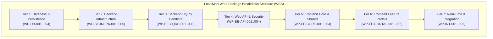

# LocalMart — Phase 10 Work Packages Specification & Implementation Blueprint

**Document Version:** 1.0  
**Phase:** 10 — Implementation Readiness & Development Work Package Specification  
**Status:** Draft / Pending Architect Review  
**Date:** September 12, 2026  
**Primary Target Stack:** ASP.NET Core Web API (C# / .NET 8) & Angular (TypeScript, Tailwind CSS, RxJS, Angular Signals, Reactive Forms)  
**Database Target:** PostgreSQL / Supabase-Managed PostgreSQL  
**Primary Source Document:** `LocalMart_BRD_v1.0(1).md`  
**Consolidated Baselines (Locked):**  
1. [`docs/BRD_BASELINE.md`](file:///d:/new%20e%20commers/docs/BRD_BASELINE.md) (Phase 00 Baseline)  
2. [`docs/SRS.md`](file:///d:/new%20e%20commers/docs/SRS.md) (Phase 01 Baseline)  
3. [`docs/USER_FLOWS_AND_USE_CASES.md`](file:///d:/new%20e%20commers/docs/USER_FLOWS_AND_USE_CASES.md) (Phase 02 Baseline)  
4. [`docs/USE_CASE_SPECIFICATIONS.md`](file:///d:/new%20e%20commers/docs/USE_CASE_SPECIFICATIONS.md) (Phase 03 Baseline)  
5. [`docs/REQUIREMENTS_TRACEABILITY_MATRIX.md`](file:///d:/new%20e%20commers/docs/REQUIREMENTS_TRACEABILITY_MATRIX.md) (Phase 04 Baseline)  
6. [`docs/DATABASE_DESIGN_AND_ERD.md`](file:///d:/new%20e%20commers/docs/DATABASE_DESIGN_AND_ERD.md) (Phase 05 Baseline)  
7. [`docs/API_CONTRACT.md`](file:///d:/new%20e%20commers/docs/API_CONTRACT.md) (Phase 06 Baseline)  
8. [`docs/SYSTEM_ARCHITECTURE.md`](file:///d:/new%20e%20commers/docs/SYSTEM_ARCHITECTURE.md) (Phase 07 Baseline)  
9. [`docs/DETAILED_MODULE_COMPONENT_ARCHITECTURE.md`](file:///d:/new%20e%20commers/docs/DETAILED_MODULE_COMPONENT_ARCHITECTURE.md) (Phase 08 Baseline)  
10. [`docs/LOW_LEVEL_DESIGN_SPECIFICATION.md`](file:///d:/new%20e%20commers/docs/LOW_LEVEL_DESIGN_SPECIFICATION.md) (Phase 09 Baseline)  
11. [`docs/PHASE_10_DOCUMENTATION_PLAN.md`](file:///d:/new%20e%20commers/docs/PHASE_10_DOCUMENTATION_PLAN.md) (Phase 10 Plan)  
**Project:** LocalMart — Location-Aware Multi-Vendor E-Commerce Marketplace  

---

## 1. Document Control & Baseline Alignment

### 1.1 Purpose
This specification establishes the concrete, implementation-ready **Development Work Package Specification** for **LocalMart**. It converts the approved Low-Level Design Blueprint ([`docs/LOW_LEVEL_DESIGN_SPECIFICATION.md`](file:///d:/new%20e%20commers/docs/LOW_LEVEL_DESIGN_SPECIFICATION.md)) into 28 ordered Work Packages across 7 implementation tiers. Each Work Package defines exact file targets, acceptance criteria, testing strategies, Definition of Done (DoD), and 10-tier traceability from business requirements down to execution units.

### 1.2 Document Priority & Traceability Hierarchy
1. Primary Business Source of Truth: [`LocalMart_BRD_v1.0(1).md`](file:///d:/new%20e%20commers/LocalMart_BRD_v1.0%281%29.md)
2. Consolidated Baseline Reference: [`docs/BRD_BASELINE.md`](file:///d:/new%20e%20commers/docs/BRD_BASELINE.md)
3. Software Requirements Specification: [`docs/SRS.md`](file:///d:/new%20e%20commers/docs/SRS.md)
4. User Flows & Use Case Catalog: [`docs/USER_FLOWS_AND_USE_CASES.md`](file:///d:/new%20e%20commers/docs/USER_FLOWS_AND_USE_CASES.md)
5. Formal Use Case Specifications: [`docs/USE_CASE_SPECIFICATIONS.md`](file:///d:/new%20e%20commers/docs/USE_CASE_SPECIFICATIONS.md)
6. Requirements Traceability Matrix: [`docs/REQUIREMENTS_TRACEABILITY_MATRIX.md`](file:///d:/new%20e%20commers/docs/REQUIREMENTS_TRACEABILITY_MATRIX.md)
7. Database Design & ERD: [`docs/DATABASE_DESIGN_AND_ERD.md`](file:///d:/new%20e%20commers/docs/DATABASE_DESIGN_AND_ERD.md)
8. API Contract & Specification: [`docs/API_CONTRACT.md`](file:///d:/new%20e%20commers/docs/API_CONTRACT.md)
9. System Architecture Specification: [`docs/SYSTEM_ARCHITECTURE.md`](file:///d:/new%20e%20commers/docs/SYSTEM_ARCHITECTURE.md)
10. Detailed Module & Component Architecture: [`docs/DETAILED_MODULE_COMPONENT_ARCHITECTURE.md`](file:///d:/new%20e%20commers/docs/DETAILED_MODULE_COMPONENT_ARCHITECTURE.md)
11. Low-Level Design Specification: [`docs/LOW_LEVEL_DESIGN_SPECIFICATION.md`](file:///d:/new%20e%20commers/docs/LOW_LEVEL_DESIGN_SPECIFICATION.md)

### 1.3 Scope & Strict Non-Goals
* **Included:** Work package definitions, DAG sequencing, task lists, file target maps, test strategies, DoD criteria, 10-tier traceability, and deferred decision preservation matrices.
* **Explicit Non-Goals:** Writing executable C# code, Angular TypeScript source files, SQL migration scripts, Docker files, or live Supabase configurations. Implementation status remains **NOT STARTED** until architect approval.

---

## 2. Work Package Categories & WBS Overview

---

## 3. Tier 1: Database & Persistence Work Packages (WP-DB)

### WP-DB-001: Core Identity & Auth Schema EF Mapping
* **Purpose:** Define EF Core entity classes and Fluent API configurations for core identity tables (`users`, `roles`, `permissions`, `user_roles`, `role_permissions`, `refresh_tokens`).
* **Target Files:** `src/LocalMart.Domain/Entities/User.cs`, `Role.cs`, `Permission.cs`, `RefreshToken.cs`, `src/LocalMart.Infrastructure/Persistence/Configurations/UserConfiguration.cs`, `RoleConfiguration.cs`.
* **Acceptance Criteria:** Foreign key relationships, unique email index, `timestamptz` column mappings match ERD.
* **Traceability:** `BR-001`, `BR-002`, `FR-AUTH-001..006`, ERD entities 1-6.
* **Dependencies:** None (Baseline DB Tier).

### WP-DB-002: Vendor & Catalog Schema EF Mapping
* **Purpose:** Map vendor profiles, categories, product attributes, product images, and inventory stock entities.
* **Target Files:** `Vendor.cs`, `Category.cs`, `Product.cs`, `ProductImage.cs`, `Inventory.cs`, `InventoryLog.cs`, `src/LocalMart.Infrastructure/Persistence/Configurations/ProductConfiguration.cs`.
* **Acceptance Criteria:** `numeric(12,2)` precision configured for monetary fields (`price`). Vendor location coordinates (`latitude`, `longitude`) mapped. Product status enum mapped (`Draft`, `Active`, `Inactive`, `OutOfStock`, `Suspended`).
* **Traceability:** `BR-003`, `BR-005`, `BR-006`, `FR-CAT-001..004`, `FR-PROD-001..005`, `FR-INV-001..004`.
* **Dependencies:** `WP-DB-001`.

### WP-DB-003: Multi-Vendor Order & Payment Schema EF Mapping
* **Purpose:** Map parent orders (`orders`), vendor sub-orders (`vendor_orders`), sub-order line items (`order_items`), payment transactions, and customer addresses.
* **Target Files:** `Order.cs`, `VendorOrder.cs`, `OrderItem.cs`, `Payment.cs`, `PaymentTransaction.cs`, `CustomerAddress.cs`.
* **Acceptance Criteria:** Parent-child foreign key relationships enforced. Canonical status enums mapped (`VendorOrderStatus`, `PaymentStatus`, `PaymentMethod`). Monetary precision set to `numeric(12,2)`.
* **Traceability:** `BR-004`, `BR-008`, `BR-009`, `FR-ORD-001..008`, `FR-PAY-001..005`, `FR-ADDR-001..003`.
* **Dependencies:** `WP-DB-002`.

### WP-DB-004: Delivery, Reviews, Coupons & Governance Schema EF Mapping
* **Purpose:** Map delivery assignments, verified purchase reviews, discount coupons, coupon usages, notifications, audit logs, and search logs.
* **Target Files:** `DeliveryAssignment.cs`, `Review.cs`, `Coupon.cs`, `CouponUsage.cs`, `Notification.cs`, `AuditLog.cs`, `SearchLog.cs`.
* **Acceptance Criteria:** Delivery status enum mapped (`Ready`, `Assigned`, `PickedUp`, `OutForDelivery`, `Delivered`, `FailedDelivery`). Audit logs configured as append-only.
* **Traceability:** `BR-010`, `BR-011`, `BR-012`, `BR-015`, `FR-DEL-001..006`, `FR-REV-001..004`, `FR-CPN-001..005`, `FR-AUD-001..003`.
* **Dependencies:** `WP-DB-003`.

---

## 4. Tier 2: Backend Infrastructure Work Packages (WP-BE-INFRA)

### WP-BE-INFRA-001: Clean Architecture Foundation & Base Abstractions
* **Purpose:** Implement base domain classes (`BaseEntity`, `ValueObject`, `IDomainEvent`) and application models (`Result<T>`).
* **Target Files:** `src/LocalMart.Domain/Common/BaseEntity.cs`, `ValueObject.cs`, `src/LocalMart.Application/Common/Models/Result.cs`.
* **Acceptance Criteria:** Universal `CreatedBy`/`UpdatedBy` columns excluded. `CreatedAt` and `UpdatedAt` mapped.
* **Traceability:** `NFR-MAINT-001`, Clean Architecture Layering.
* **Dependencies:** `WP-DB-001`.

### WP-BE-INFRA-002: Identity & Password Hashing Abstraction
* **Purpose:** Implement `IPasswordHasher` and `IJwtTokenGenerator` abstractions.
* **Target Files:** `IPasswordHasher.cs`, `IJwtTokenGenerator.cs`, `PasswordHasherAdapter.cs`, `JwtTokenGenerator.cs`.
* **Acceptance Criteria:** Abstract password hashing interface allows algorithm configuration without leaking parameters into domain. JWT token generator embeds user ID and role claims.
* **Traceability:** `NFR-SEC-001`, `NFR-SEC-002`, `FR-AUTH-004`.
* **Dependencies:** `WP-BE-INFRA-001`.

### WP-BE-INFRA-003: Media Cloudinary Signed Parameter Abstraction
* **Purpose:** Implement `ICloudinaryMediaService` for backend signed upload parameter generation.
* **Target Files:** `ICloudinaryMediaService.cs`, `CloudinaryMediaService.cs`.
* **Acceptance Criteria:** Backend generates signed parameters (timestamp, signature, preset) without exposing API secrets to clients.
* **Traceability:** `BR-005`, `BR-013`, `FR-PROD-001`, `FR-VND-001`.
* **Dependencies:** `WP-BE-INFRA-001`.

### WP-BE-INFRA-004: Location & Distance Calculation Service
* **Purpose:** Implement `ILocationService` for Haversine distance calculations.
* **Target Files:** `ILocationService.cs`, `LocationService.cs`.
* **Acceptance Criteria:** Calculates straight-line distance in kilometers between latitude/longitude pairs. Provider selection remains deferred.
* **Traceability:** `BR-003`, `FR-SCH-001..003`.
* **Dependencies:** `WP-BE-INFRA-001`.

### WP-BE-INFRA-005: Provider-Neutral Payment Gateway Abstraction
* **Purpose:** Implement `IPaymentGatewayAdapter` and framework-neutral `WebhookValidationRequest`.
* **Target Files:** `IPaymentGatewayAdapter.cs`, `WebhookValidationRequest.cs`.
* **Acceptance Criteria:** Webhook validation operates on raw payload bytes and normalized header dictionaries. ASP.NET Core web types omitted from Application tier. Supported payment methods: `COD`, `Online`.
* **Traceability:** `BR-009`, `FR-PAY-001..005`.
* **Dependencies:** `WP-BE-INFRA-001`.

---

## 5. Tier 3: Backend CQRS Handlers Work Packages (WP-BE-CQRS)

### WP-BE-CQRS-001: Authentication & User Registration CQRS
* **Purpose:** Implement `RegisterUserCommand`, `LoginCommand`, `RefreshTokenCommand`, and FluentValidation rules.
* **Target Files:** `RegisterUserCommandHandler.cs`, `LoginCommandHandler.cs`, `RegisterUserCommandValidator.cs`.
* **Acceptance Criteria:** Public registration strictly forces `Customer` role by default. Clients cannot submit privileged roles (`Admin`, `Vendor`, `Delivery Staff`).
* **Traceability:** `BR-001`, `BR-002`, `FR-AUTH-001..006`, `UC-001`, `UC-002`.
* **Dependencies:** `WP-BE-INFRA-002`.

### WP-BE-CQRS-002: Vendor Onboarding & Admin Approval CQRS
* **Purpose:** Implement `SubmitVendorApplicationCommand` and `ApproveVendorApplicationCommand`.
* **Target Files:** `SubmitVendorApplicationCommandHandler.cs`, `ApproveVendorApplicationCommandHandler.cs`.
* **Acceptance Criteria:** Canonical approval endpoint `POST /api/v1/admin/vendors/applications/{id}/approve` creates active store in `vendors` table and upgrades user role claim to `Vendor`.
* **Traceability:** `BR-013`, `FR-VND-001..003`, `UC-009`, `UC-018`.
* **Dependencies:** `WP-BE-CQRS-001`.

### WP-BE-CQRS-003: Product Catalog & Search CQRS
* **Purpose:** Implement `CreateProductCommand`, `UpdateProductCommand`, `SearchProductsQuery`, and `GetProductDetailsQuery`.
* **Target Files:** `CreateProductCommandHandler.cs`, `SearchProductsQueryHandler.cs`.
* **Acceptance Criteria:** Distance-filtered product search query evaluates vendor location radius. Search query terms logged to `search_logs`.
* **Traceability:** `BR-003`, `BR-005`, `BR-006`, `FR-CAT-001..004`, `FR-PROD-001..005`, `FR-SCH-001..004`, `UC-003`, `UC-004`, `UC-011`.
* **Dependencies:** `WP-BE-INFRA-004`, `WP-BE-CQRS-002`.

### WP-BE-CQRS-004: Shopping Cart Management CQRS
* **Purpose:** Implement `AddToCartCommand`, `UpdateCartItemCommand`, `RemoveCartItemCommand`, and `GetCartQuery`.
* **Target Files:** `AddToCartCommandHandler.cs`, `GetCartQueryHandler.cs`.
* **Acceptance Criteria:** Items grouped by `vendor_id`. Customer cart ownership strictly enforced.
* **Traceability:** `BR-004`, `BR-007`, `FR-CRT-001..004`, `UC-005`.
* **Dependencies:** `WP-BE-CQRS-003`.

### WP-BE-CQRS-005: Multi-Vendor Checkout & Sub-Order Splitting CQRS
* **Purpose:** Implement `CheckoutOrderCommand` and inventory reservation checks.
* **Target Files:** `CheckoutOrderCommandHandler.cs`, `CheckoutOrderCommandValidator.cs`.
* **Acceptance Criteria:** Splits parent order into distinct vendor sub-orders (`vendor_orders`). Validates stock availability. Accepts `Idempotency-Key` header.
* **Traceability:** `BR-004`, `BR-008`, `BR-009`, `FR-ORD-001..008`, `FR-INV-001..004`, `UC-006`.
* **Dependencies:** `WP-BE-CQRS-004`.

### WP-BE-CQRS-006: Payment Session & Webhook Handling CQRS
* **Purpose:** Implement `InitiatePaymentCommand` and `ProcessPaymentWebhookCommand`.
* **Target Files:** `InitiatePaymentCommandHandler.cs`, `ProcessPaymentWebhookCommandHandler.cs`.
* **Acceptance Criteria:** Webhook processing validates signature safely. Confirmed payment transitions order state to `Paid` and updates sub-orders to `Confirmed`. Duplicate webhooks return idempotent response.
* **Traceability:** `BR-009`, `FR-PAY-001..005`, `UC-006`, `UC-017`.
* **Dependencies:** `WP-BE-INFRA-005`, `WP-BE-CQRS-005`.

### WP-BE-CQRS-007: Delivery Assignment & Status Update CQRS
* **Purpose:** Implement `AssignDeliveryStaffCommand` and `UpdateDeliveryStatusCommand`.
* **Target Files:** `AssignDeliveryStaffCommandHandler.cs`, `UpdateDeliveryStatusCommandHandler.cs`.
* **Acceptance Criteria:** Delivery status transition to `Delivered` automatically transitions `vendor_order` status to `Delivered` and triggers `VendorOrderDeliveredEvent`. OTP verification is omitted (Marked out of MVP scope).
* **Traceability:** `BR-010`, `FR-DEL-001..006`, `UC-015`, `UC-016`.
* **Dependencies:** `WP-BE-CQRS-005`.

### WP-BE-CQRS-008: Reviews, Coupons & Vendor Commission CQRS
* **Purpose:** Implement `SubmitProductReviewCommand`, `ValidateCouponQuery`, and `GetVendorEarningsQuery`.
* **Target Files:** `SubmitProductReviewCommandHandler.cs`, `ValidateCouponQueryHandler.cs`, `GetVendorEarningsQueryHandler.cs`.
* **Acceptance Criteria:** Review submission verifies customer owns a `Delivered` order containing the product (`BR-011`). Commission calculated per sub-order.
* **Traceability:** `BR-011`, `BR-012`, `BR-014`, `FR-REV-001..004`, `FR-CPN-001..005`, `FR-FIN-001..004`, `UC-008`, `UC-014`, `UC-020`, `UC-021`, `UC-023`.
* **Dependencies:** `WP-BE-CQRS-007`.

---

## 6. Tier 4: Backend Web API & Security Work Packages (WP-BE-API)

### WP-BE-API-001: REST API Controllers Routing & OpenAPI Specifications
* **Purpose:** Implement API Controllers exposing MediatR commands/queries with exact routes from `docs/API_CONTRACT.md`.
* **Target Files:** `AuthController.cs`, `ProductsController.cs`, `CartController.cs`, `OrdersController.cs`, `AdminVendorsController.cs`, `DeliveryController.cs`.
* **Acceptance Criteria:** Route attributes match API contract (`/api/v1/...`). Vendor approval route explicitly set to `POST /api/v1/admin/vendors/applications/{id}/approve`.
* **Traceability:** `docs/API_CONTRACT.md`, All Use Cases.
* **Dependencies:** `WP-BE-CQRS-001..008`.

### WP-BE-API-002: ASP.NET Core Authorization Policy Registrations
* **Purpose:** Register custom authorization policies (`RequireAdminPolicy`, `RequireVendorPolicy`, `RequireCustomerPolicy`, `RequireDeliveryStaffPolicy`, `ManageCatalogPermissionPolicy`).
* **Target Files:** `src/LocalMart.WebAPI/Program.cs`, `PermissionAuthorizationHandler.cs`.
* **Acceptance Criteria:** Role claims enforced via standard `[Authorize(Roles = "...")]`.
* **Traceability:** `BR-001`, `BR-002`, `FR-AUTH-004`.
* **Dependencies:** `WP-BE-API-001`.

### WP-BE-API-003: MediatR Pipeline Behaviors & Idempotency Header Tier
* **Purpose:** Implement `LoggingBehavior`, `ValidationBehavior`, and `IdempotencyBehavior`.
* **Target Files:** `LoggingBehavior.cs`, `ValidationBehavior.cs`, `IdempotencyBehavior.cs`.
* **Acceptance Criteria:** `Idempotency-Key` header intercepted for checkout. Validation failures throw `ValidationException`.
* **Traceability:** `NFR-REL-002`, `NFR-MAINT-002`.
* **Dependencies:** `WP-BE-API-001`.

### WP-BE-API-004: RFC 7807 Problem Details Global Exception Middleware
* **Purpose:** Implement `ExceptionHandlingMiddleware` for standardized RFC 7807 error responses.
* **Target Files:** `ExceptionHandlingMiddleware.cs`.
* **Acceptance Criteria:** Unhandled exceptions return JSON matching RFC 7807 (`type`, `title`, `status`, `detail`, `instance`, `errors`).
* **Traceability:** `NFR-REL-001`, `NFR-MAINT-002`.
* **Dependencies:** `WP-BE-API-001`.

---

## 7. Tier 5: Frontend Core & Shared Component Work Packages (WP-FE-CORE)

### WP-FE-CORE-001: Angular Application Shell & Routing Infrastructure
* **Purpose:** Set up Angular SPA main route registry, application shell layouts (header, footer, sidebar), and lazy loading structure.
* **Target Files:** `app.routes.ts`, `app.config.ts`, `navbar.component.ts`, `footer.component.ts`.
* **Acceptance Criteria:** Lazy loading configured for all portal feature routes.
* **Traceability:** `NFR-USA-001`, `NFR-PERF-001`.
* **Dependencies:** None (Frontend Base).

### WP-FE-CORE-002: HTTP Interceptors (JWT & Error Handling)
* **Purpose:** Implement `JwtInterceptor` and `ErrorInterceptor`.
* **Target Files:** `core/interceptors/jwt.interceptor.ts`, `error.interceptor.ts`.
* **Acceptance Criteria:** `Authorization: Bearer <token>` attached automatically to API calls. Problem Details errors surfaced via UI notifications.
* **Traceability:** `NFR-SEC-002`, `NFR-USA-001`.
* **Dependencies:** `WP-FE-CORE-001`.

### WP-FE-CORE-003: Angular Signal State Stores
* **Purpose:** Implement `AuthUserSignal` and `ActiveCartSignal`.
* **Target Files:** `core/state/auth-user.signal.ts`, `active-cart.signal.ts`.
* **Acceptance Criteria:** Signals reactively store auth claims and derive cart totals (`computed()`).
* **Traceability:** `NFR-USA-001`.
* **Dependencies:** `WP-FE-CORE-001`.

### WP-FE-CORE-004: Reusable Shared UI Components
* **Purpose:** Implement `ProductCardComponent`, `StatusBadgeComponent`, `StarRatingComponent`, and Tailwind utility layouts.
* **Target Files:** `shared/components/product-card/`, `status-badge/`, `star-rating/`.
* **Acceptance Criteria:** Status badge component renders canonical status enums accurately.
* **Traceability:** `NFR-USA-001`.
* **Dependencies:** `WP-FE-CORE-001`.

---

## 8. Tier 6: Frontend Feature Portal Work Packages (WP-FE-PORTAL)

### WP-FE-PORTAL-001: Customer Portal Feature Module
* **Purpose:** Implement Customer pages: Catalog Search, Product Detail, Cart View, Multi-Vendor Checkout, and Order History.
* **Target Files:** `features/customer/pages/catalog/`, `product-detail/`, `cart/`, `checkout/`, `order-history/`.
* **Acceptance Criteria:** Location radius slider filters products. Checkout submits idempotency header and supports COD/Online options.
* **Traceability:** `BR-003..009`, `UC-001..008`, `FR-SCH`, `FR-CRT`, `FR-ORD`, `FR-PAY`.
* **Dependencies:** `WP-FE-CORE-001..004`, `WP-BE-API-001`.

### WP-FE-PORTAL-002: Vendor Portal Feature Module
* **Purpose:** Implement Vendor pages: Store Profile, Product Catalog Mgmt, Inventory Control, and Sub-Orders Fulfillment.
* **Target Files:** `features/vendor/pages/store-profile/`, `inventory-management/`, `sub-orders/`.
* **Acceptance Criteria:** Product creation uses Cloudinary direct upload signed parameters. Sub-orders transition through vendor status workflow (`Pending` -> `Confirmed` -> `Preparing` -> `ReadyForPickup`).
* **Traceability:** `BR-005`, `BR-006`, `BR-008`, `BR-009`, `UC-010..014`, `FR-VND`, `FR-INV`.
* **Dependencies:** `WP-FE-CORE-001..004`, `WP-BE-API-001`.

### WP-FE-PORTAL-003: Admin Back-Office Feature Module
* **Purpose:** Implement Admin pages: Vendor Application Review & Approval, Catalog Moderation, User Mgmt, and Audit Logs.
* **Target Files:** `features/admin/pages/vendor-applications/`, `catalog-moderation/`, `commission-management/`, `audit-logs/`.
* **Acceptance Criteria:** Vendor application approval invokes `POST /api/v1/admin/vendors/applications/{id}/approve`.
* **Traceability:** `BR-013..015`, `UC-018..024`, `FR-ADM`, `FR-AUD`, `FR-FIN`.
* **Dependencies:** `WP-FE-CORE-001..004`, `WP-BE-API-001`.

### WP-FE-PORTAL-004: Delivery Staff Web Client Feature Module
* **Purpose:** Implement Delivery Staff pages: Assignment Acceptance, Pickup Confirmation, and Delivery Completion.
* **Target Files:** `features/delivery/pages/assignment-list/`, `delivery-details/`.
* **Acceptance Criteria:** Status update to `Delivered` completes order delivery. OTP verification UI omitted.
* **Traceability:** `BR-010`, `UC-015`, `UC-016`, `FR-DEL`.
* **Dependencies:** `WP-FE-CORE-001..004`, `WP-BE-API-001`.

### WP-FE-PORTAL-005: Angular Route Guards Implementation
* **Purpose:** Implement `AuthGuard`, `RoleGuard`, and `PermissionGuard`.
* **Target Files:** `core/guards/auth.guard.ts`, `role.guard.ts`, `permission.guard.ts`.
* **Acceptance Criteria:** Route access restricted strictly based on JWT user role claims (`Admin`, `Vendor`, `Customer`, `Delivery Staff`).
* **Traceability:** `BR-001`, `BR-002`, `FR-AUTH-004`.
* **Dependencies:** `WP-FE-CORE-003`.

---

## 9. Tier 7: Real-Time & Integration Work Packages (WP-INT)

### WP-INT-001: SignalR Notification Hub & Typed Client Handlers
* **Purpose:** Implement `NotificationHub` (`/hubs/notifications`) and frontend SignalR subscription service.
* **Target Files:** `src/LocalMart.Infrastructure/SignalR/NotificationHub.cs`, `core/services/signalr.service.ts`.
* **Acceptance Criteria:** Live order status updates pushed to connected client portals. Distributed scaling/backplane remains deferred.
* **Traceability:** `BR-008`, `BR-010`, `FR-NOT-001..004`, `UC-007`.
* **Dependencies:** `WP-BE-API-001`, `WP-FE-CORE-001`.

### WP-INT-002: Cloudinary Direct Client Upload Integration Flow
* **Purpose:** Integrate frontend direct upload component with backend `ICloudinaryMediaService` signed parameter endpoints.
* **Target Files:** `shared/components/media-uploader/`, `core/services/media.service.ts`.
* **Acceptance Criteria:** Client fetches signed parameters, posts directly to Cloudinary CDN, and attaches returned URL to domain form.
* **Traceability:** `BR-005`, `BR-013`, `FR-PROD-001`, `FR-VND-001`.
* **Dependencies:** `WP-BE-INFRA-003`, `WP-FE-CORE-001`.

### WP-INT-003: Payment Webhook Integration Boundary
* **Purpose:** Configure external payment gateway webhook receiver endpoint (`POST /api/v1/webhooks/payments`).
* **Target Files:** `PaymentsController.cs`, `ProcessPaymentWebhookCommandHandler.cs`.
* **Acceptance Criteria:** Webhook payload signature validated safely. Duplicate dispatches handled idempotently.
* **Traceability:** `BR-009`, `FR-PAY-001..005`, `UC-017`.
* **Dependencies:** `WP-BE-CQRS-006`, `WP-BE-API-001`.

---

## 10. Quality, Testing & Definition of Done (DoD) Blueprint

### 10.1 Quality & Testing Strategy
Every completed Work Package must undergo strict verification before receiving approval:
* **Backend Unit Tests:** Handlers, validators, and domain rules tested via xUnit/NSubstitute.
* **API Integration Tests:** Controller endpoints tested via `WebApplicationFactory` verifying HTTP status codes and RFC 7807 response formatting.
* **Frontend Component Tests:** Jasmine/Karma tests verifying component rendering and Signal state transitions.

### 10.2 Global Definition of Done (DoD) Checklist
No Work Package will be marked **COMPLETE** until:
- [ ] Code compiles cleanly with zero warnings or errors.
- [ ] Architecture strictly adheres to Clean Architecture layers and CQRS boundaries.
- [ ] Route URLs match [`docs/API_CONTRACT.md`](file:///d:/new%20e%20commers/docs/API_CONTRACT.md) exactly.
- [ ] Entities match [`docs/DATABASE_DESIGN_AND_ERD.md`](file:///d:/new%20e%20commers/docs/DATABASE_DESIGN_AND_ERD.md) exactly.
- [ ] Unit and Integration tests pass successfully.
- [ ] Zero implementation leaks of deferred technical decisions or MVP scope exclusions.
- [ ] Complete traceability report filed detailing files created/modified and test results.

---

## 11. Preserved 14 Deferred Technical Decisions Index

All 14 technical decisions remain explicitly **DEFERRED** across all Work Packages:

1. External payment provider selection (Stripe vs local provider).
2. Maps API provider (Google Maps vs Mapbox vs OSM).
3. PostGIS spatial index evaluation.
4. SignalR Redis backplane & real-time scaling topology.
5. Inventory hold expiration timeout & background worker mechanics.
6. Password hashing algorithm parameters (`Argon2`/`BCrypt` work factor).
7. Commission calculation financial base (gross vs net).
8. Database connection pooling strategy (PgBouncer vs EF Core internal).
9. Partial multi-vendor refund mechanics.
10. Vendor reapplication mechanics & cooldown policy.
11. Jurisdiction-specific vendor verification rules.
12. PostgreSQL RLS policy mechanics.
13. Database deployment & replication topology.
14. Idempotency key storage engine & retention policy.

---

## 12. MVP Scope Protection Guardrails

The following non-goals remain strictly enforced as **OUT OF MVP SCOPE**:
* ❌ No AI semantic search or AI recommendation engines.
* ❌ No `pgvector` or vector embedding implementations.
* ❌ No live driver GPS streaming or continuous location tracking.
* ❌ No OTP-based delivery verification (Candidate future enhancement; OUT OF CURRENT BASELINE SCOPE).
* ❌ No native mobile apps (iOS / Android) or mandatory PWA requirement.
* ❌ No multi-currency or cryptocurrency support.
* ❌ No international shipping or cross-border tax calculation.
* ❌ No Redis caching or Redis backplane requirement.
* ❌ No multi-branch vendor store implementations.

---

## 13. End-to-End Traceability Matrix

| Work Package ID | Business Rules | Functional Requirements | Use Cases | API Routes | ERD Entities | LLD Section |
|---|---|---|---|---|---|---|
| `WP-DB-001` | `BR-001`, `BR-002` | `FR-AUTH-001..006` | `UC-001`, `UC-002` | N/A (DB Tier) | `users`, `roles`, `permissions`, `refresh_tokens` | Section 4, 6, 15 |
| `WP-DB-002` | `BR-003`, `BR-005`, `BR-006` | `FR-CAT`, `FR-PROD`, `FR-INV` | `UC-003`, `UC-011`, `UC-012` | N/A (DB Tier) | `vendors`, `categories`, `products`, `product_images`, `inventory` | Section 4, 6, 15 |
| `WP-DB-003` | `BR-004`, `BR-008`, `BR-009` | `FR-ORD`, `FR-PAY`, `FR-ADDR` | `UC-006`, `UC-007` | N/A (DB Tier) | `orders`, `vendor_orders`, `order_items`, `payments`, `addresses` | Section 4, 6, 15 |
| `WP-DB-004` | `BR-010`, `BR-011`, `BR-012` | `FR-DEL`, `FR-REV`, `FR-CPN` | `UC-008`, `UC-015`, `UC-020` | N/A (DB Tier) | `delivery_assignments`, `reviews`, `coupons`, `notifications` | Section 4, 6, 15 |
| `WP-BE-INFRA-001..005`| `BR-001..009`, `BR-013` | `NFR-SEC`, `NFR-MAINT` | All Use Cases | N/A (Infra Tier) | All Entities | Section 4, 8 |
| `WP-BE-CQRS-001` | `BR-001`, `BR-002` | `FR-AUTH-001..006` | `UC-001`, `UC-002` | `POST /api/v1/auth/register` | `users`, `roles` | Section 7.1, 9.1 |
| `WP-BE-CQRS-002` | `BR-013` | `FR-VND-001..003` | `UC-009`, `UC-018` | `POST /api/v1/admin/vendors/applications/{id}/approve` | `vendor_applications`, `vendors` | Section 7.1, 9.1 |
| `WP-BE-CQRS-003` | `BR-003`, `BR-005` | `FR-SCH`, `FR-PROD` | `UC-003`, `UC-004`, `UC-011` | `GET /api/v1/products/search` | `products`, `vendors`, `search_logs` | Section 7.1, 9.1 |
| `WP-BE-CQRS-004` | `BR-004`, `BR-007` | `FR-CRT-001..004` | `UC-005` | `GET /api/v1/cart`, `POST /api/v1/cart/items` | `carts`, `cart_items` | Section 7.1 |
| `WP-BE-CQRS-005` | `BR-004`, `BR-008`, `BR-009` | `FR-ORD-001..008` | `UC-006` | `POST /api/v1/orders/checkout` | `orders`, `vendor_orders`, `order_items` | Section 7.1, 9.1 |
| `WP-BE-CQRS-006` | `BR-009` | `FR-PAY-001..005` | `UC-006`, `UC-017` | `POST /api/v1/payments` | `payments`, `payment_transactions` | Section 7.1, 8.3 |
| `WP-BE-CQRS-007` | `BR-010` | `FR-DEL-001..006` | `UC-015`, `UC-016` | `PUT /api/v1/delivery/assignments/{id}/status` | `delivery_assignments` | Section 7.1 |
| `WP-BE-CQRS-008` | `BR-011`, `BR-012`, `BR-014` | `FR-REV`, `FR-CPN`, `FR-FIN` | `UC-008`, `UC-014`, `UC-020` | `POST /api/v1/products/{id}/reviews` | `reviews`, `coupons`, `vendor_commissions` | Section 7.1 |
| `WP-BE-API-001..004` | `BR-001`, `BR-002` | `NFR-REL`, `NFR-SEC` | All Use Cases | `/api/v1/...` | All Entities | Section 9, 12, 17, 18 |
| `WP-FE-CORE-001..004` | `NFR-USA-001` | All FR Requirements | All Use Cases | N/A (Frontend Core) | N/A | Section 5, 10 |
| `WP-FE-PORTAL-001..005`| All Business Rules | All FR Requirements | `UC-001..024` | All `/api/v1/...` Routes | N/A (Frontend Portals) | Section 5, 11 |
| `WP-INT-001..003` | `BR-005`, `BR-008`, `BR-009` | `FR-NOT`, `FR-PAY` | `UC-007`, `UC-017` | `/hubs/notifications`, `/webhooks` | `notifications`, `payments` | Section 13, 14 |

---

## 14. Phase 10 Validation & Status

Phase 10 Status: READY FOR ARCHITECT REVIEW  
Implementation Status: NOT STARTED
