# LocalMart — System & Solution Architecture Specification

**Document Version:** 1.1 (Architecture Correction Pass)  
**Phase:** 07 — System / Solution Architecture  
**Status:** Draft / Pending Final Architect Review  
**Date:** September 12, 2026  
**Primary Target Stack:** ASP.NET Core 8.0 Web API (.NET 8 / C#) & Angular 18+ (TypeScript / Tailwind CSS)  
**Database Target:** PostgreSQL 15+ / Supabase-Managed PostgreSQL  
**Primary Source Document:** `LocalMart_BRD_v1.0(1).md`  
**Consolidated Reference:** `docs/BRD_BASELINE.md`  
**SRS Reference:** `docs/SRS.md`  
**User Flows Reference:** `docs/USER_FLOWS_AND_USE_CASES.md`  
**Use Case Specifications:** `docs/USE_CASE_SPECIFICATIONS.md`  
**Traceability Matrix Reference:** `docs/REQUIREMENTS_TRACEABILITY_MATRIX.md`  
**Database Design Reference:** `docs/DATABASE_DESIGN_AND_ERD.md`  
**API Contract Reference:** `docs/API_CONTRACT.md`  
**Project:** LocalMart — Location-Aware Multi-Vendor E-Commerce Marketplace  

---

## 1. Document Control

### 1.1 Purpose
This document establishes the comprehensive technical solution and system architecture for **LocalMart**. It unifies all prior approved artifacts—Business Rules (`BR-001` to `BR-015`), 56 Functional Requirements, 14 Non-Functional Requirements, 81 User Flows, 24 Formal Use Cases, 35 normalized database entities (`docs/DATABASE_DESIGN_AND_ERD.md`), and the RESTful Web API Specification (`docs/API_CONTRACT.md`)—into an auditable, enterprise-grade Clean Architecture solution design.

### 1.2 Document Priority & Traceability Hierarchy
1. Primary Business Source of Truth: [`LocalMart_BRD_v1.0(1).md`](file:///d:/new%20e%20commers/LocalMart_BRD_v1.0%281%29.md)
2. Consolidated Baseline Reference: [`docs/BRD_BASELINE.md`](file:///d:/new%20e%20commers/docs/BRD_BASELINE.md)
3. Software Requirements Specification: [`docs/SRS.md`](file:///d:/new%20e%20commers/docs/SRS.md)
4. User Flows & Use Case Catalog: [`docs/USER_FLOWS_AND_USE_CASES.md`](file:///d:/new%20e%20commers/docs/USER_FLOWS_AND_USE_CASES.md)
5. Formal Use Case Specifications: [`docs/USE_CASE_SPECIFICATIONS.md`](file:///d:/new%20e%20commers/docs/USE_CASE_SPECIFICATIONS.md)
6. Requirements Traceability Matrix: [`docs/REQUIREMENTS_TRACEABILITY_MATRIX.md`](file:///d:/new%20e%20commers/docs/REQUIREMENTS_TRACEABILITY_MATRIX.md)
7. Database Design & ERD: [`docs/DATABASE_DESIGN_AND_ERD.md`](file:///d:/new%20e%20commers/docs/DATABASE_DESIGN_AND_ERD.md)
8. API Contract & Specification: [`docs/API_CONTRACT.md`](file:///d:/new%20e%20commers/docs/API_CONTRACT.md)

### 1.3 Scope & Non-Goals
* **Included:** Overall system context, Clean Architecture boundaries, CQRS command/query separation, Angular frontend structure, ASP.NET Core backend tiers, authentication/authorization flows, multi-vendor order execution, inventory & payment lifecycles, media & search architectures, SignalR notifications, deployment topologies, security models, Architectural Decision Records (ADRs), 14 deferred decisions index, and architecture traceability matrices.
* **Explicit Non-Goals:** Writing executable C# classes, Angular TypeScript code, SQL migrations, EF Core DbContext implementations, Docker runtime scripts, or live Supabase project deployments. This phase is strict architectural design documentation.

---

## 2. Purpose & Architectural Scope

LocalMart is a location-aware, multi-vendor e-commerce marketplace designed to connect local vendors with neighborhood consumers, backed by independent delivery staff fulfillment and back-office administrative governance. 

The architecture provides strict separation of concerns across four primary user web portals:
1. **Customer Web Portal:** Product discovery, cart, multi-vendor checkout, order tracking, and reviews.
2. **Vendor Portal:** Store profile administration, product catalog management, stock inventory control, and sub-order fulfillment.
3. **Admin Portal:** Vendor application review & approval, catalog moderation, marketplace coupons, commission monitoring, vendor payouts, search analytics, and audit logging.
4. **Delivery Staff Web Client:** Order delivery assignment acceptance, store pickup confirmation, and customer delivery OTP verification.

---

## 3. Technology Baseline & Standards

| Architecture Tier | Technology Selection | Version / Pattern | Purpose & Architectural Justification |
|---|---|---|---|
| **Frontend Framework** | Angular | 18+ (TypeScript) | Single-Page Application (SPA) providing reactive UI components, Signal-based state management, and robust RxJS async streams. |
| **Frontend Styling** | Tailwind CSS | 3.x+ | Utility-first CSS framework enabling consistent, responsive, high-performance UI styling across viewports (`NFR-USA-001`). |
| **Backend Framework** | ASP.NET Core Web API | .NET 8 (C#) | High-throughput, cross-platform Web API framework implementing Clean Architecture and CQRS via MediatR (`NFR-MAINT-001`). |
| **ORM / Data Access** | Entity Framework Core | EF Core 8.0 | Object-Relational Mapper accessing PostgreSQL using LINQ queries and Fluent API configurations. |
| **Database Platform** | PostgreSQL / Supabase | PostgreSQL 15+ | Acid-compliant relational database management system hosted on Supabase-Managed PostgreSQL (`docs/DATABASE_DESIGN_AND_ERD.md`). |
| **Validation Layer** | FluentValidation | 11.x+ | Strongly-typed validation rules separated from domain entities for request validation (`NFR-MAINT-002`). |
| **Authentication & AuthZ** | JWT + Refresh Tokens | ASP.NET Core Auth | Short-lived access tokens + securely managed refresh token rotation (`NFR-SEC-002`) with RBAC & Permissions (`FR-AUTH-004`). |
| **Real-Time Gateway** | ASP.NET Core SignalR | SignalR Hub (`/hubs/notifications`) | Real-time websocket transport for live notification dispatch to active client portals (`FR-NOTIF-001`). |
| **Media Hosting** | Cloudinary | Signed Direct Upload | Cloud media asset platform storing product/store images via backend signed upload parameters (`FR-PROD-001`). |
| **API Protocol & Specs** | RESTful HTTP / JSON | `/api/v1` Base Route | Standard JSON APIs with RFC 7807 Problem Details error responses and OpenAPI/Swagger documentation tooling. |

---

## 4. Architecture Overview & High-Level System Architecture

The LocalMart solution follows a decoupled, multi-tiered architecture separating client-side presentation from backend application logic and relational data storage.

### 4.1 High-Level Architecture Block Diagram

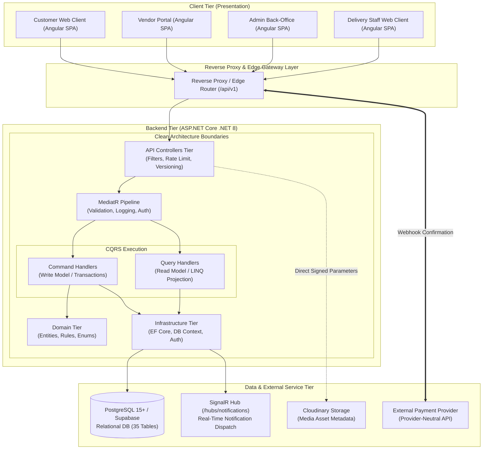

### 4.2 High-Level Request Flow Sequence

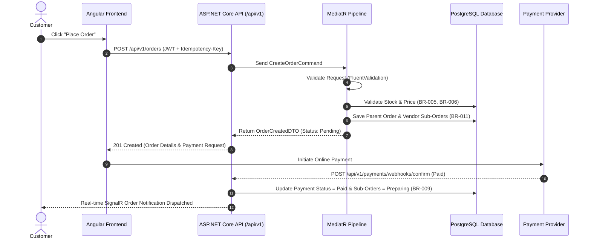

---

## 5. System Context & Trust Boundaries

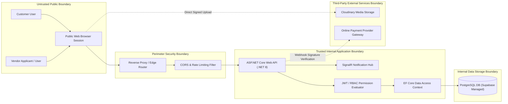

### Trust Boundary Rules:
1. **Perimeter Security:** Inbound HTTP requests pass through transport encryption (HTTPS), CORS validation, and rate-limiting filters. Exact reverse proxy selection remains an implementation/deployment decision.
2. **Authentication Guard:** Unauthenticated users can only access public catalog browsing, vendor application submission, and login endpoints.
3. **Application Tenant Isolation:** Every vendor query strictly appends `WHERE vendor_id = @CurrentVendorId` (`BR-002`). Every customer query strictly appends `WHERE customer_id = @CurrentCustomerId` (`BR-003`).
4. **Third-Party Isolation:** External payment gateways interact strictly via verified webhook signatures (`BR-009`). No raw credit card credentials, CVVs, or payment passwords ever touch the LocalMart application server or database.

---

## 6. Frontend Architecture (Angular)

The frontend application is built using **Angular 18+** as a modular Single-Page Application (SPA), adopting modern Angular Signals for local state management, RxJS for asynchronous event streams, and Reactive Forms for input handling.

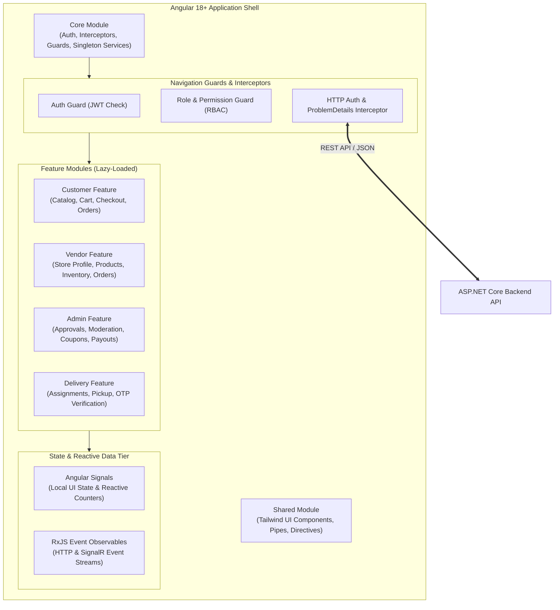

### Core Frontend Architectural Components:
* **Lazy-Loaded Feature Modules:** Split by user domain (`Customer`, `Vendor`, `Admin`, `Delivery`) for fast initial page load.
* **HTTP Auth Interceptor:** Automatically attaches `Authorization: Bearer <JWT>` headers to outgoing API calls and intercepts `401 Unauthorized` responses to trigger refresh token rotation (`NFR-SEC-002`).
* **Problem Details Error Handler:** Global HTTP interceptor parses RFC 7807 error responses and presents user-friendly toast/modal messages (`NFR-REL-001`).
* **Route Guards:** `AuthGuard` and `RoleGuard` prevent unauthorized UI route navigation based on user roles (`Customer`, `Vendor`, `Administrator`, `DeliveryStaff`).
* **Delivery Experience:** Delivery staff interactions execute via the `Delivery Staff Web Client`. Progressive Web App (PWA) capabilities represent a potential future enhancement; native mobile apps are excluded from MVP.

---

## 7. Backend Architecture (Clean Architecture)

The backend is structured strictly according to **Clean Architecture** (Onion Architecture), creating clear layer boundaries where inner layers (Domain) have zero dependencies on outer layers (Infrastructure, API).

```
   ┌─────────────────────────────────────────────────────────────┐
   │                       API Layer                             │
   │  (Controllers, Filters, Middleware, Swagger, ProblemDetails) │
   └──────────────────────────────┬──────────────────────────────┘
                                  │
   ┌──────────────────────────────▼──────────────────────────────┐
   │                   Infrastructure Layer                      │
   │   (EF Core, DbContext, Auth Services, Cloudinary, SignalR)  │
   └──────────────────────────────┬──────────────────────────────┘
                                  │
   ┌──────────────────────────────▼──────────────────────────────┐
   │                   Application Layer                         │
   │   (Commands, Queries, MediatR, DTOs, FluentValidation)      │
   └──────────────────────────────┬──────────────────────────────┘
                                  │
   ┌──────────────────────────────▼──────────────────────────────┐
   │                     Domain Layer                            │
   │   (Entities, Value Objects, Enums, Core Business Rules)     │
   └─────────────────────────────────────────────────────────────┘
```

### 7.1 Layer Responsibilities

#### 1. Domain Layer (`LocalMart.Domain`)
* **Contents:** Core domain entities (`User`, `Vendor`, `Product`, `Order`, `Inventory`), value objects, status enums, and core domain invariants.
* **Dependencies:** None (Pure .NET class library).

#### 2. Application Layer (`LocalMart.Application`)
* **Contents:** CQRS Commands and Queries, MediatR Handlers, DTO representations, FluentValidation rules, and abstraction interfaces (`IApplicationDbContext`, `IPaymentService`, `INotificationService`).
* **Dependencies:** Depends only on Domain Layer.

#### 3. Infrastructure Layer (`LocalMart.Infrastructure`)
* **Contents:** EF Core `LocalMartDbContext` implementation, PostgreSQL database configurations, JWT token generation services, Cloudinary media upload adapters, and SignalR notification hub adapters.
* **Dependencies:** Depends on Application Layer and Domain Layer.

#### 4. API Layer (`LocalMart.Api`)
* **Contents:** ASP.NET Core REST API controllers, authentication middleware, exception handling filters (RFC 7807), rate-limiting policies, CORS policies, and OpenAPI Swagger documentation filters.
* **Dependencies:** Entry point referencing Infrastructure, Application, and Domain layers.

---

## 8. CQRS Architecture (Command Query Responsibility Segregation)

The system utilizes **MediatR** to implement CQRS, cleanly separating state-changing operations (Commands) from read-only data retrievals (Queries).

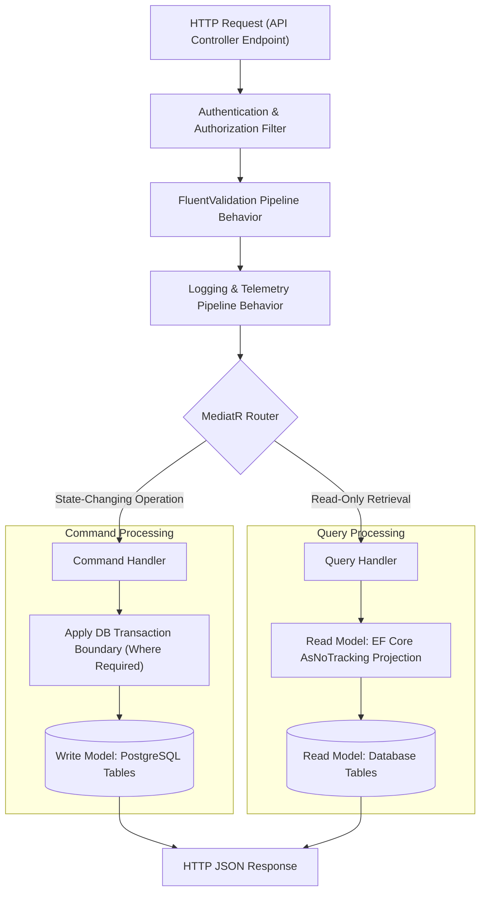

### CQRS Segregation Examples:
* **Commands (Write Operations):** `SubmitVendorApplicationCommand`, `CreateProductCommand`, `PlaceOrderCommand`, `ApproveVendorCommand`, `ConfirmPaymentWebhookCommand`, `SubmitReviewCommand`.
* **Queries (Read Operations):** `GetCatalogProductsQuery`, `GetProductDetailsQuery`, `GetCustomerOrderHistoryQuery`, `GetVendorOrdersQuery`, `GetSearchSuggestionsQuery`, `GetAdminAuditLogsQuery`.
* **Performance Benefit:** Query handlers execute read-only LINQ projections with `AsNoTracking()`, delivering high-speed catalog lookups without ORM change-tracking overhead (`NFR-PERF-003`).

---

## 9. Authentication & Authorization Architecture

### 9.1 Authentication & Token Lifecycle
1. **Credentials Verification:** User authenticates via `/api/v1/auth/{role}/login`.
2. **Token Generation:** Upon successful authentication, the API issues:
   * **Access Token:** Short-lived JWT containing user ID, email, role, and permission tokens.
   * **Refresh Token:** Cryptographically secure refresh token stored in `refresh_tokens` database table with rotation (`NFR-SEC-002`).
3. **Token Rotation:** Client uses `POST /api/v1/auth/refresh-token` to exchange an active refresh token for a new short-lived access token and rotated refresh token.

### 9.2 Authorization Engine (RBAC + Permissions)
Authorization enforces **Role-Based Access Control (RBAC)** combined with fine-grained **Permissions** (`FR-AUTH-004`):

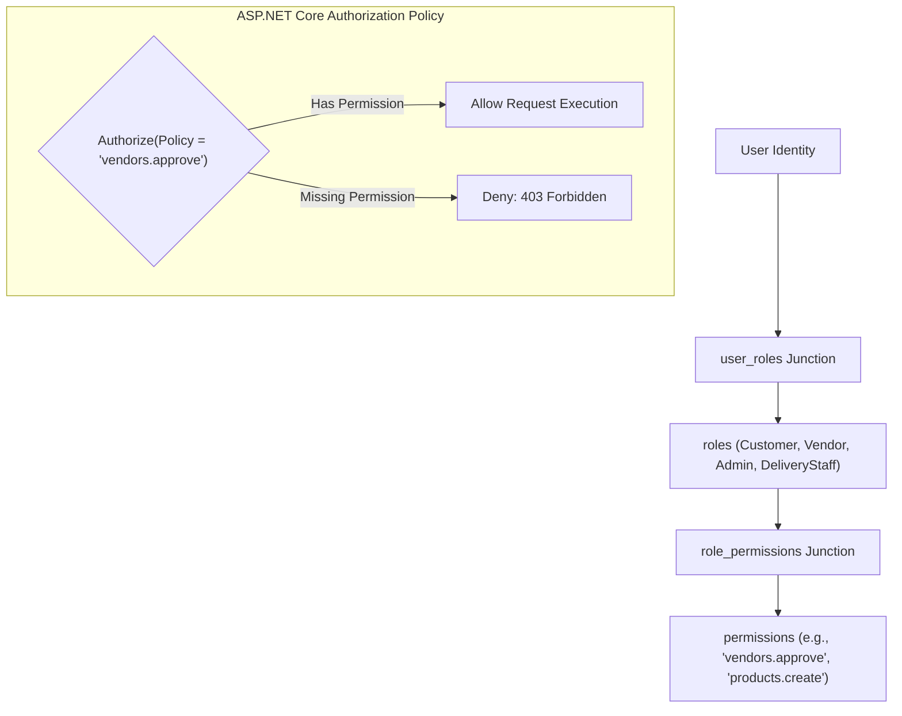

### 9.3 Role Authorization Boundaries & Vendor Onboarding Rule
* **Customer:** Access to personal profile, shopping cart, checkout, personal orders, and verified reviews.
* **Vendor Applicant:** A user with a submitted `vendor_applications` record in `Pending` or `UnderReview` state **DOES NOT HAVE VENDOR SELLING PRIVILEGES**.
* **Approved Vendor:** Vendor selling privileges (`Vendor` role, store profile management, catalog product CRUD, inventory control) are granted **ONLY AFTER AN ADMINISTRATOR APPROVES THE APPLICATION** (`BR-001`).
* **Administrator:** Full administrative governance across applications, catalog moderation, coupons, commission ledgers, vendor payouts, and audit logs (`BR-007`).
* **Delivery Staff:** Provisioned by Admin. Access limited strictly to authorized assigned deliveries (`FR-DEL-001`).

---

## 10. Data Isolation Architecture

Data isolation enforces strict multi-tenancy boundaries at the application service tier to prevent unauthorized cross-tenant data access (`BR-002`, `BR-003`, `NFR-SEC-003`).

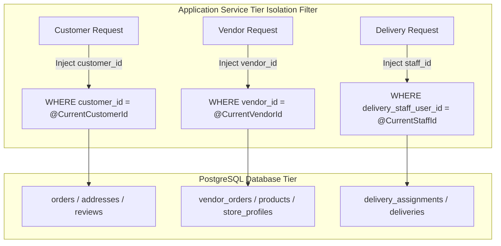

### Isolation Enforcement Rules:
1. **Vendor Isolation (`BR-002`):** Every query executed on behalf of a vendor automatically appends `WHERE vendor_id = @CurrentVendorId`. Vendor A cannot view Vendor B's orders, products, or revenue.
2. **Customer Order Isolation (`BR-003`):** Every customer order query appends `WHERE customer_id = @CurrentCustomerId`.
3. **Delivery Staff Isolation:** Delivery staff members inspect only assigned delivery records (`FR-DEL-001`).
4. **Database RLS Note:** PostgreSQL Row Level Security (RLS) policies for direct Supabase access remain a **Deferred Technical Design Decision**. Primary isolation is enforced at the ASP.NET Core API application tier.

---

## 11. Multi-Vendor Order Architecture

The multi-vendor order architecture implements **BR-011 (Multi-Vendor Order Splitting)** and **BR-002 (Vendor Data Isolation)**:

```
Customer Checkout (Single Cart)
   │
   ▼
[ orders ] (Parent Order: total_amount, customer_id, shipping_address_id)
   ├──► [ payments ] (Parent Order Payment Transaction)
   │
   ├──► [ vendor_orders ] (Vendor Sub-Order A: Vendor 1)
   │       ├── subtotal_amount, commission_amount, status ('Pending' -> 'Preparing' -> 'Delivered')
   │       └──► [ order_items ] (Line Items for Vendor 1 Products)
   │
   └──► [ vendor_orders ] (Vendor Sub-Order B: Vendor 2)
           ├── subtotal_amount, commission_amount, status ('Pending' -> 'Preparing' -> 'Delivered')
           └──► [ order_items ] (Line Items for Vendor 2 Products)
```

### Structural Rules:
1. **Parent Order (`orders`):** Captures customer checkout total, shipping address, applied marketplace coupon, and overall order status.
2. **Vendor Sub-Orders (`vendor_orders`):** Cart items are grouped by `products.vendor_id`. A separate `vendor_orders` sub-order is instantiated for each distinct vendor (`BR-011`).
3. **Line Items (`order_items`):** Line items belong strictly to a `vendor_orders` sub-order and store immutable product name/price snapshots.
4. **Sub-Order Independence:** Each vendor sub-order progresses independently through fulfillment states (`Pending` -> `Confirmed` -> `Preparing` -> `ReadyForPickup` -> `PickedUp` -> `OutForDelivery` -> `Delivered`).
5. **Partial Refund Isolation:** Partial sub-order refunds reference mandatory `payment_id` and optional `vendor_order_id`. Cross-order refunds are strictly prohibited. Complex multi-vendor partial refund split algorithms remain **Deferred Technical Design Decisions**.

---

## 12. Inventory Architecture

Inventory control enforces **BR-005 (Inventory Validation)** and **BR-006 (Inventory Reservation)**:

```
[ products ] ── 1:1 ──► [ inventories ] ── 1:N ──► [ inventory_movements ]
                           ├── quantity_available     ├── movement_type (Reservation/Deduction/Release)
                           ├── quantity_reserved      ├── quantity_change
                           └── low_stock_threshold    └── reference_order_id
```

### Conceptual Boundaries & Quantity Semantics:
* `quantity_available`: Unreserved stock currently available for new customer checkout orders.
* `quantity_reserved`: Stock temporarily held for active unconfirmed orders.
* **Total Physical On-Hand Stock:** Formally defined as `(quantity_available + quantity_reserved)`.
* **Overselling Prevention (`BR-005`, `BR-006`):** Inventory availability must be validated prior to order placement to prevent overselling.
* **Deferred Mechanics:** Inventory reservation hold timing, decrement, release timing, transaction boundaries, row locking strategies (pessimistic vs optimistic), and background cleanup workers remain **Deferred Technical Design Decisions**.

---

## 13. Payment Architecture

Supporting Cash-on-Delivery (COD) and Online Payment methods (`BR-009`):

```
[ orders ] (Parent Order)
   │
   ├──► [ payments ]
   │       ├── payment_method ('COD', 'Online')
   │       ├── provider_name ('Online') -- Provider-neutral abstraction
   │       ├── transaction_reference ('tx_9988776655')
   │       ├── status ('Pending', 'Processing', 'Paid', 'Failed', 'Refunded')
   │       └── amount
   │
   └──► [ refunds ]
           ├── payment_id (Parent Payment FK)
           ├── vendor_order_id (Optional Vendor Sub-Order FK)
           └── refund_amount, status, reason
```

### Critical Order Payment Fulfillment Protection Rules:
1. **Online Payment Order Placement:** Placing an order with `Online` payment creates the parent `orders` record and vendor sub-orders in `Pending` status.
2. **Fulfillment Protection:** Vendor sub-orders **MUST NOT PROGRESS TO PREPARING** until an authenticated payment gateway webhook confirms `Paid` state (`BR-009`).
3. **Webhook Security & Retries:** Webhook endpoint `/api/v1/payments/webhooks/confirm` verifies cryptographic gateway signatures. Duplicate webhook delivery must be handled safely without creating duplicate financial state transitions. Webhook retry policies remain dependent on the selected payment gateway.
4. **COD Handling:** Cash-on-Delivery orders bypass online webhook confirmation and enter `Confirmed` status directly upon order placement.
5. **Provider Neutrality:** External payment gateway provider selection (Stripe vs local provider) remains **Deferred**. Zero raw credit card numbers or CVV secrets are ever stored.

---

## 14. Cloudinary Media Architecture

Media management abstracts Cloudinary image asset hosting for products and vendor storefront banners (`FR-PROD-001`):

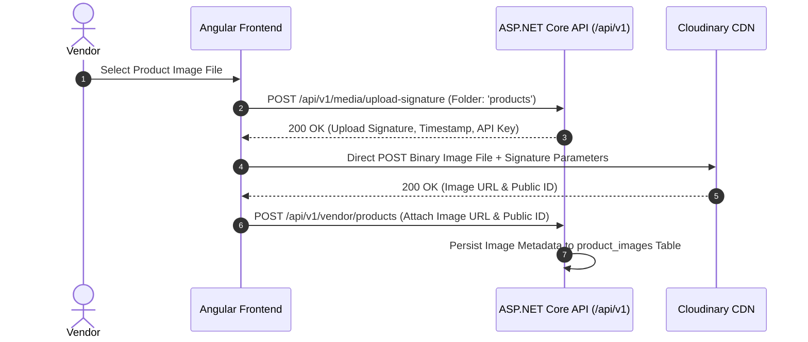

### Security & Storage Rules:
* Cloudinary API secrets are stored securely in backend environment configuration and **NEVER EXPOSED TO CLIENT BROWSERS**. Endpoints return signed upload parameters.
* PostgreSQL stores media URLs and public IDs (`product_images.image_url`). Binary image blobs are never stored in the database.

---

## 15. Search Architecture

The search architecture separates real-time catalog search from telemetry search logging (`FR-SEARCH-001`, `BR-010`):

```
Customer Search Query ('fresh milk')
   │
   ├──► Catalog Search Engine (PostgreSQL-Native Indexed Search against products, categories, brands)
   │       └── Returns Matching Active Products
   │
   └──► Telemetry Logger (Async Write to search_logs Table)
           ├── search_term, normalized_term, result_count
           └── Zero-Result Analytics & Suggestion Data
```

### Architectural Separation:
1. **Catalog Search:** Executes against `products`, `categories`, and `brands` using PostgreSQL-native indexed search. Exact indexing implementation details may be finalized during technical design.
2. **Search Logs (`search_logs`):** Stores search telemetry for zero-result detection, analytics, and auto-complete suggestions (`BR-010`). `search_logs` is NOT the product search index engine.
3. **Excluded Scope:** AI semantic search, `pgvector`, and Elasticsearch are excluded from MVP.

---

## 16. Search Suggestions Architecture

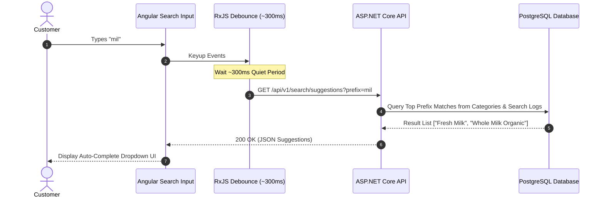

---

## 17. Location / Nearby Discovery Architecture

Location-aware discovery enables customers to find local vendor storefronts based on physical geographic proximity (`FR-LOC-001`):

```
Customer Location (Latitude, Longitude)
   │
   ▼
[ GET /api/v1/location/nearby-vendors?latitude=...&longitude=...&radiusKm=10.0 ]
   │
   ▼
Distance Bounding Query (DECIMAL Latitude / Longitude on store_profiles & addresses)
   │
   ▼
Returns Nearby Active Vendor Storefronts within Specified Radius
```

### Architectural Boundaries:
* MVP location discovery uses standard PostgreSQL latitude and longitude decimal coordinates with distance bounding logic.
* PostGIS spatial indexing extension evaluation, specific Maps API providers, and continuous live driver GPS tracking remain **Deferred Technical Decisions / Out of MVP Scope**.

---

## 18. Notification & SignalR Architecture

Real-time notification dispatch is managed via **ASP.NET Core SignalR** (`FR-NOTIF-001`):

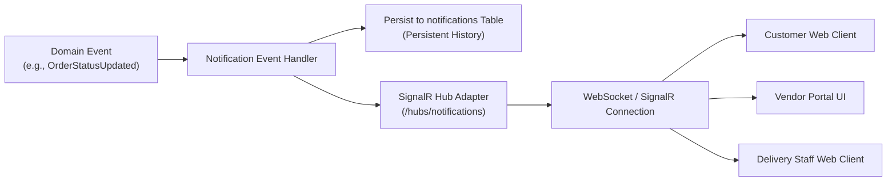

### Real-Time Boundaries:
* **Persistent Model:** Notifications are written to the `notifications` database table for unread history retrieval.
* **Live Transport:** SignalR hub (`/hubs/notifications`) dispatches real-time updates to connected client browser sessions.
* **Deferred Scaling:** Redis backplane, horizontal SignalR scaling architecture, and distributed SignalR infrastructure remain **Deferred Technical Design Decisions**.

---

## 19. Background Processing Architecture

Background processing may be required for scheduled or asynchronous system operations:

```
Conceptual Asynchronous Processing Boundaries
   ├── Inventory Reservation Expiration & Cleanup (Deferred Mechanics)
   ├── Notification & Email Dispatching
   ├── Audit & Search Telemetry Log Flushing
   └── Scheduled System Maintenance Tasks
```

* The exact background-processing mechanism, framework selection, and reservation cleanup mechanics remain **Deferred Technical Decisions**.

---

## 20. Observability & Error Handling Architecture

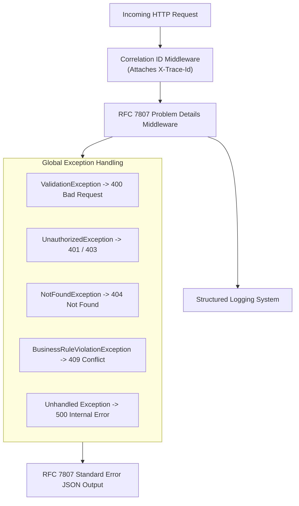

### Health Checks & Auditing:
* Health endpoint `/health` monitors database connectivity and application availability (`NFR-AVAIL-001`).
* Security and governance events write structured state diffs to `audit_logs` (`FR-AUDIT-001`).

---

## 21. Security Architecture

1. **Transport Security:** HTTPS/TLS is required for transport security. Exact TLS version and configuration are deployment decisions.
2. **Authentication Security:** Short-lived JWT access tokens + securely managed refresh tokens with rotation (`NFR-SEC-002`). Passwords must use a secure industry-standard password hashing mechanism; exact algorithm and parameters remain deferred (`NFR-SEC-001`).
3. **RBAC & Permission Authorization:** Explicit role and permission checks enforce least privilege access across Admin, Vendor, Customer, and Delivery staff routes (`FR-AUTH-004`).
4. **Data Isolation:** Vendor tenant filters (`vendor_id`) and customer filters (`customer_id`) prevent unauthorized cross-tenant data access (`BR-002`, `BR-003`).
5. **Zero Financial Credential Exposure:** Absolutely no raw credit card numbers, CVVs, or payment card secrets are accepted or retained.
6. **Input Sanitization:** FluentValidation validates all DTO payloads prior to request execution (`NFR-MAINT-002`).

---

## 22. Deployment Architecture

Conceptual deployment topology separating presentation, API, relational database, and external cloud services:

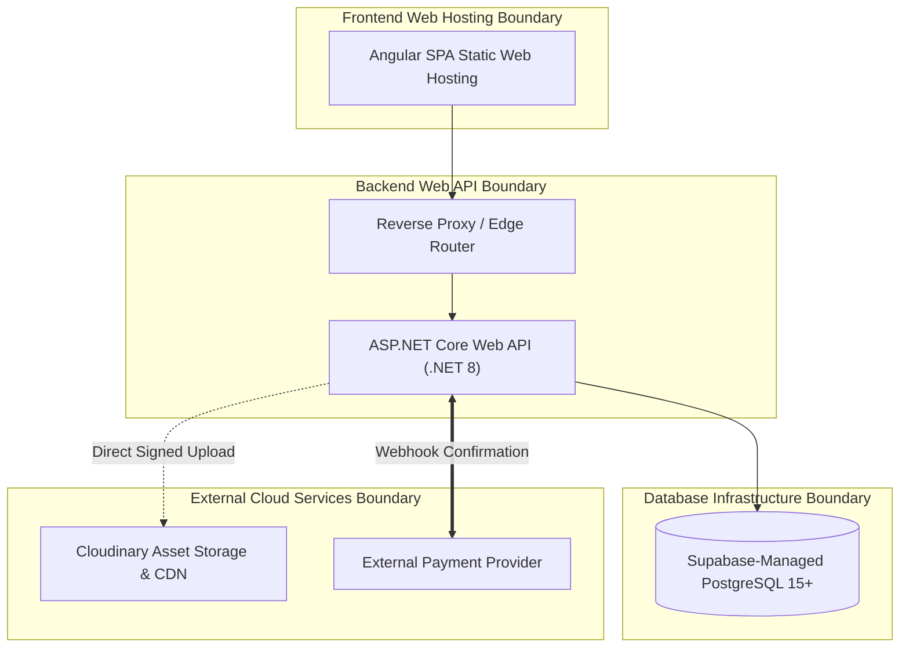

* **Deployment Flexibility:** Docker and GitHub Actions represent tooling directions. Exact hosting providers, replication topologies, scaling topologies, and production deployment infrastructure remain **Deferred Technical Decisions**.

---

## 23. Environment Configuration & Secret Management

Environment configuration strictly isolates parameters across Development, Testing/Staging, and Production environments:

* **Database Connections & API Keys:** Injected via environment variables or secret managers per environment.
* **JWT & Webhook Secrets:** High-entropy secret keys managed outside source code.
* **Zero Source Secrets:** Secrets, private keys, and passwords must NEVER be committed to Git source control.

---

## 24. Trust Boundaries & Data Flow Diagrams

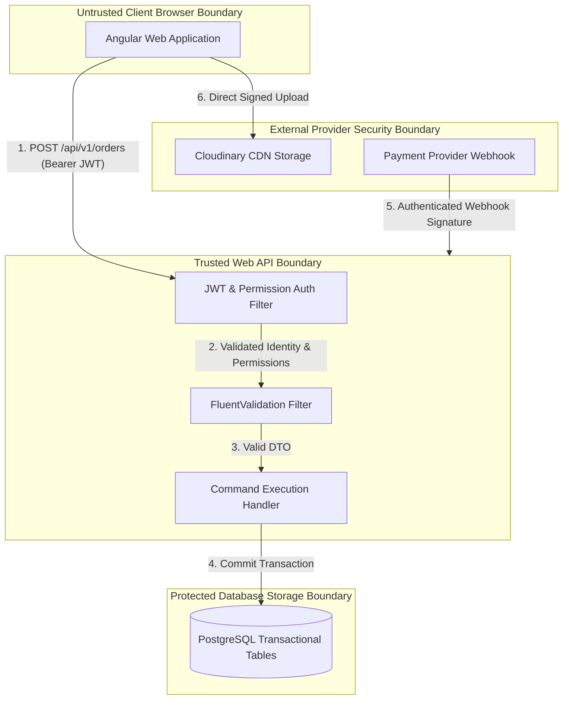

---

## 25. Failure & Resilience Architecture

| Failure Scenario | Architectural Handling & Resilience Strategy |
|---|---|
| **Payment Webhook Delivery Failure** | Webhook delivery failure must be handled safely and duplicate webhook delivery must not create duplicate financial state transitions. Customer portal offers check payment status endpoint (`GET /api/v1/payments/{order_id}`). Provider-specific retry behavior remains dependent on selected payment gateway. |
| **Inventory Stock Contention** | Stock availability validation (`BR-005`) and reservation (`BR-006`) enforce overselling prevention rules. Insufficient stock returns RFC 7807 `400 Bad Request` validation error. Exact locking and concurrency strategies remain deferred. |
| **Cloudinary Upload Outage** | Image upload failure halts catalog product submission on client; backend rejects incomplete product payload missing primary image URL. |
| **Invalid / Expired JWT Token** | Angular HTTP interceptor catches `401 Unauthorized` and executes refresh token rotation via `POST /api/v1/auth/refresh-token`. |
| **Duplicate High-Risk Request** | Applicable high-risk operations use the `Idempotency-Key` header contract defined by the API specification. Duplicate requests with the same key must not repeat protected financial/order operations. Idempotency key storage mechanism, lifecycle, and retention policy are deferred technical decisions. |

---

## 26. Architectural Decision Records (ADRs) & Deferred Decisions Index

### 26.1 Approved Technology Decisions
* **Frontend:** Angular 18+ SPA, TypeScript, Tailwind CSS, RxJS, Angular Signals, Reactive Forms.
* **Backend:** ASP.NET Core Web API (.NET 8 / C#), Clean Architecture, CQRS (MediatR), EF Core 8.0, FluentValidation.
* **Database:** PostgreSQL 15+ / Supabase-Managed PostgreSQL (35 Normalized Tables).
* **Media & Search:** Cloudinary signed direct uploads; PostgreSQL-native indexed search.
* **Real-Time & API:** ASP.NET Core SignalR (`/hubs/notifications`); REST API (`/api/v1`), RFC 7807 Problem Details error contract.

### 26.2 Deferred Technical Decisions Index (14 Items)
1. **External Payment Provider Selection:** Specific payment gateway selection (Stripe vs local provider).
2. **Maps API Provider:** Specific Maps API selection (Google Maps vs Mapbox vs OpenStreetMap).
3. **PostGIS Evaluation:** Evaluation of PostGIS spatial extension vs standard PostgreSQL decimal lat/long.
4. **SignalR Redis Backplane:** Distributed SignalR backplane scaling architecture.
5. **Inventory Hold Timeout:** Exact reservation hold expiration timeout and background cleanup worker mechanics.
6. **Password Hashing Parameters:** Specific hashing algorithm, work factor, and parameters (`NFR-SEC-001`).
7. **Commission Calculation Financial Base:** Pre-vs-post discount calculation base and tax/shipping inclusions.
8. **Database Connection Pooling:** PgBouncer vs EF Core internal connection pool configuration.
9. **Partial Multi-Vendor Refund Mechanics:** Detailed partial vendor sub-order refund allocation algorithms.
10. **Vendor Reapplication Mechanics:** Reapplication record handling for rejected vendor applicants.
11. **Jurisdiction-Specific Vendor Document Rules:** Regional legal compliance documentation rules.
12. **PostgreSQL Row Level Security (RLS) Policies:** Direct Supabase RLS policies vs ASP.NET Core API application-level tenancy.
13. **Database Deployment Topology:** Supabase Managed Postgres vs AWS RDS Multi-AZ topology.
14. **Idempotency Key Retention Policy:** Idempotency key storage mechanism, retention policy, and storage implementation.

---

## 27. Architecture Traceability Matrix

| Architectural Area | Business Rule(s) | SRS FR(s) / NFR(s) | Formal Use Case(s) | Database Entity / API Endpoint |
|---|---|---|---|---|
| **Clean Architecture & CQRS** | — | `NFR-MAINT-001`, `NFR-PERF-003` | All Use Cases | ASP.NET Core .NET 8 API Layer / MediatR |
| **Authentication & RBAC** | `BR-001`, `BR-007` | `FR-AUTH-001` to `005`, `NFR-SEC-002` | `UC-CUST-001`, `UC-ADMIN-001` | `users`, `roles`, `permissions`, `/api/v1/auth/*` |
| **Vendor Onboarding & Approval** | `BR-001`, `BR-015` | `FR-VEND-001` to `003` | `UC-VEND-001`, `UC-ADMIN-003` | `vendor_applications`, `vendors`, `/api/v1/admin/vendors/*` |
| **Catalog & Product Visibility** | `BR-012` | `FR-PROD-001` to `004` | `UC-VEND-004`, `UC-CUST-004` | `products` (`status = 'Active'`), `/api/v1/products` |
| **Inventory Validation & Reservation**| `BR-005`, `BR-006` | `FR-INV-001` to `004` | `UC-VEND-005`, `UC-CUST-008` | `inventories` (`quantity_available`), `/api/v1/cart/*` |
| **Multi-Vendor Order Splitting** | `BR-002`, `BR-003`, `BR-011` | `FR-ORDER-001` to `004` | `UC-CUST-008`, `UC-VEND-006` | `orders`, `vendor_orders`, `order_items`, `/api/v1/orders` |
| **Payment Confirmation Protection** | `BR-009` | `FR-PAY-001` to `004` | `UC-CUST-008`, `UC-ADMIN-005` | `payments`, `refunds`, `/api/v1/payments/webhooks/confirm` |
| **Delivery Staff OTP Verification** | `BR-013` | `FR-DEL-001` to `003` | `UC-DEL-001`, `UC-DEL-002` | `deliveries`, `delivery_assignments`, `/api/v1/delivery/*` |
| **Indexed Catalog Search** | `BR-010` | `FR-SEARCH-001`, `FR-SEARCH-005` | `UC-CUST-003` | PostgreSQL-Native Indexing, `/api/v1/search` |
| **Search Telemetry Logging** | `BR-010` | `FR-SEARCH-005` | `UC-CUST-003` | `search_logs`, `/api/v1/admin/search-analytics` |
| **Verified Customer Reviews** | `BR-004` | `FR-REVIEW-001` to `003` | `UC-CUST-010` | `reviews` (`order_item_id`), `/api/v1/reviews` |
| **Marketplace Coupons & Commission** | `BR-008`, `BR-014` | `FR-COMM-001` to `003` | `UC-CUST-006`, `UC-ADMIN-005` | `coupons`, `commissions`, `payouts`, `/api/v1/admin/*` |

---

## 28. Scope Protection & Correction Audit Notes

### 28.1 Scope Protection Guardrails (Excluded from MVP)
The LocalMart System Architecture explicitly excludes the following features from MVP scope:
* AI semantic search (`pgvector` vector embeddings)
* AI recommendation engines
* Continuous driver live GPS location streaming
* Multi-currency processing & crypto payments
* International shipping & cross-border logistics
* Multi-branch vendor management
* Native mobile applications (Delivery staff uses Web Client)

### 28.2 Controlled Correction Pass Audit Notes
1. **Inventory Mechanics:** Removed hardcoded payment deduction and serializable transaction claims. Preserved stock validation (`BR-005`), reservation (`BR-006`), and quantity semantics while explicitly marking hold timing, locking, and worker cleanup as deferred.
2. **Background Processing:** Made implementation neutral ("Background processing may be required..."). Marked mechanism and cleanup workers as deferred.
3. **Deployment Architecture:** Replaced mandatory Cloudflare/multi-instance cluster topology with a conceptual container/hosting architecture. Marked hosting provider, replication topology, and deployment infrastructure as deferred.
4. **Security & Cryptography:** Replaced specific TLS version and BCrypt/Argon2 assertions with general HTTPS and industry-standard hashing requirements, preserving deferred password parameters (`NFR-SEC-001`).
5. **Idempotency Storage:** Removed "checks cache" assumption. Clarified that storage mechanism, lifecycle, and retention policy are deferred.
6. **Payment Webhook Retries:** Provider-neutral webhook retry handling specified. Retained signature verification and payment confirmation protection (`BR-009`).
7. **Search Indexing:** Preserved PostgreSQL-native indexed search as current MVP direction without locking specific implementation constructs. Kept `search_logs` separate.
8. **Delivery Client:** Updated to "Delivery Staff Web Client". Mobile applications excluded from MVP.
9. **CQRS Pipeline Diagram:** Corrected query pipeline to execute read-only LINQ projections without mandatory write transactions.
10. **Reverse Proxy:** Updated API gateway / reverse proxy to optional edge routing. Logical route remains `/api/v1`.
11. **Token Lifetimes:** Updated token lifetimes to short-lived access tokens and securely managed refresh tokens with rotation (`NFR-SEC-002`).
12. **Cloudinary Architecture:** Clarified signed upload parameters concept without exposing secrets.
13. **Location & SignalR:** Kept bounding box discovery and SignalR notifications while marking PostGIS, Maps providers, live GPS, and Redis backplanes as deferred.
14. **Canonical Endpoint:** Standardized `POST /api/v1/admin/vendors/applications/{id}/approve`.
15. **Zero Implementation Code:** `NONE` (Zero C#, Angular, SQL, migration, Docker runtime, or Supabase code executed).

---

*End of Phase 07 — Controlled Architecture Correction Pass Document.*
