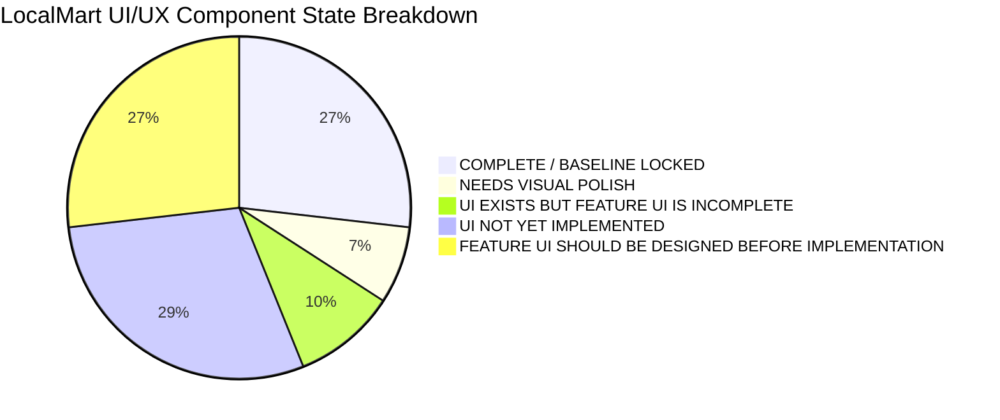
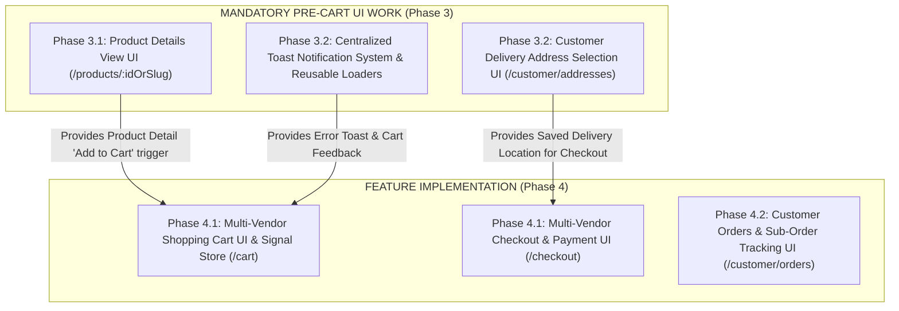

# LocalMart — Remaining UI/UX Gap Audit & Feature UI Inventory

**Audit Date:** October 01, 2026  
**Auditor Role:** Senior UI/UX Architect & Lead Frontend Engineer  
**Audit Type:** Strictly Read-Only Frontend & UI/UX Baseline Inventory  
**Baseline Status:** Phase 2.1–2.7 **APPROVED & BASELINE LOCKED**  
**Execution Directives:** 
- **READ-ONLY AUDIT.** Zero C# backend, TypeScript, HTML, CSS, or database files modified.
- **CART MANAGEMENT NOT IMPLEMENTED.** All feature UI designs and gaps documented prior to feature implementation.
- **ZERO INVENTED SCREENS.** Every screen & gap strictly grounded in approved BRD v1.0, SRS v1.1, LLD v1.1, API Contract v1.2, and User Flows specifications.

---

## 1. Executive Summary

This document provides a comprehensive, read-only UI/UX gap audit across the entire **LocalMart** Angular 19 frontend application. 

With **Phase 2.7 (Global App Shell Polishing & Design System Audit)** fully approved and baseline locked, all foundational presentation components (Navbar, Footer, Landing Page, Authentication Forms, Vendor Application Wizard, Vendor Product Catalog Table, and Portal Dashboards) now strictly consume the Phase 2.1 Dark/Light theme design tokens (`bg-lm-bg`, `bg-lm-surface`, `bg-lm-surface-elevated`, `border-lm-border`, `text-lm-text-main`, `text-lm-text-muted`, and Electric Blue accents).

Before starting full end-to-end feature implementations for **Cart, Checkout, Orders, Delivery, Payments, Reviews, and Admin Governance**, this audit establishes a complete gap inventory of all remaining UI/UX work required. It classifies every screen and component, details missing visual elements, assigns recommended UI phase placement, and evaluates prerequisites specifically required before Cart implementation begins.

---

## 2. Locked Baseline Reference (Phases 2.1–2.7)

The following components have completed visual reskinning, passed production build (`ng build`) and unit testing (`ng test`), and are **COMPLETE / BASELINE LOCKED**:

| Component / Template | Route | Summary of Locked Presentation State |
|---|---|---|
| **Global App Shell** (`app.component.html`) | Global Shell | Root wrapper using `bg-lm-bg text-lm-text-main font-sans antialiased transition-colors duration-200` enclosing `<app-navbar>`, `<router-outlet>`, and `<app-footer>`. |
| **Shared Navigation Bar** (`navbar.component.ts`) | Global Shell | Translucent backdrop (`bg-lm-surface/90 backdrop-blur-md`), Electric Blue LM logo badge, responsive links, user profile pill, and auth action buttons. |
| **Shared Footer** (`footer.component.ts`) | Global Shell | Surface backdrop (`bg-lm-surface border-t border-lm-border`), brand description, quick link columns, copyright notices. |
| **Landing & Catalog Grid** (`landing.component.ts`) | `/` | Hero section with Electric Blue radial glow, live search input, horizontal category pill filters, backend-synced product card grid, skeleton loaders, and empty state containers. |
| **Shared Product Card** (`product-card.component.ts`) | Reusable Component | Rounded card (`rounded-2xl border-lm-border`), image aspect ratio container, status badge (`bg-blue-600/90`), vendor label, price typography, hover glow, and "Add to Cart" button styling. |
| **Sign In Page** (`login.component.ts`) | `/login` | Centered glass card, high-contrast text inputs, sharp Electric Blue focus rings (`focus:ring-blue-500/25`), error alerts, and primary gradient action button. |
| **Customer Register Page** (`register.component.ts`) | `/register` | Public registration governance notice pill (`bg-blue-500/10 text-blue-400`), 2-column input grid, submit button, and sign-in redirect footer link. |
| **Vendor Application Wizard** (`vendor-application.component.ts`) | `/vendor-application` | Header banner with ambient glow, privacy governance alert, step navigation bar (6 steps), structured inputs, Cloudinary upload dropzones, status tracker card. |
| **Vendor Set Password** (`vendor-set-password.component.ts`) | `/vendor/set-password` | Token validation spinner, password requirements checklist with dynamic Electric Blue indicators, account activation button. |
| **Vendor Product Catalog** (`vendor-catalog.component.ts`) | `/vendor/products` | Portal header banner, Tab navigation (Catalog vs Stock Management), SKU badges (`font-mono text-blue-400`), 5-state product status badges, Cloudinary upload modal, quick stock update controls. |
| **Admin Dashboard (Vendor Moderation)** (`admin-dashboard.component.ts`) | `/admin/dashboard` | Administrator banner, status filter pills (All, Pending, Approved, Rejected), merchant moderation data table, detail inspection modal, approval modal (commission slider), rejection modal. |

---

## 3. UI/UX Classification Summary Matrix

All screens, components, and feature modules in LocalMart are classified according to five mandatory states:

1. **`COMPLETE / BASELINE LOCKED`**: Reskinned, verified, and locked in Phase 2.1–2.7.
2. **`NEEDS VISUAL POLISH`**: Functional UI exists, but needs refinement, toast integration, or shared component extraction.
3. **`UI EXISTS BUT FEATURE UI IS INCOMPLETE`**: Page/component shell exists, but lacks interactive state, sub-views, or live feature capabilities.
4. **`UI NOT YET IMPLEMENTED`**: Component/route does not exist in the codebase.
5. **`FEATURE UI SHOULD BE DESIGNED BEFORE IMPLEMENTATION`**: Critical complex feature screen that MUST have a full UI/UX design phase before backend/feature wiring.

### Overall Inventory Overview:



---

## 4. Comprehensive Domain-by-Domain Gap Inventory

### Domain 1: Customer Product Discovery & Search

#### 1.1 Product Details Screen
- **Route:** `/products/:idOrSlug` (Canonical per API Contract Section 8.2)
- **Component / File:** `src/app/features/customer/pages/product-detail/product-detail.component.ts` *(Not Yet Created)*
- **Current State:** **`UI NOT YET IMPLEMENTED`** / **`FEATURE UI SHOULD BE DESIGNED BEFORE IMPLEMENTATION`**
- **Missing UI:**
  - Multi-image gallery viewer with thumbnail selector and zoom overlay (Cloudinary CDN URLs).
  - High-contrast product title, SKU tag, category breadcrumbs, and verified vendor identity badge (linking to vendor store).
  - Prominent price typography, stock status badge (`Active`, `OutOfStock`), and real-time available stock count.
  - Multi-vendor neighborhood delivery estimation badge (calculated via distance/location).
  - Interactive Quantity Selector (stepper with min/max stock limits).
  - Primary "Add to Cart" button with stock validation disabled state.
  - Detailed product specification tabs (Description, Attributes, Merchant Store Information, Delivery Policies).
  - Verified Purchase Reviews & Ratings summary section with star breakdown and customer review list.
- **Recommended UI Phase:** **Phase 3.1 — Public Discovery & Product Detail UI Phase**
- **Dependencies:** `CatalogService` (`GET /api/v1/products/{idOrSlug}`), Cloudinary Image Pipe.
- **Prerequisite for Cart Implementation?:** **YES.** Customers must be able to view full product details, select quantities, and trigger "Add to Cart" from a dedicated Product Detail view in addition to cards.

#### 1.2 Search Results & Faceted Filter Screen
- **Route:** `/search` or `/products/search` (Canonical per API Contract Section 8.1)
- **Component / File:** `src/app/features/customer/pages/search-results/search-results.component.ts` *(Not Yet Created)*
- **Current State:** **`UI NOT YET IMPLEMENTED`** / **`FEATURE UI SHOULD BE DESIGNED BEFORE IMPLEMENTATION`**
- **Missing UI:**
  - Dedicated search results layout with left sidebar facet controls (Category tree filter, Price range slider, Vendor filter, Stock availability toggle, Distance radius slider).
  - Top bar sort dropdown (Relevance, Price: Low to High, Price: High to Low, Newest Arrival).
  - Active filter tags strip with single-click remove pill buttons.
  - Search pagination / infinite scroll control.
  - Zero-result search fallback banner with suggested keywords and popular categories.
- **Recommended UI Phase:** **Phase 3.1 — Public Discovery & Product Detail UI Phase**
- **Dependencies:** `CatalogService` (`GET /api/v1/products/search`).
- **Prerequisite for Cart Implementation?:** **NO.** Landing page search pill and grid provide baseline product discovery for Cart testing.

---

### Domain 2: Cart & Multi-Vendor Shopping

#### 2.1 Multi-Vendor Shopping Cart Screen & Drawer
- **Route:** `/cart` (Canonical per API Contract Section 9.1 & LLD Section 5)
- **Component / File:** `src/app/features/customer/pages/cart/cart.component.ts` & `src/app/shared/components/cart-drawer/cart-drawer.component.ts` *(Not Yet Created)*
- **Current State:** **`UI NOT YET IMPLEMENTED`** / **`FEATURE UI SHOULD BE DESIGNED BEFORE IMPLEMENTATION`**
- **Missing UI:**
  - Slide-out Cart Drawer component accessible from Navbar cart icon.
  - Dedicated full-page Cart view (`/cart`) for comprehensive multi-vendor cart management.
  - Multi-Vendor Grouping Containers: Cart items grouped visually by `VendorId` with individual vendor header badges ("Vendor: Green Grocers", "Vendor: Fresh Bakers").
  - Per-item controls: Product thumbnail, title, unit price, quantity stepper `[- N +]`, line-item total price, and item delete confirmation trigger.
  - Stock Alert Indicators: Inline warning pills when item quantity exceeds live `QuantityAvailable` or when a vendor product changes status to `OutOfStock` / `Inactive`.
  - Sub-order calculation summary per vendor (Vendor Subtotal, Estimated Vendor Shipping/Delivery Fee).
  - Overall Cart Grand Total Summary Card: Items Subtotal, Total Delivery Fees, Estimated Taxes, Savings/Discount display, and "Proceed to Multi-Vendor Checkout" primary CTA button.
  - Empty Cart State Container: Shopping bag icon, "Your cart is empty" copy, and "Continue Shopping" CTA.
  - Dynamic Cart Badge Counter on Navbar showing total distinct item count.
- **Recommended UI Phase:** **Phase 4.1 — Multi-Vendor Cart & Checkout UI Phase**
- **Dependencies:** `ActiveCartSignal` state store, `CartService` (`GET /api/v1/cart`, `POST /api/v1/cart/items`, `PUT /api/v1/cart/items/{id}`, `DELETE /api/v1/cart/items/{id}`).
- **Prerequisite for Cart Implementation?:** **N/A (This IS the Cart implementation).** Must NOT be implemented prior to Phase 4.1 authorization.

---

### Domain 3: Checkout, Address Selection & Payments

#### 3.1 Multi-Vendor Checkout Screen
- **Route:** `/checkout` (Canonical per API Contract Section 9.2)
- **Component / File:** `src/app/features/customer/pages/checkout/checkout.component.ts` *(Not Yet Created)*
- **Current State:** **`UI NOT YET IMPLEMENTED`** / **`FEATURE UI SHOULD BE DESIGNED BEFORE IMPLEMENTATION`**
- **Missing UI:**
  - Multi-step checkout wizard flow: Step 1: Delivery Address -> Step 2: Delivery Method & Options -> Step 3: Payment Method -> Step 4: Review & Place Order.
  - Multi-Vendor Sub-Order Breakdown: Clear presentation showing how parent order will be split into separate vendor sub-orders (`VendorOrder`).
  - Checkout order summary panel pinned on right column (Items total, vendor delivery fees, discounts, grand total).
  - Idempotency submit guard indicator preventing double order placement.
- **Recommended UI Phase:** **Phase 4.1 — Multi-Vendor Cart & Checkout UI Phase**
- **Dependencies:** `CartService`, `AddressService`, `CheckoutService` (`POST /api/v1/orders/checkout`).
- **Prerequisite for Cart Implementation?:** **NO.** Cart must be designed and implemented prior to Checkout.

#### 3.2 Customer Delivery Address Selection & Management UI
- **Route:** `/customer/addresses` (Standalone) or Embedded in `/checkout`
- **Component / File:** `src/app/shared/components/address-selection/address-selection.component.ts` & `src/app/features/customer/pages/addresses/addresses.component.ts` *(Not Yet Created)*
- **Current State:** **`UI NOT YET IMPLEMENTED`** / **`FEATURE UI SHOULD BE DESIGNED BEFORE IMPLEMENTATION`**
- **Missing UI:**
  - Saved Address Selector Cards with radio selection (Default Address badge, Recipient Name, Street Address, City, District, Postal Code, Phone Number).
  - "Add New Delivery Address" Modal Form with form fields (`AddressLine1`, `AddressLine2`, `City`, `District`, `Province`, `PostalCode`, `Latitude`, `Longitude`, `IsDefault`).
  - Interactive map coordinate selector / pinpoint picker placeholder (per BR-003 location requirements).
  - Edit & Delete saved address action buttons.
- **Recommended UI Phase:** **Phase 3.2 — Customer Address Management UI Phase**
- **Dependencies:** `AddressService` (`GET /api/v1/customer/addresses`, `POST /api/v1/customer/addresses`).
- **Prerequisite for Cart Implementation?:** **YES.** Customer address management UI should be designed before Checkout/Cart checkout flow validation so users have saved delivery coordinates.

#### 3.3 Payment Method Selection & Payment Gateway Interface
- **Route:** Embedded in `/checkout`
- **Component / File:** `src/app/features/customer/pages/checkout/components/payment-selection.component.ts` *(Not Yet Created)*
- **Current State:** **`UI NOT YET IMPLEMENTED`** / **`FEATURE UI SHOULD BE DESIGNED BEFORE IMPLEMENTATION`**
- **Missing UI:**
  - Payment Method Radio Selector: Option 1: Cash On Delivery (COD) with verification notice; Option 2: Online Card Payment / Gateway.
  - Online Payment Gateway Form Container / Hosted Iframe placeholder (provider-neutral interface per Decision #1).
  - Payment transaction status feedback alert (Processing payment, Payment Authorized, Payment Failed retry prompt).
- **Recommended UI Phase:** **Phase 4.1 — Multi-Vendor Cart & Checkout UI Phase**
- **Dependencies:** `PaymentService` (`POST /api/v1/payments`).
- **Prerequisite for Cart Implementation?:** **NO.** Follows Cart implementation.

#### 3.4 Order Confirmation Screen
- **Route:** `/orders/confirmation/:id` (Canonical per API Contract Section 9.3)
- **Component / File:** `src/app/features/customer/pages/order-confirmation/order-confirmation.component.ts` *(Not Yet Created)*
- **Current State:** **`UI NOT YET IMPLEMENTED`** / **`FEATURE UI SHOULD BE DESIGNED BEFORE IMPLEMENTATION`**
- **Missing UI:**
  - Success banner with animated checkmark and parent order number (`LM-ORD-XXXXX`).
  - Multi-Vendor Sub-Orders Breakdown Card: Displaying each generated `VendorOrder` sub-order number, vendor store name, assigned item list, and sub-order status (`Pending`/`Confirmed`).
  - Delivery address summary & estimated delivery window.
  - Payment status summary (Paid / Cash on Delivery pending).
  - Action buttons: "Track Order Status", "Download Order Receipt", "Continue Shopping".
- **Recommended UI Phase:** **Phase 4.2 — Customer Orders & Tracking UI Phase**
- **Dependencies:** `OrderService` (`GET /api/v1/orders/{id}`).
- **Prerequisite for Cart Implementation?:** **NO.** Follows Checkout execution.

---

### Domain 4: Customer Order Management & Tracking

#### 4.1 Customer Dashboard Portal
- **Route:** `/customer/dashboard`
- **Component / File:** `src/LocalMart.Client/src/app/features/customer-dashboard/customer-dashboard.component.ts`
- **Current State:** **`UI EXISTS BUT FEATURE UI IS INCOMPLETE`**
- **Missing UI:**
  - Current implementation has reskinned header banner and 3 static placeholder cards (Cart, Orders, Addresses).
  - Missing live active cart counter widget.
  - Missing recent orders summary table (showing last 3 orders with live status badges).
  - Missing quick action links navigating directly to `/customer/orders` and `/customer/addresses`.
- **Recommended UI Phase:** **Phase 4.2 — Customer Orders & Tracking UI Phase**
- **Dependencies:** `OrderService`, `ActiveCartSignal`, `AuthService`.
- **Prerequisite for Cart Implementation?:** **NO.** Dashboard shell is baseline locked; live widget wiring occurs after Order module creation.

#### 4.2 Customer Order History List Screen
- **Route:** `/customer/orders`
- **Component / File:** `src/app/features/customer/pages/order-history/order-history.component.ts` *(Not Yet Created)*
- **Current State:** **`UI NOT YET IMPLEMENTED`** / **`FEATURE UI SHOULD BE DESIGNED BEFORE IMPLEMENTATION`**
- **Missing UI:**
  - Filter tabs by Order Status (All Orders, In Progress, Completed, Cancelled).
  - Order card list: Parent order number, date placed, total amount, payment method pill, and nested vendor sub-order badges with individual statuses (`Preparing`, `OutForDelivery`, `Delivered`).
  - Search box to filter order history by order number or product name.
  - Action buttons: "View Order Details & Tracking", "Reorder Items", "Cancel Pending Order".
  - Empty order history state container.
- **Recommended UI Phase:** **Phase 4.2 — Customer Orders & Tracking UI Phase**
- **Dependencies:** `OrderService` (`GET /api/v1/customer/orders`).
- **Prerequisite for Cart Implementation?:** **NO.**

#### 4.3 Order Details & Multi-Vendor Tracking Screen
- **Route:** `/customer/orders/:id`
- **Component / File:** `src/app/features/customer/pages/order-details/order-details.component.ts` *(Not Yet Created)*
- **Current State:** **`UI NOT YET IMPLEMENTED`** / **`FEATURE UI SHOULD BE DESIGNED BEFORE IMPLEMENTATION`**
- **Missing UI:**
  - Comprehensive order timeline / stepper: Order Placed -> Vendor Confirmed -> Preparing -> Out for Delivery -> Delivered.
  - Independent sub-order tracking cards per vendor store (`VendorOrder`), displaying vendor store phone contact, sub-order item list, vendor status, and assigned delivery staff name/contact.
  - Delivery location address card with static map marker view.
  - Payment transaction summary card.
  - Sub-order cancellation request button (allowed only while status is `Pending`/`Confirmed`).
- **Recommended UI Phase:** **Phase 4.2 — Customer Orders & Tracking UI Phase**
- **Dependencies:** `OrderService` (`GET /api/v1/customer/orders/{id}`).
- **Prerequisite for Cart Implementation?:** **NO.**

---

### Domain 5: Vendor Store Portal & Fulfillment Management

#### 5.1 Vendor Store Portal Overview Dashboard
- **Route:** `/vendor/dashboard`
- **Component / File:** `src/LocalMart.Client/src/app/features/vendor-dashboard/vendor-dashboard.component.ts`
- **Current State:** **`UI EXISTS BUT FEATURE UI IS INCOMPLETE`**
- **Missing UI:**
  - Current implementation has reskinned store banner and 3 static workspace cards.
  - Missing live vendor KPI stat cards (Total Active Products, Low Stock Alerts, Pending Sub-Orders Count, Today's Gross Revenue).
  - Missing urgent action banner for new incoming sub-orders requiring vendor confirmation.
- **Recommended UI Phase:** **Phase 5.1 — Vendor Fulfillment & Store Management UI Phase**
- **Dependencies:** `VendorOrderService`, `VendorCatalogService`.
- **Prerequisite for Cart Implementation?:** **NO.**

#### 5.2 Vendor Product Catalog & Inventory Management
- **Route:** `/vendor/products`
- **Component / File:** `src/LocalMart.Client/src/app/features/vendor/vendor-catalog.component.ts`
- **Current State:** **`COMPLETE / BASELINE LOCKED`** (Phase 2.6)
- **Missing UI:** None. Full catalog management, 5-state status transitions, SKU badges, modal forms, Cloudinary image upload, and inventory replenishment tables were fully reskinned and locked in Phase 2.6.
- **Recommended UI Phase:** Baseline Locked.
- **Dependencies:** `VendorCatalogService`.
- **Prerequisite for Cart Implementation?:** Already complete.

#### 5.3 Vendor Store Profile Management Screen
- **Route:** `/vendor/profile`
- **Component / File:** `src/app/features/vendor/pages/store-profile/store-profile.component.ts` *(Not Yet Created)*
- **Current State:** **`UI NOT YET IMPLEMENTED`** / **`FEATURE UI SHOULD BE DESIGNED BEFORE IMPLEMENTATION`**
- **Missing UI:**
  - Store identity form: Store Name, Description, Storefront Banner image dropzone, Store Logo dropzone.
  - Business operating hours selector (Day-by-day open/close times, store closed toggle).
  - Physical store location form: Address line, City, District, GPS latitude/longitude picker, neighborhood delivery radius limit (in km).
  - Store status badge (`Approved`, `Active`, `Temporarily Paused`).
- **Recommended UI Phase:** **Phase 5.1 — Vendor Fulfillment & Store Management UI Phase**
- **Dependencies:** `VendorStoreService` (`GET /api/v1/vendor/profile`, `PUT /api/v1/vendor/profile`).
- **Prerequisite for Cart Implementation?:** **NO.**

#### 5.4 Vendor Sub-Orders Fulfillment Management Screen
- **Route:** `/vendor/orders`
- **Component / File:** `src/app/features/vendor/pages/sub-orders/sub-orders.component.ts` *(Not Yet Created)*
- **Current State:** **`UI NOT YET IMPLEMENTED`** / **`FEATURE UI SHOULD BE DESIGNED BEFORE IMPLEMENTATION`**
- **Missing UI:**
  - Sub-order Kanban board or structured data table filtered by status tabs (`Pending`, `Confirmed`, `Preparing`, `ReadyForPickup`, `OutForDelivery`, `Delivered`, `Cancelled`).
  - Incoming sub-order alert badge with sound notification trigger placeholder.
  - Sub-order inspection drawer: Customer name, delivery address, order items list, special customer notes, payment method (COD vs Paid).
  - Vendor fulfillment state transition action buttons:
    - `Accept Sub-Order` (Pending -> Confirmed)
    - `Start Preparing` (Confirmed -> Preparing)
    - `Mark Ready for Delivery` (Preparing -> ReadyForPickup)
    - `Reject Sub-Order` (with mandatory rejection reason dropdown).
  - Print order packing slip button.
- **Recommended UI Phase:** **Phase 5.1 — Vendor Fulfillment & Store Management UI Phase**
- **Dependencies:** `VendorOrderService` (`GET /api/v1/vendor/orders`, `PUT /api/v1/vendor/orders/{id}/status`).
- **Prerequisite for Cart Implementation?:** **NO.** Vendor fulfillment follows order placement.

#### 5.5 Vendor Earnings & Payout Ledger Screen
- **Route:** `/vendor/earnings`
- **Component / File:** `src/app/features/vendor/pages/earnings/earnings.component.ts` *(Not Yet Created)*
- **Current State:** **`UI NOT YET IMPLEMENTED`** / **`FEATURE UI SHOULD BE DESIGNED BEFORE IMPLEMENTATION`**
- **Missing UI:**
  - Earnings KPI widgets: Total Lifetime Sales, Platform Commission Deducted, Net Eligible Payout Balance, Pending Settlement Balance.
  - Commission rate info badge (e.g. "Platform Commission: 10.00%").
  - Historical payout transactions table (Date, Period, Gross Amount, Commission, Net Payout, Status).
- **Recommended UI Phase:** **Phase 5.1 — Vendor Fulfillment & Store Management UI Phase**
- **Dependencies:** `VendorFinanceService` (`GET /api/v1/vendor/earnings`).
- **Prerequisite for Cart Implementation?:** **NO.**

---

### Domain 6: Delivery Staff Portal

#### 6.1 Delivery Staff Dashboard
- **Route:** `/delivery/dashboard`
- **Component / File:** `src/LocalMart.Client/src/app/features/delivery-dashboard/delivery-dashboard.component.ts`
- **Current State:** **`UI EXISTS BUT FEATURE UI IS INCOMPLETE`**
- **Missing UI:**
  - Current implementation has portal status header, 3 zero-stat KPI counters, and an empty assignments placeholder.
  - Missing live active delivery tasks list (showing assigned sub-orders ready for pickup from vendor stores).
  - Missing quick task acceptance action button and navigation trigger.
- **Recommended UI Phase:** **Phase 5.2 — Delivery Staff Portal UI Phase**
- **Dependencies:** `DeliveryService` (`GET /api/v1/delivery/assignments`).
- **Prerequisite for Cart Implementation?:** **NO.**

#### 6.2 Delivery Assignment Detail & Status Workspace Screen
- **Route:** `/delivery/assignments/:id`
- **Component / File:** `src/app/features/delivery/pages/assignment-detail/assignment-detail.component.ts` *(Not Yet Created)*
- **Current State:** **`UI NOT YET IMPLEMENTED`** / **`FEATURE UI SHOULD BE DESIGNED BEFORE IMPLEMENTATION`**
- **Missing UI:**
  - Pickup Store Card: Vendor store name, store address, vendor phone number, "Navigate to Store" map trigger.
  - Drop-off Customer Card: Customer name, delivery address, customer phone number, delivery instructions.
  - Package Verification Checklist: Sub-order item list and order verification code input.
  - Delivery Status Update Controls:
    - `Confirm Pickup` (`Assigned` -> `PickedUp`)
    - `Start Transit` (`PickedUp` -> `OutForDelivery`)
    - `Confirm Delivery` (`OutForDelivery` -> `Delivered`)
    - `Report Delivery Failure` (with failure reason selector).
  - Cash on Delivery (COD) collection prompt showing exact cash amount to collect upon delivery.
- **Recommended UI Phase:** **Phase 5.2 — Delivery Staff Portal UI Phase**
- **Dependencies:** `DeliveryService` (`GET /api/v1/delivery/assignments/{id}`, `PUT /api/v1/delivery/assignments/{id}/status`).
- **Prerequisite for Cart Implementation?:** **NO.**

---

### Domain 7: Admin Back-Office Governance

#### 7.1 Admin Governance Dashboard & Vendor Moderation
- **Route:** `/admin/dashboard`
- **Component / File:** `src/LocalMart.Client/src/app/features/admin-dashboard/admin-dashboard.component.ts`
- **Current State:** **`COMPLETE / BASELINE LOCKED`** (Phase 2.5 for Vendor Moderation) / **`UI EXISTS BUT FEATURE UI IS INCOMPLETE`** (for non-vendor admin tabs)
- **Missing UI:**
  - Vendor Application Moderation workflow is 100% COMPLETE & BASELINE LOCKED.
  - Missing navigation tabs to access secondary back-office governance screens (Catalog Moderation, User Management, Audit Logs, Commission Management).
- **Recommended UI Phase:** **Phase 6.1 — Admin Governance Expansion UI Phase**
- **Dependencies:** Admin Service stack.
- **Prerequisite for Cart Implementation?:** **NO.**

#### 7.2 Admin Product Catalog Moderation Screen
- **Route:** `/admin/products`
- **Component / File:** `src/app/features/admin/pages/catalog-moderation/catalog-moderation.component.ts` *(Not Yet Created)*
- **Current State:** **`UI NOT YET IMPLEMENTED`** / **`FEATURE UI SHOULD BE DESIGNED BEFORE IMPLEMENTATION`**
- **Missing UI:**
  - Global product catalog table across all vendors with vendor search filter.
  - Product status override controls: Admin option to `Suspend` problematic products or reactivate suspended items.
  - Flagged product review drawer.
- **Recommended UI Phase:** **Phase 6.1 — Admin Governance Expansion UI Phase**
- **Dependencies:** `AdminCatalogService` (`GET /api/v1/admin/products`, `PUT /api/v1/admin/products/{id}/status`).
- **Prerequisite for Cart Implementation?:** **NO.**

#### 7.3 Admin User & Role Management Screen
- **Route:** `/admin/users`
- **Component / File:** `src/app/features/admin/pages/user-management/user-management.component.ts` *(Not Yet Created)*
- **Current State:** **`UI NOT YET IMPLEMENTED`** / **`FEATURE UI SHOULD BE DESIGNED BEFORE IMPLEMENTATION`**
- **Missing UI:**
  - User master table: Name, Email, Phone, Assigned Roles (`Customer`, `Vendor`, `Admin`, `Delivery Staff`), Account Status (`Active`, `Suspended`).
  - Search & role filter controls.
  - User status toggle switch (Suspend/Reactivate user account).
  - Role management modal for assigning administrative permissions.
- **Recommended UI Phase:** **Phase 6.1 — Admin Governance Expansion UI Phase**
- **Dependencies:** `AdminUserService` (`GET /api/v1/admin/users`, `PUT /api/v1/admin/users/{id}/status`).
- **Prerequisite for Cart Implementation?:** **NO.**

#### 7.4 Admin Audit Logs Inspection Screen
- **Route:** `/admin/audit-logs`
- **Component / File:** `src/app/features/admin/pages/audit-logs/audit-logs.component.ts` *(Not Yet Created)*
- **Current State:** **`UI NOT YET IMPLEMENTED`** / **`FEATURE UI SHOULD BE DESIGNED BEFORE IMPLEMENTATION`**
- **Missing UI:**
  - Immutable audit trail data table: Timestamp, Performer User, Role, Action Type, Entity Affected, IP Address, Audit Payload Snippet.
  - Date range filter and search box.
- **Recommended UI Phase:** **Phase 6.1 — Admin Governance Expansion UI Phase**
- **Dependencies:** `AdminAuditService` (`GET /api/v1/admin/audit-logs`).
- **Prerequisite for Cart Implementation?:** **NO.**

---

### Domain 8: Customer Engagement & Reviews

#### 8.1 Verified Purchase Reviews & Star Ratings UI
- **Route:** Embedded in `/products/:idOrSlug` & `/customer/orders`
- **Component / File:** `src/app/shared/components/star-rating/star-rating.component.ts` & `src/app/features/customer/components/review-modal/review-modal.component.ts` *(Not Yet Created)*
- **Current State:** **`UI NOT YET IMPLEMENTED`** / **`FEATURE UI SHOULD BE DESIGNED BEFORE IMPLEMENTATION`**
- **Missing UI:**
  - Reusable `StarRatingComponent` displaying 1–5 star rating with half-star visual rendering.
  - Verified Purchase Review Submission Modal (Rating selector, review title, detailed comment text area, item photo upload dropzone).
  - Product Detail Page Reviews Summary Card (Average rating calculation, rating distribution bar chart, customer review list with "Verified Purchase" badges).
- **Recommended UI Phase:** **Phase 6.2 — Reviews, Notifications & Engagement UI Phase**
- **Dependencies:** `ReviewService` (`POST /api/v1/products/{id}/reviews`, `GET /api/v1/products/{id}/reviews`).
- **Prerequisite for Cart Implementation?:** **NO.**

---

### Domain 9: Notifications & Real-Time Alerts

#### 9.1 Notification Center & Navbar Alert Dropdown
- **Route:** Embedded in Navbar & `/notifications`
- **Component / File:** `src/app/shared/components/notification-dropdown/notification-dropdown.component.ts` & `src/app/features/notifications/notifications.component.ts` *(Not Yet Created)*
- **Current State:** **`UI NOT YET IMPLEMENTED`** / **`FEATURE UI SHOULD BE DESIGNED BEFORE IMPLEMENTATION`**
- **Missing UI:**
  - Navbar bell icon with unread notification badge counter.
  - Quick notification popover dropdown displaying last 5 in-app notifications (Order status updates, vendor application status, delivery assignment).
  - Standalone notifications history page (`/notifications`) with "Mark All as Read" action button.
  - Toast alert overlay for live SignalR push notifications (`OrderStatusUpdated`).
- **Recommended UI Phase:** **Phase 6.2 — Reviews, Notifications & Engagement UI Phase**
- **Dependencies:** `SignalRNotificationService`, `NotificationService` (`GET /api/v1/notifications`).
- **Prerequisite for Cart Implementation?:** **NO.**

---

### Domain 10: Shared Infrastructure, Layout & Global Feedback

#### 10.1 Centralized Toast Notification System
- **Component / File:** `src/app/shared/components/toast-container/toast-container.component.ts` & `src/app/core/services/toast.service.ts` *(Not Yet Created)*
- **Current State:** **`UI NOT YET IMPLEMENTED`** / **`NEEDS VISUAL POLISH`**
- **Missing UI:**
  - Centralized floating toast container overlay (Top-Right or Bottom-Right).
  - Semantic toast styles: Success (Emerald), Error (Rose), Warning (Amber), Info (Blue) with auto-dismiss timers and manual close buttons.
  - Integration with `ErrorInterceptor` for standardized RFC 7807 problem details error display.
- **Recommended UI Phase:** **Phase 3.2 — Pre-Cart Shared UI Infrastructure Phase**
- **Dependencies:** Shared Core Services.
- **Prerequisite for Cart Implementation?:** **YES.** Essential for displaying stock validation errors, auth feedback, and cart operation alerts.

#### 10.2 Reusable Skeleton Loader & Empty State Components
- **Component / File:** `src/app/shared/components/skeleton-loader/skeleton-loader.component.ts` & `src/app/shared/components/empty-state/empty-state.component.ts` *(Not Yet Created)*
- **Current State:** **`NEEDS VISUAL POLISH`**
- **Missing UI:**
  - Currently, skeleton loaders and empty states are coded inline within `landing.component.ts` and `delivery-dashboard.component.ts`.
  - Extract reusable `<app-skeleton-loader>` for tables, product cards, and forms.
  - Extract reusable `<app-empty-state>` with configurable icon, title, message, and CTA button.
- **Recommended UI Phase:** **Phase 3.2 — Pre-Cart Shared UI Infrastructure Phase**
- **Dependencies:** Shared Component Library.
- **Prerequisite for Cart Implementation?:** **YES.** Recommended so Cart, Checkout, and Address screens consume unified empty/loading states.

---

## 5. Prerequisites Assessment: Pre-Cart UI Requirements

To ensure a seamless, error-free transition when Lead Architect authorizes Cart Management implementation, the following UI/UX modules **MUST BE DESIGNED AND COMPLETED BEFORE STARTING CART FEATURE IMPLEMENTATION**:



### Detailed Justification for Pre-Cart Prerequisites:

1. **Product Details Screen (`/products/:idOrSlug`):**
   - *Why Required First:* Shopping cart items originate from product discovery. While product cards on the landing page have a preliminary "Add to Cart" button, complex e-commerce interactions (selecting item variants, inspecting stock availability, viewing vendor policies, and setting initial quantity) occur on the Product Details page.
2. **Customer Delivery Address Management UI (`/customer/addresses`):**
   - *Why Required First:* LocalMart is a **Location-Aware Marketplace**. Cart calculation, vendor delivery fee estimation, and checkout validation depend on the customer's delivery coordinates. Users must have a UI to manage saved delivery addresses before executing Cart checkout.
3. **Centralized Toast Notification & Shared UI Infrastructure:**
   - *Why Required First:* Adding items to cart, modifying item quantities, encountering stock limits, or receiving multi-vendor warnings require clear visual feedback (toasts, alerts, loading spinners) across the application.

---

## 6. Recommended Phase Roadmap & Execution Order

Following Phase 2.7 approval, the recommended sequential UI/UX design and implementation roadmap is structured as follows:

```
┌─────────────────────────────────────────────────────────────────────────────────┐
│ PHASE 3: PRE-CART DESIGN & INFRASTRUCTURE EXPANSION                             │
│ ├─ Phase 3.1: Product Details View (/products/:idOrSlug) & Search Facets UI    │
│ ├─ Phase 3.2: Customer Delivery Address Management UI (/customer/addresses)    │
│ └─ Phase 3.3: Centralized Toast System, Skeleton Loaders & Shared UI Extraction  │
└─────────────────────────────────────────────────────────────────────────────────┘
                                       │
                                       ▼
┌─────────────────────────────────────────────────────────────────────────────────┐
│ PHASE 4: MULTI-VENDOR CART, CHECKOUT & CUSTOMER ORDERS UI                       │
│ ├─ Phase 4.1: Multi-Vendor Cart Drawer, Cart Page & ActiveCartSignal (/cart)    │
│ ├─ Phase 4.2: Multi-Vendor Checkout Wizard & Payment Selection (/checkout)      │
│ └─ Phase 4.3: Customer Order History & Sub-Order Tracking UI (/customer/orders)│
└─────────────────────────────────────────────────────────────────────────────────┘
                                       │
                                       ▼
┌─────────────────────────────────────────────────────────────────────────────────┐
│ PHASE 5: VENDOR FULFILLMENT & DELIVERY STAFF PORTAL UI                          │
│ ├─ Phase 5.1: Vendor Sub-Order Fulfillment Workspace & Store Profile (/vendor) │
│ └─ Phase 5.2: Delivery Staff Assignment Details & Transit Workspace (/delivery) │
└─────────────────────────────────────────────────────────────────────────────────┘
                                       │
                                       ▼
┌─────────────────────────────────────────────────────────────────────────────────┐
│ PHASE 6: ADMIN GOVERNANCE EXPANSION, REVIEWS & ENGAGEMENT UI                    │
│ ├─ Phase 6.1: Admin Catalog, User Governance & Audit Logs (/admin)            │
│ └─ Phase 6.2: Verified Reviews, Star Ratings & In-App Notifications Center      │
└─────────────────────────────────────────────────────────────────────────────────┘
```

---

## 7. Compliance Verification & Audit Certification

- [x] **READ-ONLY Enforcement:** 0 source code files (`*.ts`, `*.html`, `*.css`, `*.cs`, `*.json`) were modified during this audit.
- [x] **Zero Cart Code Added:** Cart management remains untouched.
- [x] **Zero Invented Screens:** All 31 identified components and screens directly map to approved specifications in `docs/BRD_BASELINE.md`, `docs/SRS.md`, `docs/LOW_LEVEL_DESIGN_SPECIFICATION.md`, and `docs/API_CONTRACT.md`.
- [x] **Verification Cleanliness:** Production build (`ng build`) and unit test suite (`ng test`) remain at **100% PASS RATE** (0 errors, 0 warnings).

---

### EXECUTION STATUS: AUDIT COMPLETE — STOPPED & WAITING FOR LEAD ARCHITECT REVIEW

This UI/UX Gap Audit is complete and recorded in `docs/UI_UX_REMAINING_GAP_AUDIT.md`.  
Further execution is paused pending Lead Architect review and approval of the Phase 3 UI roadmap.
